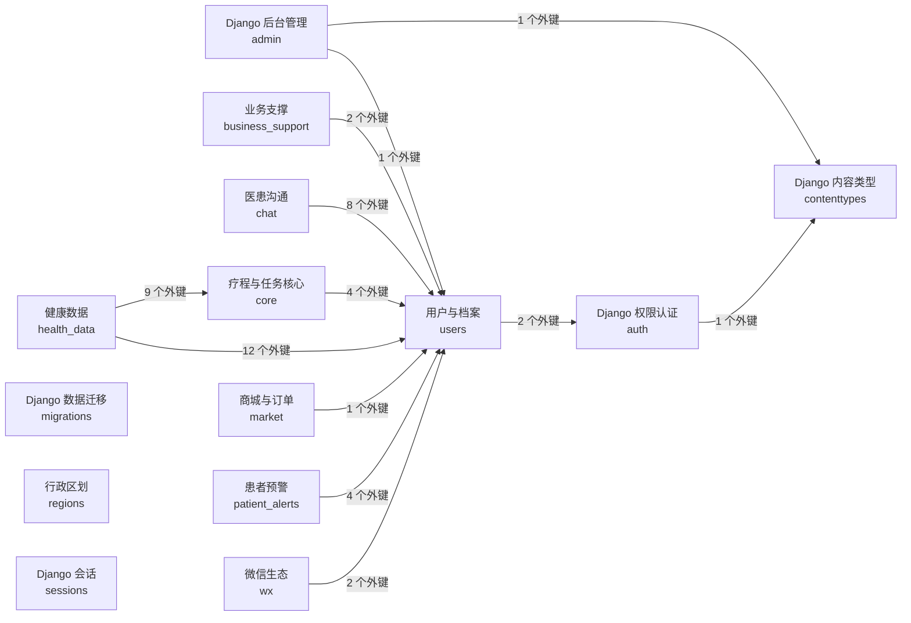

# 慢病院外管理系统 MySQL 数据库结构文档

> 生成时间：2026-07-13 16:22:55 Asia/Shanghai  
> 数据源：当前 Django 配置连接的 live MySQL Schema `lung_cancer_care`  
> MySQL 版本：`8.0.44`  
> Django 数据库别名：`default`；Settings：`lung_cancer_care.settings`  
> 最近应用的 migration：`patient_alerts.0003_patientalertsource`（2026-06-07 13:40:53.974007）  
> 结构指纹（SHA-256）：`87902ad174b3a9ed6276dbbbc35c5de1a66471479bb9d3c65d329a75986454a9`

## 1. 文档说明

本文档面向前端开发和接口联调，完整列出当前业务库的基础表、字段、索引和表间关系。物理结构以 MySQL `information_schema` 为准；中文业务名、字段含义、枚举值和少量逻辑关系由当前 Django 模型元数据补充。生成过程读取数据库结构元数据、Django migration 登记和模型元数据，不读取患者、消息、订单等业务行数据，也不记录连接账号、密码或主机地址。

字段说明的取值优先级为：数据库列注释 → 通用技术字段中文解释 → Django `verbose_name/help_text` → 保守的字段名直译。

当前设置未提供可可靠识别的开发/测试/生产环境标签，因此不能仅凭本文档判断环境。请使用数据库别名、Schema 名、最近 migration 和结构指纹与目标环境对照。

关系分为两类：

- **物理外键**：MySQL 中真实存在的 Foreign Key，包含更新与删除规则。
- **逻辑关系**：Django 模型声明了关联，但 MySQL 未建立物理外键约束；使用时需要由应用层保证一致性。

## 2. 数据库概览

| 指标 | 数量/值 |
|---|---:|
| 基础表 | 56 |
| 字段 | 521 |
| 物理外键 | 89 |
| 逻辑关系（无物理 FK） | 0 |
| 索引（含 PRIMARY、UNIQUE、普通 INDEX） | 230 |
| 视图 | 0 |
| 可映射到 Django 模型的表 | 55/56 |

### 2.1 表清单

| 模块 | 表名 | 业务名称 | 字段数 | 主键 | 外键数 | 被引用数 |
|---|---|---|---:|---|---:|---:|
| Django 权限认证 | [`auth_group`](#table-auth_group) | 组 | 2 | `id` | 0 | 2 |
| Django 权限认证 | [`auth_group_permissions`](#table-auth_group_permissions) | 权限组-权限关系 | 3 | `id` | 2 | 0 |
| Django 权限认证 | [`auth_permission`](#table-auth_permission) | 权限 | 4 | `id` | 1 | 2 |
| 业务支撑 | [`business_support_device`](#table-business_support_device) | 智能设备 | 13 | `id` | 1 | 0 |
| 业务支撑 | [`business_support_feedback`](#table-business_support_feedback) | 意见反馈 | 7 | `id` | 1 | 1 |
| 业务支撑 | [`business_support_feedbackimage`](#table-business_support_feedbackimage) | 反馈图片 | 3 | `id` | 1 | 0 |
| 业务支撑 | [`business_support_systemdocument`](#table-business_support_systemdocument) | 系统文案/协议 | 8 | `id` | 0 | 0 |
| 医患沟通 | [`chat_conversation`](#table-chat_conversation) | 会话 | 8 | `id` | 3 | 3 |
| 医患沟通 | [`chat_conversationreadstate`](#table-chat_conversationreadstate) | 会话已读状态 | 6 | `id` | 3 | 0 |
| 医患沟通 | [`chat_conversationsession`](#table-chat_conversationsession) | 会话分段 | 9 | `id` | 2 | 0 |
| 医患沟通 | [`chat_message`](#table-chat_message) | 消息 | 11 | `id` | 2 | 1 |
| 医患沟通 | [`chat_patientstudioassignment`](#table-chat_patientstudioassignment) | 患者工作室归属 | 8 | `id` | 2 | 0 |
| 疗程与任务核心 | [`core_checkup_field_mappings`](#table-core_checkup_field_mappings) | 检查项字段映射 | 7 | `id` | 2 | 0 |
| 疗程与任务核心 | [`core_checkup_library`](#table-core_checkup_library) | 复查项目 | 8 | `id` | 0 | 4 |
| 疗程与任务核心 | [`core_daily_tasks`](#table-core_daily_tasks) | 每日任务 | 14 | `id` | 2 | 1 |
| 疗程与任务核心 | [`core_medication`](#table-core_medication) | 药物知识库 | 13 | `id` | 0 | 0 |
| 疗程与任务核心 | [`core_monitoring_templates`](#table-core_monitoring_templates) | 监测模板 | 7 | `id` | 0 | 0 |
| 疗程与任务核心 | [`core_plan_items`](#table-core_plan_items) | 疗程计划条目 | 14 | `id` | 3 | 1 |
| 疗程与任务核心 | [`core_questionnaire_options`](#table-core_questionnaire_options) | 题目选项 | 6 | `id` | 1 | 1 |
| 疗程与任务核心 | [`core_questionnaire_questions`](#table-core_questionnaire_questions) | 问卷题目 | 8 | `id` | 1 | 2 |
| 疗程与任务核心 | [`core_questionnaires`](#table-core_questionnaires) | 问卷模板 | 7 | `id` | 0 | 2 |
| 疗程与任务核心 | [`core_standard_field_aliases`](#table-core_standard_field_aliases) | 标准字段别名 | 8 | `id` | 1 | 0 |
| 疗程与任务核心 | [`core_standard_fields`](#table-core_standard_fields) | 标准字段 | 11 | `id` | 0 | 4 |
| 疗程与任务核心 | [`core_treatment_cycles`](#table-core_treatment_cycles) | 治疗疗程 | 7 | `id` | 1 | 1 |
| Django 后台管理 | [`django_admin_log`](#table-django_admin_log) | 日志记录 | 8 | `id` | 2 | 0 |
| Django 内容类型 | [`django_content_type`](#table-django_content_type) | 内容类型 | 3 | `id` | 0 | 2 |
| Django 数据迁移 | [`django_migrations`](#table-django_migrations) | 数据库迁移记录 | 4 | `id` | 0 | 0 |
| Django 会话 | [`django_session`](#table-django_session) | 会话 | 3 | `session_key` | 0 | 0 |
| 健康数据 | [`health_checkup_orphan_fields`](#table-health_checkup_orphan_fields) | 结构化孤儿字段 | 23 | `id` | 5 | 0 |
| 健康数据 | [`health_checkup_result_values`](#table-health_checkup_result_values) | 结构化复查结果 | 20 | `id` | 4 | 1 |
| 健康数据 | [`health_clinical_events`](#table-health_clinical_events) | 临床诊疗事件 | 11 | `id` | 2 | 1 |
| 健康数据 | [`health_data_medicalhistory`](#table-health_data_medicalhistory) | 病情记录 | 10 | `id` | 2 | 0 |
| 健康数据 | [`health_metrics`](#table-health_metrics) | 客观指标 | 12 | `id` | 2 | 1 |
| 健康数据 | [`health_questionnaire_answers`](#table-health_questionnaire_answers) | 问卷回答明细 | 5 | `id` | 3 | 0 |
| 健康数据 | [`health_questionnaire_submissions`](#table-health_questionnaire_submissions) | 问卷提交记录 | 7 | `id` | 2 | 2 |
| 健康数据 | [`health_report_images`](#table-health_report_images) | 报告图片 | 20 | `id` | 6 | 2 |
| 健康数据 | [`health_report_uploads`](#table-health_report_uploads) | 报告上传批次 | 8 | `id` | 3 | 1 |
| 商城与订单 | [`market_order`](#table-market_order) | 订单 | 9 | `id` | 2 | 0 |
| 商城与订单 | [`market_product`](#table-market_product) | 商品/服务包 | 8 | `id` | 0 | 1 |
| 患者预警 | [`patient_alert_sources`](#table-patient_alert_sources) | 患者预警来源 | 14 | `id` | 2 | 0 |
| 患者预警 | [`patient_alerts`](#table-patient_alerts) | 患者预警 | 19 | `id` | 3 | 1 |
| 行政区划 | [`regions_city`](#table-regions_city) | 城市 | 4 | `id` | 1 | 0 |
| 行政区划 | [`regions_province`](#table-regions_province) | 省份 | 3 | `id` | 0 | 1 |
| 用户与档案 | [`users_assistantprofile`](#table-users_assistantprofile) | 医生助理 | 9 | `id` | 1 | 1 |
| 用户与档案 | [`users_customuser`](#table-users_customuser) | 系统用户 | 20 | `id` | 1 | 18 |
| 用户与档案 | [`users_customuser_groups`](#table-users_customuser_groups) | 用户-权限组关系 | 3 | `id` | 2 | 0 |
| 用户与档案 | [`users_customuser_user_permissions`](#table-users_customuser_user_permissions) | 用户-权限关系 | 3 | `id` | 2 | 0 |
| 用户与档案 | [`users_doctorassistantmap`](#table-users_doctorassistantmap) | 医生-助理关系 | 5 | `id` | 2 | 0 |
| 用户与档案 | [`users_doctorprofile`](#table-users_doctorprofile) | 医生档案 | 10 | `id` | 2 | 7 |
| 用户与档案 | [`users_doctorprofile_sales`](#table-users_doctorprofile_sales) | 医生-销售关系 | 3 | `id` | 2 | 0 |
| 用户与档案 | [`users_doctorstudio`](#table-users_doctorstudio) | 医生工作室 | 7 | `id` | 1 | 3 |
| 用户与档案 | [`users_patientprofile`](#table-users_patientprofile) | 患者档案 | 36 | `id` | 3 | 19 |
| 用户与档案 | [`users_patientrelation`](#table-users_patientrelation) | 患者关系 | 11 | `id` | 2 | 0 |
| 用户与档案 | [`users_salesprofile`](#table-users_salesprofile) | 销售档案 | 10 | `id` | 1 | 3 |
| 微信生态 | [`wx_messagetemplate`](#table-wx_messagetemplate) | 微信消息文案库 | 8 | `id` | 0 | 0 |
| 微信生态 | [`wx_send_message_logs`](#table-wx_send_message_logs) | 微信消息发送日志 | 13 | `id` | 2 | 0 |

## 3. 表关系总览



该图按模块聚合跨模块物理外键；模块内部关系及每个字段的具体指向见下方表明细。

## 4. 数据表明细

<a id="table-auth_group"></a>
### 4.1 `auth_group` — 组

- **所属模块**：Django 权限认证（`auth`）
- **Django 模型**：`auth.Group`
- **用途**：Django 权限组定义。
- **存储信息**：引擎 `InnoDB`；排序规则 `utf8mb4_unicode_ci`

| # | 字段 | MySQL 类型 | 可空 | 默认值 | 键/索引 | 字段说明 | 对应关系 |
|---:|---|---|:---:|---|---|---|---|
| 1 | `id` | `int` | 否 | —<br/>`auto_increment` | PK | 主键 ID。 | — |
| 2 | `name` | `varchar(150)` | 否 | — | UNIQUE:name | 名称。 | — |

**关系摘要**

- 被其他表引用：`auth_group_permissions.group_id` → `id`（1:N，auth_group_permissions_group_id_b120cbf9_fk_auth_group_id）；`users_customuser_groups.group_id` → `id`（1:N，users_customuser_groups_group_id_01390b14_fk_auth_group_id）。

**索引摘要**：`name` UNIQUE (`name`)；`PRIMARY` PRIMARY (`id`)。

<a id="table-auth_group_permissions"></a>
### 4.2 `auth_group_permissions` — 权限组-权限关系

- **所属模块**：Django 权限认证（`auth`）
- **Django 模型**：`auth.Group_permissions`
- **用途**：权限组与权限的多对多中间表。
- **存储信息**：引擎 `InnoDB`；排序规则 `utf8mb4_unicode_ci`

| # | 字段 | MySQL 类型 | 可空 | 默认值 | 键/索引 | 字段说明 | 对应关系 |
|---:|---|---|:---:|---|---|---|---|
| 1 | `id` | `bigint` | 否 | —<br/>`auto_increment` | PK | 主键 ID。 | — |
| 2 | `group_id` | `int` | 否 | — | UNIQUE:auth_group_permissions_group_id_permission_id_0cd325b0_uniq | 关联权限组。 | → [`auth_group`](#table-auth_group).`id` (N:1 FK；DELETE NO ACTION；UPDATE NO ACTION) |
| 3 | `permission_id` | `int` | 否 | — | INDEX:auth_group_permissio_permission_id_84c5c92e_fk_auth_perm<br/>UNIQUE:auth_group_permissions_group_id_permission_id_0cd325b0_uniq | 关联权限。 | → [`auth_permission`](#table-auth_permission).`id` (N:1 FK；DELETE NO ACTION；UPDATE NO ACTION) |

**关系摘要**

- 本表外键：`permission_id` → `auth_permission.id`（N:1，auth_group_permissio_permission_id_84c5c92e_fk_auth_perm）；`group_id` → `auth_group.id`（N:1，auth_group_permissions_group_id_b120cbf9_fk_auth_group_id）。

**索引摘要**：`auth_group_permissio_permission_id_84c5c92e_fk_auth_perm` INDEX (`permission_id`)；`auth_group_permissions_group_id_permission_id_0cd325b0_uniq` UNIQUE (`group_id`, `permission_id`)；`PRIMARY` PRIMARY (`id`)。

<a id="table-auth_permission"></a>
### 4.3 `auth_permission` — 权限

- **所属模块**：Django 权限认证（`auth`）
- **Django 模型**：`auth.Permission`
- **用途**：Django 权限项定义。
- **存储信息**：引擎 `InnoDB`；排序规则 `utf8mb4_unicode_ci`

| # | 字段 | MySQL 类型 | 可空 | 默认值 | 键/索引 | 字段说明 | 对应关系 |
|---:|---|---|:---:|---|---|---|---|
| 1 | `id` | `int` | 否 | —<br/>`auto_increment` | PK | 主键 ID。 | — |
| 2 | `name` | `varchar(255)` | 否 | — | — | 名称。 | — |
| 3 | `content_type_id` | `int` | 否 | — | UNIQUE:auth_permission_content_type_id_codename_01ab375a_uniq | 内容类型。 | → [`django_content_type`](#table-django_content_type).`id` (N:1 FK；DELETE NO ACTION；UPDATE NO ACTION) |
| 4 | `codename` | `varchar(100)` | 否 | — | UNIQUE:auth_permission_content_type_id_codename_01ab375a_uniq | 代码名称。 | — |

**关系摘要**

- 本表外键：`content_type_id` → `django_content_type.id`（N:1，auth_permission_content_type_id_2f476e4b_fk_django_co）。
- 被其他表引用：`auth_group_permissions.permission_id` → `id`（1:N，auth_group_permissio_permission_id_84c5c92e_fk_auth_perm）；`users_customuser_user_permissions.permission_id` → `id`（1:N，users_customuser_use_permission_id_baaa2f74_fk_auth_perm）。

**索引摘要**：`auth_permission_content_type_id_codename_01ab375a_uniq` UNIQUE (`content_type_id`, `codename`)；`PRIMARY` PRIMARY (`id`)。

<a id="table-business_support_device"></a>
### 4.4 `business_support_device` — 智能设备

- **所属模块**：业务支撑（`business_support`）
- **Django 模型**：`business_support.Device`
- **用途**：用于存储“智能设备”相关数据。
- **存储信息**：引擎 `InnoDB`；排序规则 `utf8mb4_unicode_ci`

| # | 字段 | MySQL 类型 | 可空 | 默认值 | 键/索引 | 字段说明 | 对应关系 |
|---:|---|---|:---:|---|---|---|---|
| 1 | `id` | `bigint` | 否 | —<br/>`auto_increment` | PK | 主键 ID。 | — |
| 2 | `created_at` | `datetime(6)` | 否 | — | INDEX:business_support_device_created_at_1ab0e6a0 | 创建时间；【业务说明】记录数据首次写入时间；【用法】只读字段，自动写入；【示例】2025-01-01 09:00;【参数】无；【返回值】datetime。 | — |
| 3 | `updated_at` | `datetime(6)` | 否 | — | INDEX:business_support_device_updated_at_0dc63798 | 更新时间；【业务说明】记录最新修改时间，方便比对变更；【用法】ORM 保存时自动更新；【示例】2025-01-02 18:30;【参数】无；【返回值】datetime。 | — |
| 4 | `sn` | `varchar(64)` | 否 | — | UNIQUE:sn | 设备SN码；【业务说明】设备唯一物理标识；【来源】扫描字段 sn；【示例】ZK204X...。 | — |
| 5 | `imei` | `varchar(64)` | 否 | — | UNIQUE:imei | imei；【业务说明】蜂窝网络标识，如有则必须唯一；【来源】扫描字段 imei。 | — |
| 6 | `model_name` | `varchar(64)` | 否 | — | — | 硬件型号；【来源】扫描字段 model，如 ZK204。 | — |
| 7 | `ble_name` | `varchar(64)` | 否 | — | — | 蓝牙广播名；【来源】扫描字段 ble，用于蓝牙连接匹配。 | — |
| 8 | `firmware_version` | `varchar(64)` | 否 | — | — | 固件版本；【来源】扫描字段 version，用于判断是否需要 OTA 升级。 | — |
| 9 | `device_type` | `smallint unsigned` | 否 | — | INDEX:business_su_device__efeed6_idx | 设备类型；【业务说明】设备分类枚举；可选值：1=智能手表。 | — |
| 10 | `is_active` | `tinyint(1)` | 否 | — | INDEX:business_support_device_is_active_b927d79d | 是否启用；【业务说明】软删除标记；【用法】设备报废或误录入删除时置为False，不物理删除以保留历史数据。 | — |
| 11 | `bind_at` | `datetime(6)` | 是 | — | — | 最近绑定时间；【业务说明】发放给当前患者的时间，每次绑定更新。 | — |
| 12 | `last_active_at` | `datetime(6)` | 是 | — | INDEX:business_su_device__efeed6_idx | 最后活跃时间；【业务说明】最后一次上报数据或心跳的时间，用于判断设备是否离线。 | — |
| 13 | `current_patient_id` | `bigint` | 是 | — | INDEX:business_support_dev_current_patient_id_b24c668a_fk_users_pat | 当前绑定患者；【业务说明】当前设备在谁手上；【用法】库存状态时为 NULL。 | → [`users_patientprofile`](#table-users_patientprofile).`id` (N:1 FK；DELETE NO ACTION；UPDATE NO ACTION) |

**关系摘要**

- 本表外键：`current_patient_id` → `users_patientprofile.id`（N:1，business_support_dev_current_patient_id_b24c668a_fk_users_pat）。

**索引摘要**：`business_su_device__efeed6_idx` INDEX (`device_type`, `last_active_at`)；`business_support_dev_current_patient_id_b24c668a_fk_users_pat` INDEX (`current_patient_id`)；`business_support_device_created_at_1ab0e6a0` INDEX (`created_at`)；`business_support_device_is_active_b927d79d` INDEX (`is_active`)；`business_support_device_updated_at_0dc63798` INDEX (`updated_at`)；`imei` UNIQUE (`imei`)；`PRIMARY` PRIMARY (`id`)；`sn` UNIQUE (`sn`)。

<a id="table-business_support_feedback"></a>
### 4.5 `business_support_feedback` — 意见反馈

- **所属模块**：业务支撑（`business_support`）
- **Django 模型**：`business_support.Feedback`
- **用途**：用于存储“意见反馈”相关数据。
- **存储信息**：引擎 `InnoDB`；排序规则 `utf8mb4_unicode_ci`

| # | 字段 | MySQL 类型 | 可空 | 默认值 | 键/索引 | 字段说明 | 对应关系 |
|---:|---|---|:---:|---|---|---|---|
| 1 | `id` | `bigint` | 否 | —<br/>`auto_increment` | PK | 主键 ID。 | — |
| 2 | `feedback_type` | `smallint unsigned` | 否 | — | — | 反馈类型；可选值：1=反馈问题；2=提出建议。 | — |
| 3 | `content` | `longtext` | 否 | — | — | 反馈内容。 | — |
| 4 | `contact_phone` | `varchar(20)` | 否 | — | — | 联系方式。 | — |
| 5 | `status` | `smallint unsigned` | 否 | — | — | 业务状态；可选值：1=待处理；2=处理中；3=已解决。 | — |
| 6 | `created_at` | `datetime(6)` | 否 | — | — | 创建时间。 | — |
| 7 | `user_id` | `bigint` | 是 | — | INDEX:business_support_fee_user_id_87ae45e7_fk_users_pat | 关联用户。 | → [`users_patientprofile`](#table-users_patientprofile).`id` (N:1 FK；DELETE NO ACTION；UPDATE NO ACTION) |

**关系摘要**

- 本表外键：`user_id` → `users_patientprofile.id`（N:1，business_support_fee_user_id_87ae45e7_fk_users_pat）。
- 被其他表引用：`business_support_feedbackimage.feedback_id` → `id`（1:N，business_support_fee_feedback_id_fa2ab46b_fk_business_）。

**索引摘要**：`business_support_fee_user_id_87ae45e7_fk_users_pat` INDEX (`user_id`)；`PRIMARY` PRIMARY (`id`)。

<a id="table-business_support_feedbackimage"></a>
### 4.6 `business_support_feedbackimage` — 反馈图片

- **所属模块**：业务支撑（`business_support`）
- **Django 模型**：`business_support.FeedbackImage`
- **用途**：用于存储“反馈图片”相关数据。
- **存储信息**：引擎 `InnoDB`；排序规则 `utf8mb4_unicode_ci`

| # | 字段 | MySQL 类型 | 可空 | 默认值 | 键/索引 | 字段说明 | 对应关系 |
|---:|---|---|:---:|---|---|---|---|
| 1 | `id` | `bigint` | 否 | —<br/>`auto_increment` | PK | 主键 ID。 | — |
| 2 | `image` | `varchar(100)` | 否 | — | — | 图片；数据库保存文件路径或存储键，不保存二进制文件内容。 | — |
| 3 | `feedback_id` | `bigint` | 否 | — | INDEX:business_support_fee_feedback_id_fa2ab46b_fk_business_ | 反馈。 | → [`business_support_feedback`](#table-business_support_feedback).`id` (N:1 FK；DELETE NO ACTION；UPDATE NO ACTION) |

**关系摘要**

- 本表外键：`feedback_id` → `business_support_feedback.id`（N:1，business_support_fee_feedback_id_fa2ab46b_fk_business_）。

**索引摘要**：`business_support_fee_feedback_id_fa2ab46b_fk_business_` INDEX (`feedback_id`)；`PRIMARY` PRIMARY (`id`)。

<a id="table-business_support_systemdocument"></a>
### 4.7 `business_support_systemdocument` — 系统文案/协议

- **所属模块**：业务支撑（`business_support`）
- **Django 模型**：`business_support.SystemDocument`
- **用途**：用于存储“系统文案/协议”相关数据。
- **存储信息**：引擎 `InnoDB`；排序规则 `utf8mb4_unicode_ci`

| # | 字段 | MySQL 类型 | 可空 | 默认值 | 键/索引 | 字段说明 | 对应关系 |
|---:|---|---|:---:|---|---|---|---|
| 1 | `id` | `bigint` | 否 | —<br/>`auto_increment` | PK | 主键 ID。 | — |
| 2 | `created_at` | `datetime(6)` | 否 | — | INDEX:business_support_systemdocument_created_at_7a6ca3e2 | 创建时间；【业务说明】记录数据首次写入时间；【用法】只读字段，自动写入；【示例】2025-01-01 09:00;【参数】无；【返回值】datetime。 | — |
| 3 | `updated_at` | `datetime(6)` | 否 | — | INDEX:business_support_systemdocument_updated_at_891b35db | 更新时间；【业务说明】记录最新修改时间，方便比对变更；【用法】ORM 保存时自动更新；【示例】2025-01-02 18:30;【参数】无；【返回值】datetime。 | — |
| 4 | `key` | `varchar(50)` | 否 | — | UNIQUE:key | 唯一标识 Key；【说明】程序调用用的标识，如 "about_us"、"user_agreement"、"privacy_policy"、"informed_consent"；创建后请勿随意修改。 | — |
| 5 | `title` | `varchar(100)` | 否 | — | — | 标题；【说明】文案标题，例如“用户协议”。 | — |
| 6 | `content` | `longtext` | 否 | — | — | 正文内容（Markdown）；【说明】支持 Markdown 语法，自动渲染为 HTML；可使用标题、列表、加粗等格式。 | — |
| 7 | `version` | `varchar(20)` | 否 | — | — | 版本号；【说明】可选版本号，例如 "1.0"、"2025.01"。 | — |
| 8 | `is_active` | `tinyint(1)` | 否 | — | — | 是否启用；【说明】控制该文案是否对前端可见。 | — |

**关系摘要**

- 当前未发现与其他表的物理外键或 Django 字段级逻辑关系。

**索引摘要**：`business_support_systemdocument_created_at_7a6ca3e2` INDEX (`created_at`)；`business_support_systemdocument_updated_at_891b35db` INDEX (`updated_at`)；`key` UNIQUE (`key`)；`PRIMARY` PRIMARY (`id`)。

<a id="table-chat_conversation"></a>
### 4.8 `chat_conversation` — 会话

- **所属模块**：医患沟通（`chat`）
- **Django 模型**：`chat.Conversation`
- **用途**：用于存储“会话”相关数据。
- **存储信息**：引擎 `InnoDB`；排序规则 `utf8mb4_unicode_ci`

| # | 字段 | MySQL 类型 | 可空 | 默认值 | 键/索引 | 字段说明 | 对应关系 |
|---:|---|---|:---:|---|---|---|---|
| 1 | `id` | `bigint` | 否 | —<br/>`auto_increment` | PK | 主键 ID。 | — |
| 2 | `created_at` | `datetime(6)` | 否 | — | INDEX:chat_conversation_created_at_8be0a7c7 | 创建时间；【业务说明】记录数据首次写入时间；【用法】只读字段，自动写入；【示例】2025-01-01 09:00;【参数】无；【返回值】datetime。 | — |
| 3 | `updated_at` | `datetime(6)` | 否 | — | INDEX:chat_conversation_updated_at_bd4108ff | 更新时间；【业务说明】记录最新修改时间，方便比对变更；【用法】ORM 保存时自动更新；【示例】2025-01-02 18:30;【参数】无；【返回值】datetime。 | — |
| 4 | `type` | `smallint unsigned` | 否 | — | INDEX:idx_chat_conv_patient_type<br/>UNIQUE:uq_chat_conversation_patient_type | 会话类型；会话类型，患者会话或内部会话；可选值：1=患者会话；2=内部会话。 | — |
| 5 | `last_message_at` | `datetime(6)` | 是 | — | — | 最后消息时间；该会话最新一条消息的时间。 | — |
| 6 | `created_by_id` | `bigint` | 是 | — | INDEX:chat_conversation_created_by_id_615454ae_fk_users_customuser_id | 创建人；创建该会话的操作人。 | → [`users_customuser`](#table-users_customuser).`id` (N:1 FK；DELETE NO ACTION；UPDATE NO ACTION) |
| 7 | `patient_id` | `bigint` | 否 | — | INDEX:idx_chat_conv_patient_type<br/>UNIQUE:uq_chat_conversation_patient_type | 关联患者；会话关联的患者档案。 | → [`users_patientprofile`](#table-users_patientprofile).`id` (N:1 FK；DELETE NO ACTION；UPDATE NO ACTION) |
| 8 | `studio_id` | `bigint` | 否 | — | INDEX:idx_chat_conv_studio | 工作室；会话所属工作室。 | → [`users_doctorstudio`](#table-users_doctorstudio).`id` (N:1 FK；DELETE NO ACTION；UPDATE NO ACTION) |

**关系摘要**

- 本表外键：`created_by_id` → `users_customuser.id`（N:1，chat_conversation_created_by_id_615454ae_fk_users_customuser_id）；`patient_id` → `users_patientprofile.id`（N:1，chat_conversation_patient_id_26542672_fk_users_patientprofile_id）；`studio_id` → `users_doctorstudio.id`（N:1，chat_conversation_studio_id_55a2d193_fk_users_doctorstudio_id）。
- 被其他表引用：`chat_conversationreadstate.conversation_id` → `id`（1:N，chat_conversationrea_conversation_id_4df04a11_fk_chat_conv）；`chat_conversationsession.conversation_id` → `id`（1:N，chat_conversationses_conversation_id_3af5f4bb_fk_chat_conv）；`chat_message.conversation_id` → `id`（1:N，chat_message_conversation_id_a1207bf4_fk_chat_conversation_id）。

**索引摘要**：`chat_conversation_created_at_8be0a7c7` INDEX (`created_at`)；`chat_conversation_created_by_id_615454ae_fk_users_customuser_id` INDEX (`created_by_id`)；`chat_conversation_updated_at_bd4108ff` INDEX (`updated_at`)；`idx_chat_conv_patient_type` INDEX (`patient_id`, `type`)；`idx_chat_conv_studio` INDEX (`studio_id`)；`PRIMARY` PRIMARY (`id`)；`uq_chat_conversation_patient_type` UNIQUE (`patient_id`, `type`)。

<a id="table-chat_conversationreadstate"></a>
### 4.9 `chat_conversationreadstate` — 会话已读状态

- **所属模块**：医患沟通（`chat`）
- **Django 模型**：`chat.ConversationReadState`
- **用途**：用于存储“会话已读状态”相关数据。
- **存储信息**：引擎 `InnoDB`；排序规则 `utf8mb4_unicode_ci`

| # | 字段 | MySQL 类型 | 可空 | 默认值 | 键/索引 | 字段说明 | 对应关系 |
|---:|---|---|:---:|---|---|---|---|
| 1 | `id` | `bigint` | 否 | —<br/>`auto_increment` | PK | 主键 ID。 | — |
| 2 | `created_at` | `datetime(6)` | 否 | — | INDEX:chat_conversationreadstate_created_at_cc684cf6 | 创建时间；【业务说明】记录数据首次写入时间；【用法】只读字段，自动写入；【示例】2025-01-01 09:00;【参数】无；【返回值】datetime。 | — |
| 3 | `updated_at` | `datetime(6)` | 否 | — | INDEX:chat_conversationreadstate_updated_at_d3ce4685 | 更新时间；【业务说明】记录最新修改时间，方便比对变更；【用法】ORM 保存时自动更新；【示例】2025-01-02 18:30;【参数】无；【返回值】datetime。 | — |
| 4 | `conversation_id` | `bigint` | 否 | — | INDEX:idx_chat_read_state_conv_user<br/>UNIQUE:uq_chat_read_state_conversation_user | 会话；该已读状态所属的会话。 | → [`chat_conversation`](#table-chat_conversation).`id` (N:1 FK；DELETE NO ACTION；UPDATE NO ACTION) |
| 5 | `user_id` | `bigint` | 否 | — | INDEX:chat_conversationrea_user_id_a075dc06_fk_users_cus<br/>INDEX:idx_chat_read_state_conv_user<br/>UNIQUE:uq_chat_read_state_conversation_user | 关联用户；拥有该已读游标的用户。 | → [`users_customuser`](#table-users_customuser).`id` (N:1 FK；DELETE NO ACTION；UPDATE NO ACTION) |
| 6 | `last_read_message_id` | `bigint` | 是 | — | INDEX:chat_conversationrea_last_read_message_id_1acbb30d_fk_chat_mess | 最后已读消息；用户已读的最新消息。 | → [`chat_message`](#table-chat_message).`id` (N:1 FK；DELETE NO ACTION；UPDATE NO ACTION) |

**关系摘要**

- 本表外键：`conversation_id` → `chat_conversation.id`（N:1，chat_conversationrea_conversation_id_4df04a11_fk_chat_conv）；`last_read_message_id` → `chat_message.id`（N:1，chat_conversationrea_last_read_message_id_1acbb30d_fk_chat_mess）；`user_id` → `users_customuser.id`（N:1，chat_conversationrea_user_id_a075dc06_fk_users_cus）。

**索引摘要**：`chat_conversationrea_last_read_message_id_1acbb30d_fk_chat_mess` INDEX (`last_read_message_id`)；`chat_conversationrea_user_id_a075dc06_fk_users_cus` INDEX (`user_id`)；`chat_conversationreadstate_created_at_cc684cf6` INDEX (`created_at`)；`chat_conversationreadstate_updated_at_d3ce4685` INDEX (`updated_at`)；`idx_chat_read_state_conv_user` INDEX (`conversation_id`, `user_id`)；`PRIMARY` PRIMARY (`id`)；`uq_chat_read_state_conversation_user` UNIQUE (`conversation_id`, `user_id`)。

<a id="table-chat_conversationsession"></a>
### 4.10 `chat_conversationsession` — 会话分段

- **所属模块**：医患沟通（`chat`）
- **Django 模型**：`chat.ConversationSession`
- **用途**：用于存储“会话分段”相关数据。
- **存储信息**：引擎 `InnoDB`；排序规则 `utf8mb4_unicode_ci`

| # | 字段 | MySQL 类型 | 可空 | 默认值 | 键/索引 | 字段说明 | 对应关系 |
|---:|---|---|:---:|---|---|---|---|
| 1 | `id` | `bigint` | 否 | —<br/>`auto_increment` | PK | 主键 ID。 | — |
| 2 | `created_at` | `datetime(6)` | 否 | — | INDEX:chat_conversationsession_created_at_4b100520 | 创建时间；【业务说明】记录数据首次写入时间；【用法】只读字段，自动写入；【示例】2025-01-01 09:00;【参数】无；【返回值】datetime。 | — |
| 3 | `updated_at` | `datetime(6)` | 否 | — | INDEX:chat_conversationsession_updated_at_14226933 | 更新时间；【业务说明】记录最新修改时间，方便比对变更；【用法】ORM 保存时自动更新；【示例】2025-01-02 18:30;【参数】无；【返回值】datetime。 | — |
| 4 | `conversation_type` | `smallint unsigned` | 否 | — | INDEX:idx_chat_sess_patient_type | 会话类型；会话类型快照；可选值：1=患者会话；2=内部会话。 | — |
| 5 | `start_at` | `datetime(6)` | 否 | — | INDEX:idx_chat_sess_conv_start<br/>INDEX:idx_chat_sess_patient_start<br/>INDEX:idx_chat_sess_patient_type | 开始时间；本次会话分段的开始时间。 | — |
| 6 | `end_at` | `datetime(6)` | 否 | — | — | 结束时间；本次会话分段的结束时间。 | — |
| 7 | `message_count` | `int unsigned` | 否 | — | — | 消息数量；本次会话分段内的消息数量。 | — |
| 8 | `conversation_id` | `bigint` | 否 | — | INDEX:idx_chat_sess_conv_start | 会话；会话分段所属的会话。 | → [`chat_conversation`](#table-chat_conversation).`id` (N:1 FK；DELETE NO ACTION；UPDATE NO ACTION) |
| 9 | `patient_id` | `bigint` | 否 | — | INDEX:idx_chat_sess_patient_start<br/>INDEX:idx_chat_sess_patient_type | 关联患者；该会话分段所属的患者。 | → [`users_patientprofile`](#table-users_patientprofile).`id` (N:1 FK；DELETE NO ACTION；UPDATE NO ACTION) |

**关系摘要**

- 本表外键：`conversation_id` → `chat_conversation.id`（N:1，chat_conversationses_conversation_id_3af5f4bb_fk_chat_conv）；`patient_id` → `users_patientprofile.id`（N:1，chat_conversationses_patient_id_b239c84b_fk_users_pat）。

**索引摘要**：`chat_conversationsession_created_at_4b100520` INDEX (`created_at`)；`chat_conversationsession_updated_at_14226933` INDEX (`updated_at`)；`idx_chat_sess_conv_start` INDEX (`conversation_id`, `start_at`)；`idx_chat_sess_patient_start` INDEX (`patient_id`, `start_at`)；`idx_chat_sess_patient_type` INDEX (`patient_id`, `conversation_type`, `start_at`)；`PRIMARY` PRIMARY (`id`)。

<a id="table-chat_message"></a>
### 4.11 `chat_message` — 消息

- **所属模块**：医患沟通（`chat`）
- **Django 模型**：`chat.Message`
- **用途**：用于存储“消息”相关数据。
- **存储信息**：引擎 `InnoDB`；排序规则 `utf8mb4_unicode_ci`

| # | 字段 | MySQL 类型 | 可空 | 默认值 | 键/索引 | 字段说明 | 对应关系 |
|---:|---|---|:---:|---|---|---|---|
| 1 | `id` | `bigint` | 否 | —<br/>`auto_increment` | PK | 主键 ID。 | — |
| 2 | `created_at` | `datetime(6)` | 否 | — | INDEX:chat_message_created_at_618078f0<br/>INDEX:idx_chat_msg_conv_time | 创建时间；【业务说明】记录数据首次写入时间；【用法】只读字段，自动写入；【示例】2025-01-01 09:00;【参数】无；【返回值】datetime。 | — |
| 3 | `updated_at` | `datetime(6)` | 否 | — | INDEX:chat_message_updated_at_4791906b | 更新时间；【业务说明】记录最新修改时间，方便比对变更；【用法】ORM 保存时自动更新；【示例】2025-01-02 18:30;【参数】无；【返回值】datetime。 | — |
| 4 | `sender_role_snapshot` | `smallint unsigned` | 否 | — | — | 发送者角色快照；发送时的角色快照；可选值：1=患者；2=家属；3=主任；4=平台医生；5=医生助理；6=CRC；99=其他。 | — |
| 5 | `sender_display_name_snapshot` | `varchar(100)` | 否 | — | — | 发送者展示名快照；发送时的展示名称快照。 | — |
| 6 | `studio_name_snapshot` | `varchar(100)` | 否 | — | — | 工作室名称快照；发送时的工作室名称快照。 | — |
| 7 | `content_type` | `smallint unsigned` | 否 | — | — | 内容类型；消息的内容类型；可选值：1=文本；2=图片。 | — |
| 8 | `text_content` | `longtext` | 否 | — | — | 文本内容；文本消息的内容。 | — |
| 9 | `image` | `varchar(100)` | 是 | — | — | 图片；数据库保存文件路径或存储键，不保存二进制文件内容。 | — |
| 10 | `conversation_id` | `bigint` | 否 | — | INDEX:idx_chat_msg_conv_time | 会话；该消息所属的会话。 | → [`chat_conversation`](#table-chat_conversation).`id` (N:1 FK；DELETE NO ACTION；UPDATE NO ACTION) |
| 11 | `sender_id` | `bigint` | 否 | — | INDEX:chat_message_sender_id_991c686c_fk_users_customuser_id | 发送者；发送该消息的用户。 | → [`users_customuser`](#table-users_customuser).`id` (N:1 FK；DELETE NO ACTION；UPDATE NO ACTION) |

**关系摘要**

- 本表外键：`conversation_id` → `chat_conversation.id`（N:1，chat_message_conversation_id_a1207bf4_fk_chat_conversation_id）；`sender_id` → `users_customuser.id`（N:1，chat_message_sender_id_991c686c_fk_users_customuser_id）。
- 被其他表引用：`chat_conversationreadstate.last_read_message_id` → `id`（1:N，chat_conversationrea_last_read_message_id_1acbb30d_fk_chat_mess）。

**索引摘要**：`chat_message_created_at_618078f0` INDEX (`created_at`)；`chat_message_sender_id_991c686c_fk_users_customuser_id` INDEX (`sender_id`)；`chat_message_updated_at_4791906b` INDEX (`updated_at`)；`idx_chat_msg_conv_time` INDEX (`conversation_id`, `created_at`)；`PRIMARY` PRIMARY (`id`)。

<a id="table-chat_patientstudioassignment"></a>
### 4.12 `chat_patientstudioassignment` — 患者工作室归属

- **所属模块**：医患沟通（`chat`）
- **Django 模型**：`chat.PatientStudioAssignment`
- **用途**：用于存储“患者工作室归属”相关数据。
- **存储信息**：引擎 `InnoDB`；排序规则 `utf8mb4_unicode_ci`

| # | 字段 | MySQL 类型 | 可空 | 默认值 | 键/索引 | 字段说明 | 对应关系 |
|---:|---|---|:---:|---|---|---|---|
| 1 | `id` | `bigint` | 否 | —<br/>`auto_increment` | PK | 主键 ID。 | — |
| 2 | `created_at` | `datetime(6)` | 否 | — | INDEX:chat_patientstudioassignment_created_at_a0808614 | 创建时间；【业务说明】记录数据首次写入时间；【用法】只读字段，自动写入；【示例】2025-01-01 09:00;【参数】无；【返回值】datetime。 | — |
| 3 | `updated_at` | `datetime(6)` | 否 | — | INDEX:chat_patientstudioassignment_updated_at_26e91bb0 | 更新时间；【业务说明】记录最新修改时间，方便比对变更；【用法】ORM 保存时自动更新；【示例】2025-01-02 18:30;【参数】无；【返回值】datetime。 | — |
| 4 | `start_at` | `datetime(6)` | 否 | — | — | 开始时间；归属开始时间。 | — |
| 5 | `end_at` | `datetime(6)` | 是 | — | INDEX:idx_chat_assignment_active | 结束时间；归属结束时间，空值表示当前仍有效。 | — |
| 6 | `reason` | `longtext` | 否 | — | — | 转移原因；可选的转移原因说明。 | — |
| 7 | `patient_id` | `bigint` | 否 | — | INDEX:idx_chat_assignment_active | 关联患者；归属到工作室的患者档案。 | → [`users_patientprofile`](#table-users_patientprofile).`id` (N:1 FK；DELETE NO ACTION；UPDATE NO ACTION) |
| 8 | `studio_id` | `bigint` | 否 | — | INDEX:chat_patientstudioas_studio_id_b9003a6a_fk_users_doc | 工作室；患者当前归属的工作室。 | → [`users_doctorstudio`](#table-users_doctorstudio).`id` (N:1 FK；DELETE NO ACTION；UPDATE NO ACTION) |

**关系摘要**

- 本表外键：`patient_id` → `users_patientprofile.id`（N:1，chat_patientstudioas_patient_id_f6e588ba_fk_users_pat）；`studio_id` → `users_doctorstudio.id`（N:1，chat_patientstudioas_studio_id_b9003a6a_fk_users_doc）。

**索引摘要**：`chat_patientstudioas_studio_id_b9003a6a_fk_users_doc` INDEX (`studio_id`)；`chat_patientstudioassignment_created_at_a0808614` INDEX (`created_at`)；`chat_patientstudioassignment_updated_at_26e91bb0` INDEX (`updated_at`)；`idx_chat_assignment_active` INDEX (`patient_id`, `end_at`)；`PRIMARY` PRIMARY (`id`)。

<a id="table-core_checkup_field_mappings"></a>
### 4.13 `core_checkup_field_mappings` — 检查项字段映射

- **所属模块**：疗程与任务核心（`core`）
- **Django 模型**：`core.CheckupFieldMapping`
- **用途**：用于存储“检查项字段映射”相关数据。
- **存储信息**：引擎 `InnoDB`；排序规则 `utf8mb4_unicode_ci`

| # | 字段 | MySQL 类型 | 可空 | 默认值 | 键/索引 | 字段说明 | 对应关系 |
|---:|---|---|:---:|---|---|---|---|
| 1 | `id` | `bigint` | 否 | —<br/>`auto_increment` | PK | 主键 ID。 | — |
| 2 | `sort_order` | `int unsigned` | 否 | — | — | 排序权重；该字段在当前检查项下的展示顺序。 | — |
| 3 | `is_active` | `tinyint(1)` | 否 | — | — | 是否启用。 | — |
| 4 | `created_at` | `datetime(6)` | 否 | — | — | 创建时间。 | — |
| 5 | `updated_at` | `datetime(6)` | 否 | — | — | 更新时间。 | — |
| 6 | `checkup_item_id` | `bigint` | 否 | — | UNIQUE:uniq_checkup_standard_field | 检查项；允许使用该字段的检查项。 | → [`core_checkup_library`](#table-core_checkup_library).`id` (N:1 FK；DELETE NO ACTION；UPDATE NO ACTION) |
| 7 | `standard_field_id` | `bigint` | 否 | — | INDEX:core_checkup_field_m_standard_field_id_8b8c9237_fk_core_stan<br/>UNIQUE:uniq_checkup_standard_field | 标准字段；当前检查项支持的标准字段。 | → [`core_standard_fields`](#table-core_standard_fields).`id` (N:1 FK；DELETE NO ACTION；UPDATE NO ACTION) |

**关系摘要**

- 本表外键：`checkup_item_id` → `core_checkup_library.id`（N:1，core_checkup_field_m_checkup_item_id_15f1eca1_fk_core_chec）；`standard_field_id` → `core_standard_fields.id`（N:1，core_checkup_field_m_standard_field_id_8b8c9237_fk_core_stan）。

**索引摘要**：`core_checkup_field_m_standard_field_id_8b8c9237_fk_core_stan` INDEX (`standard_field_id`)；`PRIMARY` PRIMARY (`id`)；`uniq_checkup_standard_field` UNIQUE (`checkup_item_id`, `standard_field_id`)。

<a id="table-core_checkup_library"></a>
### 4.14 `core_checkup_library` — 复查项目

- **所属模块**：疗程与任务核心（`core`）
- **Django 模型**：`core.CheckupLibrary`
- **用途**：用于存储“复查项目”相关数据。
- **存储信息**：引擎 `InnoDB`；排序规则 `utf8mb4_unicode_ci`

| # | 字段 | MySQL 类型 | 可空 | 默认值 | 键/索引 | 字段说明 | 对应关系 |
|---:|---|---|:---:|---|---|---|---|
| 1 | `id` | `bigint` | 否 | —<br/>`auto_increment` | PK | 主键 ID。 | — |
| 2 | `name` | `varchar(50)` | 否 | — | — | 名称。 | — |
| 3 | `code` | `varchar(50)` | 否 | — | UNIQUE:code | 项目编码；英文编码，例如 BLOOD_ROUTINE/CT_CHEST。 | — |
| 4 | `category` | `smallint unsigned` | 否 | — | — | 分类；可选值：1=影像；2=血液；3=功能。 | — |
| 5 | `related_report_type` | `smallint unsigned` | 是 | — | — | 关联报告类型；上传该报告类型时自动核销任务；可选值：0=未分类；1=胸部CT；2=血常规；3=生化检查；4=肿瘤标志物；5=心电图。 | — |
| 6 | `is_active` | `tinyint(1)` | 否 | — | — | 是否启用。 | — |
| 7 | `sort_order` | `int unsigned` | 否 | — | — | 排序权重。 | — |
| 8 | `schedule_days_template` | `json` | 否 | `_utf8mb4\'[]\'`<br/>`DEFAULT_GENERATED` | — | 推荐执行天(周期内)；周期天数列表，例如 [3, 8] 或 [1,2,...,21]。 | — |

**关系摘要**

- 被其他表引用：`core_checkup_field_mappings.checkup_item_id` → `id`（1:N，core_checkup_field_m_checkup_item_id_15f1eca1_fk_core_chec）；`health_checkup_orphan_fields.checkup_item_id` → `id`（1:N，health_checkup_orpha_checkup_item_id_a9bd8584_fk_core_chec）；`health_checkup_result_values.checkup_item_id` → `id`（1:N，health_checkup_resul_checkup_item_id_b50e9aa2_fk_core_chec）；`health_report_images.checkup_item_id` → `id`（1:N，health_report_images_checkup_item_id_298906cd_fk_core_chec）。

**索引摘要**：`code` UNIQUE (`code`)；`PRIMARY` PRIMARY (`id`)。

<a id="table-core_daily_tasks"></a>
### 4.15 `core_daily_tasks` — 每日任务

- **所属模块**：疗程与任务核心（`core`）
- **Django 模型**：`core.DailyTask`
- **用途**：用于存储“每日任务”相关数据。
- **存储信息**：引擎 `InnoDB`；排序规则 `utf8mb4_unicode_ci`

| # | 字段 | MySQL 类型 | 可空 | 默认值 | 键/索引 | 字段说明 | 对应关系 |
|---:|---|---|:---:|---|---|---|---|
| 1 | `id` | `bigint` | 否 | —<br/>`auto_increment` | PK | 主键 ID。 | — |
| 2 | `task_date` | `date` | 否 | — | INDEX:idx_core_task_patient_date | 任务日期。 | — |
| 3 | `task_type` | `smallint unsigned` | 否 | — | — | 任务类型；可选值：1=用药；2=检查；3=问卷；4=监测。 | — |
| 4 | `title` | `varchar(100)` | 否 | — | — | 标题。 | — |
| 5 | `detail` | `longtext` | 否 | — | — | 任务描述。 | — |
| 6 | `status` | `smallint unsigned` | 否 | — | — | 业务状态；可选值：0=未完成；1=已完成；2=未开始；3=已终止。 | — |
| 7 | `completed_at` | `datetime(6)` | 是 | — | — | 完成时间。 | — |
| 8 | `is_locked` | `tinyint(1)` | 否 | — | — | 是否锁定。 | — |
| 9 | `related_report_type` | `smallint unsigned` | 是 | — | — | 关联报告类型；可选值：0=未分类；1=胸部CT；2=血常规；3=生化检查；4=肿瘤标志物；5=心电图。 | — |
| 10 | `interaction_payload` | `json` | 否 | — | — | 交互配置快照；生成任务时保留的交互配置快照。 | — |
| 11 | `patient_id` | `bigint` | 否 | — | INDEX:idx_core_task_patient_date | 关联患者。 | → [`users_patientprofile`](#table-users_patientprofile).`id` (N:1 FK；DELETE NO ACTION；UPDATE NO ACTION) |
| 12 | `plan_item_id` | `bigint` | 是 | — | INDEX:core_daily_tasks_plan_item_id_1f5ac3d6_fk_core_plan_items_id | 来源计划。 | → [`core_plan_items`](#table-core_plan_items).`id` (N:1 FK；DELETE NO ACTION；UPDATE NO ACTION) |
| 13 | `created_at` | `datetime(6)` | 否 | — | — | 创建时间。 | — |
| 14 | `updated_at` | `datetime(6)` | 否 | — | — | 更新时间。 | — |

**关系摘要**

- 本表外键：`patient_id` → `users_patientprofile.id`（N:1，core_daily_tasks_patient_id_0d7b3f8f_fk_users_patientprofile_id）；`plan_item_id` → `core_plan_items.id`（N:1，core_daily_tasks_plan_item_id_1f5ac3d6_fk_core_plan_items_id）。
- 被其他表引用：`health_report_uploads.related_task_id` → `id`（1:N，health_report_upload_related_task_id_f52d5e14_fk_core_dail）。

**索引摘要**：`core_daily_tasks_plan_item_id_1f5ac3d6_fk_core_plan_items_id` INDEX (`plan_item_id`)；`idx_core_task_patient_date` INDEX (`patient_id`, `task_date`)；`PRIMARY` PRIMARY (`id`)。

<a id="table-core_medication"></a>
### 4.16 `core_medication` — 药物知识库

- **所属模块**：疗程与任务核心（`core`）
- **Django 模型**：`core.Medication`
- **用途**：用于存储“药物知识库”相关数据。
- **存储信息**：引擎 `InnoDB`；排序规则 `utf8mb4_unicode_ci`

| # | 字段 | MySQL 类型 | 可空 | 默认值 | 键/索引 | 字段说明 | 对应关系 |
|---:|---|---|:---:|---|---|---|---|
| 1 | `id` | `bigint` | 否 | —<br/>`auto_increment` | PK | 主键 ID。 | — |
| 2 | `name` | `varchar(50)` | 否 | — | UNIQUE:name | 名称；【说明】药物通用名，例如“奥希替尼”；【约束】唯一。 | — |
| 3 | `trade_names` | `varchar(100)` | 否 | — | — | 商品名；【说明】常见商品名，可录入多个，以空格或顿号分隔，例如“泰瑞沙”；【约束】可空。 | — |
| 4 | `name_abbr` | `varchar(50)` | 否 | — | — | 通用名拼音简码；【说明】通用名拼音首字母缩写，例如“奥希替尼”→“AXTN”；【用法】留空时保存会自动生成。 | — |
| 5 | `trade_names_abbr` | `varchar(50)` | 否 | — | — | 商品名拼音简码；【说明】商品名拼音首字母缩写，例如“泰瑞沙”→“TRS”；【用法】留空时保存会自动生成。 | — |
| 6 | `drug_type` | `smallint unsigned` | 否 | — | — | 药物类型；【说明】靶向/化疗/免疫/抗血管/其它；可选值：1=靶向治疗；2=化疗；3=免疫治疗；4=合并用药；9=其它。 | — |
| 7 | `method` | `smallint unsigned` | 否 | — | — | 给药方式；【说明】口服/静脉注射/皮下注射/口吸/其它；可选值：1=口服；2=静脉注射；3=皮下注射；4=口吸；9=其它。 | — |
| 8 | `target_gene` | `varchar(50)` | 否 | — | — | 靶点；【说明】主要靶点，例如 EGFR、ALK；【约束】可空。 | — |
| 9 | `default_dosage` | `varchar(50)` | 否 | — | — | 默认剂量；【说明】推荐剂量描述，例如“80mg”；【约束】仅作展示。 | — |
| 10 | `default_frequency` | `varchar(50)` | 否 | — | — | 默认频次；【说明】推荐给药频次，例如“每日 1 次”。 | — |
| 11 | `schedule_days_template` | `json` | 否 | — | — | 推荐执行天(周期内)；【说明】周期天数模板，例如 [1, 8, 15]；留空表示由医生自定义。 | — |
| 12 | `description` | `longtext` | 否 | — | — | 描述；【说明】补充说明、注意事项等。 | — |
| 13 | `is_active` | `tinyint(1)` | 否 | — | — | 是否启用；【说明】控制药物是否可在前台选择。 | — |

**关系摘要**

- 当前未发现与其他表的物理外键或 Django 字段级逻辑关系。

**索引摘要**：`name` UNIQUE (`name`)；`PRIMARY` PRIMARY (`id`)。

<a id="table-core_monitoring_templates"></a>
### 4.17 `core_monitoring_templates` — 监测模板

- **所属模块**：疗程与任务核心（`core`）
- **Django 模型**：`core.MonitoringTemplate`
- **用途**：用于存储“监测模板”相关数据。
- **存储信息**：引擎 `InnoDB`；排序规则 `utf8mb4_unicode_ci`

| # | 字段 | MySQL 类型 | 可空 | 默认值 | 键/索引 | 字段说明 | 对应关系 |
|---:|---|---|:---:|---|---|---|---|
| 1 | `id` | `bigint` | 否 | —<br/>`auto_increment` | PK | 主键 ID。 | — |
| 2 | `name` | `varchar(50)` | 否 | — | — | 名称。 | — |
| 3 | `code` | `varchar(50)` | 否 | — | UNIQUE:code | 监测编码；唯一英文编码，例如 M_TEMP、M_SPO2。 | — |
| 4 | `metric_type` | `varchar(50)` | 是 | — | — | 关联指标类型；对应 HealthMetric.MetricType，用于将监测结果映射到指标表。 | — |
| 5 | `is_active` | `tinyint(1)` | 否 | — | — | 是否启用。 | — |
| 6 | `sort_order` | `int unsigned` | 否 | — | — | 排序权重。 | — |
| 7 | `schedule_days_template` | `json` | 否 | `_utf8mb4\'[]\'`<br/>`DEFAULT_GENERATED` | — | 推荐执行天(周期内)；周期内执行的 DayIndex 集合，例如 [1,3,5,7] 表示每2天一次。 | — |

**关系摘要**

- 当前未发现与其他表的物理外键或 Django 字段级逻辑关系。

**索引摘要**：`code` UNIQUE (`code`)；`PRIMARY` PRIMARY (`id`)。

<a id="table-core_plan_items"></a>
### 4.18 `core_plan_items` — 疗程计划条目

- **所属模块**：疗程与任务核心（`core`）
- **Django 模型**：`core.PlanItem`
- **用途**：用于存储“疗程计划条目”相关数据。
- **存储信息**：引擎 `InnoDB`；排序规则 `utf8mb4_unicode_ci`

| # | 字段 | MySQL 类型 | 可空 | 默认值 | 键/索引 | 字段说明 | 对应关系 |
|---:|---|---|:---:|---|---|---|---|
| 1 | `id` | `bigint` | 否 | —<br/>`auto_increment` | PK | 主键 ID。 | — |
| 2 | `category` | `smallint unsigned` | 否 | — | INDEX:idx_cycle_category<br/>INDEX:idx_cycle_category_template | 类型；可选值：1=用药；2=检查；3=问卷；4=监测。 | — |
| 3 | `item_name` | `varchar(100)` | 否 | — | — | 项目名称。 | — |
| 4 | `drug_dosage` | `varchar(50)` | 否 | — | — | 单次用量。 | — |
| 5 | `drug_usage` | `varchar(50)` | 否 | — | — | 用法。 | — |
| 6 | `schedule_days` | `json` | 否 | — | — | 调度天数；当 schedule_type=CUSTOM 时使用，例如 [1,8,15]。 | — |
| 7 | `status` | `smallint unsigned` | 否 | — | — | 业务状态；可选值：1=生效；0=停用。 | — |
| 8 | `priority_level` | `varchar(20)` | 否 | — | — | 治疗阶段；可选值：1st_line=一线；2nd_line=二线；maintenance=维持。 | — |
| 9 | `cycle_id` | `bigint` | 否 | — | INDEX:idx_cycle_category<br/>INDEX:idx_cycle_category_template | 所属疗程。 | → [`core_treatment_cycles`](#table-core_treatment_cycles).`id` (N:1 FK；DELETE NO ACTION；UPDATE NO ACTION) |
| 10 | `template_id` | `int unsigned` | 否 | — | INDEX:idx_cycle_category_template | 模板ID。 | 未声明 FK/模型关系；具体目标需结合接口契约确认 |
| 11 | `created_by_id` | `bigint` | 是 | — | INDEX:core_plan_items_created_by_id_a6848b08_fk_users_customuser_id | 创建人。 | → [`users_customuser`](#table-users_customuser).`id` (N:1 FK；DELETE NO ACTION；UPDATE NO ACTION) |
| 12 | `updated_by_id` | `bigint` | 是 | — | INDEX:core_plan_items_updated_by_id_ab63f6af_fk_users_customuser_id | 更新人。 | → [`users_customuser`](#table-users_customuser).`id` (N:1 FK；DELETE NO ACTION；UPDATE NO ACTION) |
| 13 | `created_at` | `datetime(6)` | 否 | — | — | 创建时间。 | — |
| 14 | `updated_at` | `datetime(6)` | 否 | — | — | 更新时间。 | — |

**关系摘要**

- 本表外键：`created_by_id` → `users_customuser.id`（N:1，core_plan_items_created_by_id_a6848b08_fk_users_customuser_id）；`cycle_id` → `core_treatment_cycles.id`（N:1，core_plan_items_cycle_id_eec5db20_fk_core_treatment_cycles_id）；`updated_by_id` → `users_customuser.id`（N:1，core_plan_items_updated_by_id_ab63f6af_fk_users_customuser_id）。
- 被其他表引用：`core_daily_tasks.plan_item_id` → `id`（1:N，core_daily_tasks_plan_item_id_1f5ac3d6_fk_core_plan_items_id）。

**索引摘要**：`core_plan_items_created_by_id_a6848b08_fk_users_customuser_id` INDEX (`created_by_id`)；`core_plan_items_updated_by_id_ab63f6af_fk_users_customuser_id` INDEX (`updated_by_id`)；`idx_cycle_category` INDEX (`cycle_id`, `category`)；`idx_cycle_category_template` INDEX (`cycle_id`, `category`, `template_id`)；`PRIMARY` PRIMARY (`id`)。

<a id="table-core_questionnaire_options"></a>
### 4.19 `core_questionnaire_options` — 题目选项

- **所属模块**：疗程与任务核心（`core`）
- **Django 模型**：`core.QuestionnaireOption`
- **用途**：用于存储“题目选项”相关数据。
- **存储信息**：引擎 `InnoDB`；排序规则 `utf8mb4_unicode_ci`

| # | 字段 | MySQL 类型 | 可空 | 默认值 | 键/索引 | 字段说明 | 对应关系 |
|---:|---|---|:---:|---|---|---|---|
| 1 | `id` | `bigint` | 否 | —<br/>`auto_increment` | PK | 主键 ID。 | — |
| 2 | `text` | `varchar(200)` | 否 | — | — | 选项内容。 | — |
| 3 | `value` | `varchar(50)` | 否 | — | — | 选项值；用于代码逻辑的标识值。 | — |
| 4 | `score` | `decimal(8,2)` | 否 | — | — | 分值；该选项对应的得分。 | — |
| 5 | `seq` | `int unsigned` | 否 | — | — | 排序号。 | — |
| 6 | `question_id` | `bigint` | 否 | — | INDEX:core_questionnaire_o_question_id_4cc1c6c9_fk_core_ques | 所属题目。 | → [`core_questionnaire_questions`](#table-core_questionnaire_questions).`id` (N:1 FK；DELETE NO ACTION；UPDATE NO ACTION) |

**关系摘要**

- 本表外键：`question_id` → `core_questionnaire_questions.id`（N:1，core_questionnaire_o_question_id_4cc1c6c9_fk_core_ques）。
- 被其他表引用：`health_questionnaire_answers.option_id` → `id`（1:N，health_questionnaire_option_id_437f376d_fk_core_ques）。

**索引摘要**：`core_questionnaire_o_question_id_4cc1c6c9_fk_core_ques` INDEX (`question_id`)；`PRIMARY` PRIMARY (`id`)。

<a id="table-core_questionnaire_questions"></a>
### 4.20 `core_questionnaire_questions` — 问卷题目

- **所属模块**：疗程与任务核心（`core`）
- **Django 模型**：`core.QuestionnaireQuestion`
- **用途**：用于存储“问卷题目”相关数据。
- **存储信息**：引擎 `InnoDB`；排序规则 `utf8mb4_unicode_ci`

| # | 字段 | MySQL 类型 | 可空 | 默认值 | 键/索引 | 字段说明 | 对应关系 |
|---:|---|---|:---:|---|---|---|---|
| 1 | `id` | `bigint` | 否 | —<br/>`auto_increment` | PK | 主键 ID。 | — |
| 2 | `section` | `varchar(100)` | 否 | — | — | 所属章节；问卷内的分组标题，例如'第一部分：基本信息'。 | — |
| 3 | `text` | `longtext` | 否 | — | — | 题目内容。 | — |
| 4 | `q_type` | `varchar(20)` | 否 | — | — | 题目类型；可选值：SINGLE=单选题；MULTIPLE=多选题；TEXT=问答/填空。 | — |
| 5 | `seq` | `int unsigned` | 否 | — | — | 排序号。 | — |
| 6 | `weight` | `decimal(5,2)` | 否 | — | — | 权重；题目分值权重。 | — |
| 7 | `is_required` | `tinyint(1)` | 否 | — | — | 是否必填。 | — |
| 8 | `questionnaire_id` | `bigint` | 否 | — | INDEX:core_questionnaire_q_questionnaire_id_dd46bd6d_fk_core_ques | 所属问卷。 | → [`core_questionnaires`](#table-core_questionnaires).`id` (N:1 FK；DELETE NO ACTION；UPDATE NO ACTION) |

**关系摘要**

- 本表外键：`questionnaire_id` → `core_questionnaires.id`（N:1，core_questionnaire_q_questionnaire_id_dd46bd6d_fk_core_ques）。
- 被其他表引用：`core_questionnaire_options.question_id` → `id`（1:N，core_questionnaire_o_question_id_4cc1c6c9_fk_core_ques）；`health_questionnaire_answers.question_id` → `id`（1:N，health_questionnaire_question_id_65b1e684_fk_core_ques）。

**索引摘要**：`core_questionnaire_q_questionnaire_id_dd46bd6d_fk_core_ques` INDEX (`questionnaire_id`)；`PRIMARY` PRIMARY (`id`)。

<a id="table-core_questionnaires"></a>
### 4.21 `core_questionnaires` — 问卷模板

- **所属模块**：疗程与任务核心（`core`）
- **Django 模型**：`core.Questionnaire`
- **用途**：用于存储“问卷模板”相关数据。
- **存储信息**：引擎 `InnoDB`；排序规则 `utf8mb4_unicode_ci`

| # | 字段 | MySQL 类型 | 可空 | 默认值 | 键/索引 | 字段说明 | 对应关系 |
|---:|---|---|:---:|---|---|---|---|
| 1 | `id` | `bigint` | 否 | —<br/>`auto_increment` | PK | 主键 ID。 | — |
| 2 | `name` | `varchar(50)` | 否 | — | — | 名称。 | — |
| 3 | `code` | `varchar(50)` | 否 | — | UNIQUE:code | 问卷编码；唯一英文编码，例如 Q_PAIN、Q_SLEEP。 | — |
| 4 | `calculation_strategy` | `varchar(50)` | 否 | — | — | 计分策略；SUM: 简单累加; AVG: 平均分; CUSTOM_*: 特殊算法。 | — |
| 5 | `schedule_days_template` | `json` | 否 | — | — | 推荐执行天(周期内)；周期内执行的 DayIndex 集合，例如 [7, 14, 21]。 | — |
| 6 | `is_active` | `tinyint(1)` | 否 | — | — | 是否启用。 | — |
| 7 | `sort_order` | `int unsigned` | 否 | — | — | 排序权重。 | — |

**关系摘要**

- 被其他表引用：`core_questionnaire_questions.questionnaire_id` → `id`（1:N，core_questionnaire_q_questionnaire_id_dd46bd6d_fk_core_ques）；`health_questionnaire_submissions.questionnaire_id` → `id`（1:N，health_questionnaire_questionnaire_id_dfb8fe3b_fk_core_ques）。

**索引摘要**：`code` UNIQUE (`code`)；`PRIMARY` PRIMARY (`id`)。

<a id="table-core_standard_field_aliases"></a>
### 4.22 `core_standard_field_aliases` — 标准字段别名

- **所属模块**：疗程与任务核心（`core`）
- **Django 模型**：`core.StandardFieldAlias`
- **用途**：用于存储“标准字段别名”相关数据。
- **存储信息**：引擎 `InnoDB`；排序规则 `utf8mb4_unicode_ci`

| # | 字段 | MySQL 类型 | 可空 | 默认值 | 键/索引 | 字段说明 | 对应关系 |
|---:|---|---|:---:|---|---|---|---|
| 1 | `id` | `bigint` | 否 | —<br/>`auto_increment` | PK | 主键 ID。 | — |
| 2 | `alias_name` | `varchar(100)` | 否 | — | — | 别名原文；OCR/AI 可能识别出的原始名称。 | — |
| 3 | `normalized_name` | `varchar(100)` | 否 | — | UNIQUE:normalized_name | 归一化名称；系统自动生成，用于唯一匹配。 | — |
| 4 | `is_active` | `tinyint(1)` | 否 | — | — | 是否启用。 | — |
| 5 | `notes` | `longtext` | 否 | — | — | 备注；记录该别名来源医院或特殊说明。 | — |
| 6 | `created_at` | `datetime(6)` | 否 | — | — | 创建时间。 | — |
| 7 | `updated_at` | `datetime(6)` | 否 | — | — | 更新时间。 | — |
| 8 | `standard_field_id` | `bigint` | 否 | — | INDEX:core_standard_field__standard_field_id_678339f6_fk_core_stan | 所属标准字段；别名最终指向的标准字段。 | → [`core_standard_fields`](#table-core_standard_fields).`id` (N:1 FK；DELETE NO ACTION；UPDATE NO ACTION) |

**关系摘要**

- 本表外键：`standard_field_id` → `core_standard_fields.id`（N:1，core_standard_field__standard_field_id_678339f6_fk_core_stan）。

**索引摘要**：`core_standard_field__standard_field_id_678339f6_fk_core_stan` INDEX (`standard_field_id`)；`normalized_name` UNIQUE (`normalized_name`)；`PRIMARY` PRIMARY (`id`)。

<a id="table-core_standard_fields"></a>
### 4.23 `core_standard_fields` — 标准字段

- **所属模块**：疗程与任务核心（`core`）
- **Django 模型**：`core.StandardField`
- **用途**：用于存储“标准字段”相关数据。
- **存储信息**：引擎 `InnoDB`；排序规则 `utf8mb4_unicode_ci`

| # | 字段 | MySQL 类型 | 可空 | 默认值 | 键/索引 | 字段说明 | 对应关系 |
|---:|---|---|:---:|---|---|---|---|
| 1 | `id` | `bigint` | 否 | —<br/>`auto_increment` | PK | 主键 ID。 | — |
| 2 | `local_code` | `varchar(64)` | 否 | — | UNIQUE:local_code | 本地标准编码；系统内部稳定编码，例如 WBC、ALT、IMG_FINDINGS。 | — |
| 3 | `english_abbr` | `varchar(64)` | 否 | — | — | 英文简称；字段简称，例如 WBC、ALT；可为空。 | — |
| 4 | `chinese_name` | `varchar(100)` | 否 | — | — | 中文标准名；用于后台展示的规范中文名称。 | — |
| 5 | `value_type` | `varchar(16)` | 否 | — | — | 值类型；结果值存储方式，仅支持数值或文本；可选值：DECIMAL=数值；TEXT=文本。 | — |
| 6 | `default_unit` | `varchar(50)` | 否 | — | — | 默认单位；默认展示单位，例如 g/L、10^9/L；文本字段可留空。 | — |
| 7 | `description` | `longtext` | 否 | — | — | 描述；补充该字段的业务含义或使用说明。 | — |
| 8 | `is_active` | `tinyint(1)` | 否 | — | — | 是否启用。 | — |
| 9 | `sort_order` | `int unsigned` | 否 | — | — | 排序权重。 | — |
| 10 | `created_at` | `datetime(6)` | 否 | — | — | 创建时间。 | — |
| 11 | `updated_at` | `datetime(6)` | 否 | — | — | 更新时间。 | — |

**关系摘要**

- 被其他表引用：`core_checkup_field_mappings.standard_field_id` → `id`（1:N，core_checkup_field_m_standard_field_id_8b8c9237_fk_core_stan）；`core_standard_field_aliases.standard_field_id` → `id`（1:N，core_standard_field__standard_field_id_678339f6_fk_core_stan）；`health_checkup_orphan_fields.resolved_standard_field_id` → `id`（1:N，health_checkup_orpha_resolved_standard_fi_41a61e21_fk_core_stan）；`health_checkup_result_values.standard_field_id` → `id`（1:N，health_checkup_resul_standard_field_id_15b228d3_fk_core_stan）。

**索引摘要**：`local_code` UNIQUE (`local_code`)；`PRIMARY` PRIMARY (`id`)。

<a id="table-core_treatment_cycles"></a>
### 4.24 `core_treatment_cycles` — 治疗疗程

- **所属模块**：疗程与任务核心（`core`）
- **Django 模型**：`core.TreatmentCycle`
- **用途**：用于存储“治疗疗程”相关数据。
- **存储信息**：引擎 `InnoDB`；排序规则 `utf8mb4_unicode_ci`

| # | 字段 | MySQL 类型 | 可空 | 默认值 | 键/索引 | 字段说明 | 对应关系 |
|---:|---|---|:---:|---|---|---|---|
| 1 | `id` | `bigint` | 否 | —<br/>`auto_increment` | PK | 主键 ID。 | — |
| 2 | `name` | `varchar(50)` | 否 | — | — | 名称。 | — |
| 3 | `start_date` | `date` | 否 | — | — | 开始日期。 | — |
| 4 | `end_date` | `date` | 是 | — | — | 结束日期。 | — |
| 5 | `cycle_days` | `int unsigned` | 否 | — | — | 周期天数。 | — |
| 6 | `status` | `smallint unsigned` | 否 | — | — | 业务状态；可选值：1=进行中；2=已结束；3=已终止。 | — |
| 7 | `patient_id` | `bigint` | 否 | — | INDEX:core_treatment_cycle_patient_id_d2b646a1_fk_users_pat | 关联患者。 | → [`users_patientprofile`](#table-users_patientprofile).`id` (N:1 FK；DELETE NO ACTION；UPDATE NO ACTION) |

**关系摘要**

- 本表外键：`patient_id` → `users_patientprofile.id`（N:1，core_treatment_cycle_patient_id_d2b646a1_fk_users_pat）。
- 被其他表引用：`core_plan_items.cycle_id` → `id`（1:N，core_plan_items_cycle_id_eec5db20_fk_core_treatment_cycles_id）。

**索引摘要**：`core_treatment_cycle_patient_id_d2b646a1_fk_users_pat` INDEX (`patient_id`)；`PRIMARY` PRIMARY (`id`)。

<a id="table-django_admin_log"></a>
### 4.25 `django_admin_log` — 日志记录

- **所属模块**：Django 后台管理（`admin`）
- **Django 模型**：`admin.LogEntry`
- **用途**：Django Admin 后台操作审计日志。
- **存储信息**：引擎 `InnoDB`；排序规则 `utf8mb4_unicode_ci`

| # | 字段 | MySQL 类型 | 可空 | 默认值 | 键/索引 | 字段说明 | 对应关系 |
|---:|---|---|:---:|---|---|---|---|
| 1 | `id` | `int` | 否 | —<br/>`auto_increment` | PK | 主键 ID。 | — |
| 2 | `action_time` | `datetime(6)` | 否 | — | — | 操作时间。 | — |
| 3 | `object_id` | `longtext` | 是 | — | — | 对象id。 | 未声明 FK/模型关系；具体目标需结合接口契约确认 |
| 4 | `object_repr` | `varchar(200)` | 否 | — | — | 对象表示。 | — |
| 5 | `action_flag` | `smallint unsigned` | 否 | — | — | 动作标志；可选值：1=添加；2=修改；3=删除。 | — |
| 6 | `change_message` | `longtext` | 否 | — | — | 修改消息。 | — |
| 7 | `content_type_id` | `int` | 是 | — | INDEX:django_admin_log_content_type_id_c4bce8eb_fk_django_co | 内容类型。 | → [`django_content_type`](#table-django_content_type).`id` (N:1 FK；DELETE NO ACTION；UPDATE NO ACTION) |
| 8 | `user_id` | `bigint` | 否 | — | INDEX:django_admin_log_user_id_c564eba6_fk_users_customuser_id | 关联用户。 | → [`users_customuser`](#table-users_customuser).`id` (N:1 FK；DELETE NO ACTION；UPDATE NO ACTION) |

**关系摘要**

- 本表外键：`content_type_id` → `django_content_type.id`（N:1，django_admin_log_content_type_id_c4bce8eb_fk_django_co）；`user_id` → `users_customuser.id`（N:1，django_admin_log_user_id_c564eba6_fk_users_customuser_id）。

**索引摘要**：`django_admin_log_content_type_id_c4bce8eb_fk_django_co` INDEX (`content_type_id`)；`django_admin_log_user_id_c564eba6_fk_users_customuser_id` INDEX (`user_id`)；`PRIMARY` PRIMARY (`id`)。

<a id="table-django_content_type"></a>
### 4.26 `django_content_type` — 内容类型

- **所属模块**：Django 内容类型（`contenttypes`）
- **Django 模型**：`contenttypes.ContentType`
- **用途**：Django 模型内容类型注册表。
- **存储信息**：引擎 `InnoDB`；排序规则 `utf8mb4_unicode_ci`

| # | 字段 | MySQL 类型 | 可空 | 默认值 | 键/索引 | 字段说明 | 对应关系 |
|---:|---|---|:---:|---|---|---|---|
| 1 | `id` | `int` | 否 | —<br/>`auto_increment` | PK | 主键 ID。 | — |
| 2 | `app_label` | `varchar(100)` | 否 | — | UNIQUE:django_content_type_app_label_model_76bd3d3b_uniq | Django 应用标识。 | — |
| 3 | `model` | `varchar(100)` | 否 | — | UNIQUE:django_content_type_app_label_model_76bd3d3b_uniq | python 模型类名。 | — |

**关系摘要**

- 被其他表引用：`auth_permission.content_type_id` → `id`（1:N，auth_permission_content_type_id_2f476e4b_fk_django_co）；`django_admin_log.content_type_id` → `id`（1:N，django_admin_log_content_type_id_c4bce8eb_fk_django_co）。

**索引摘要**：`django_content_type_app_label_model_76bd3d3b_uniq` UNIQUE (`app_label`, `model`)；`PRIMARY` PRIMARY (`id`)。

<a id="table-django_migrations"></a>
### 4.27 `django_migrations` — 数据库迁移记录

- **所属模块**：Django 数据迁移（`migrations`）
- **Django 模型**：—
- **用途**：记录已执行的 Django migration。
- **存储信息**：引擎 `InnoDB`；排序规则 `utf8mb4_unicode_ci`

| # | 字段 | MySQL 类型 | 可空 | 默认值 | 键/索引 | 字段说明 | 对应关系 |
|---:|---|---|:---:|---|---|---|---|
| 1 | `id` | `bigint` | 否 | —<br/>`auto_increment` | PK | 主键 ID。 | — |
| 2 | `app` | `varchar(255)` | 否 | — | — | Django 应用名称。 | — |
| 3 | `name` | `varchar(255)` | 否 | — | — | 名称。 | — |
| 4 | `applied` | `datetime(6)` | 否 | — | — | 迁移执行时间。 | — |

**关系摘要**

- 当前未发现与其他表的物理外键或 Django 字段级逻辑关系。

**索引摘要**：`PRIMARY` PRIMARY (`id`)。

<a id="table-django_session"></a>
### 4.28 `django_session` — 会话

- **所属模块**：Django 会话（`sessions`）
- **Django 模型**：`sessions.Session`
- **用途**：Django 服务端会话数据。
- **存储信息**：引擎 `InnoDB`；排序规则 `utf8mb4_unicode_ci`

| # | 字段 | MySQL 类型 | 可空 | 默认值 | 键/索引 | 字段说明 | 对应关系 |
|---:|---|---|:---:|---|---|---|---|
| 1 | `session_key` | `varchar(40)` | 否 | — | PK | 会话密钥。 | — |
| 2 | `session_data` | `longtext` | 否 | — | — | 会话数据。 | — |
| 3 | `expire_date` | `datetime(6)` | 否 | — | INDEX:django_session_expire_date_a5c62663 | 过期时间。 | — |

**关系摘要**

- 当前未发现与其他表的物理外键或 Django 字段级逻辑关系。

**索引摘要**：`django_session_expire_date_a5c62663` INDEX (`expire_date`)；`PRIMARY` PRIMARY (`session_key`)。

<a id="table-health_checkup_orphan_fields"></a>
### 4.29 `health_checkup_orphan_fields` — 结构化孤儿字段

- **所属模块**：健康数据（`health_data`）
- **Django 模型**：`health_data.CheckupOrphanField`
- **用途**：用于存储“结构化孤儿字段”相关数据。
- **存储信息**：引擎 `InnoDB`；排序规则 `utf8mb4_unicode_ci`

| # | 字段 | MySQL 类型 | 可空 | 默认值 | 键/索引 | 字段说明 | 对应关系 |
|---:|---|---|:---:|---|---|---|---|
| 1 | `id` | `bigint` | 否 | —<br/>`auto_increment` | PK | 主键 ID。 | — |
| 2 | `report_date` | `date` | 否 | — | INDEX:idx_orphan_patient_date | 报告日期；孤儿字段对应的报告日期。 | — |
| 3 | `raw_name` | `varchar(100)` | 否 | — | — | 原始字段名；未能正式落库的原始字段名。 | — |
| 4 | `normalized_name` | `varchar(100)` | 否 | — | INDEX:health_checkup_orphan_fields_normalized_name_a297d371<br/>INDEX:idx_orphan_norm_status<br/>UNIQUE:uniq_orphan_report_image_norm_name | 归一化字段名；匹配失败后保留的归一化字段名。 | — |
| 5 | `raw_value` | `longtext` | 否 | — | — | 原始值文本；OCR/AI 识别出的原始值文本。 | — |
| 6 | `value_numeric` | `decimal(14,4)` | 是 | — | — | 数值结果；若能解析为数值则保留，供后续转正复用。 | — |
| 7 | `value_text` | `longtext` | 否 | — | — | 文本结果；若为文本型内容则保留原文本。 | — |
| 8 | `unit` | `varchar(50)` | 否 | — | — | 结果单位；原始识别到的单位。 | — |
| 9 | `lower_bound` | `decimal(14,4)` | 是 | — | — | 参考下限；原始识别到的参考范围下限。 | — |
| 10 | `upper_bound` | `decimal(14,4)` | 是 | — | — | 参考上限；原始识别到的参考范围上限。 | — |
| 11 | `range_text` | `varchar(100)` | 否 | — | — | 参考范围原文；原始参考范围文本。 | — |
| 12 | `raw_line_text` | `longtext` | 否 | — | — | 原始整行文本；便于后台回看和排查的整行原文。 | — |
| 13 | `status` | `varchar(16)` | 否 | — | INDEX:idx_orphan_norm_status | 业务状态；当前孤儿字段的处理状态；可选值：PENDING=待处理；RESOLVED=已解决；IGNORED=已忽略。 | — |
| 14 | `resolved_at` | `datetime(6)` | 是 | — | — | 解决时间；孤儿字段被自动或人工解决的时间。 | — |
| 15 | `notes` | `longtext` | 否 | — | — | 处理备注；后台处理时的附加说明。 | — |
| 16 | `created_at` | `datetime(6)` | 否 | — | — | 创建时间。 | — |
| 17 | `updated_at` | `datetime(6)` | 否 | — | — | 更新时间。 | — |
| 18 | `checkup_item_id` | `bigint` | 否 | — | INDEX:health_checkup_orpha_checkup_item_id_a9bd8584_fk_core_chec | 检查项；孤儿字段所属检查项。 | → [`core_checkup_library`](#table-core_checkup_library).`id` (N:1 FK；DELETE NO ACTION；UPDATE NO ACTION) |
| 19 | `patient_id` | `bigint` | 否 | — | INDEX:idx_orphan_patient_date | 关联患者；冗余患者，便于按患者检索孤儿字段。 | → [`users_patientprofile`](#table-users_patientprofile).`id` (N:1 FK；DELETE NO ACTION；UPDATE NO ACTION) |
| 20 | `report_image_id` | `bigint` | 否 | — | UNIQUE:uniq_orphan_report_image_norm_name | 来源图片；孤儿字段来自哪一张报告图片。 | → [`health_report_images`](#table-health_report_images).`id` (N:1 FK；DELETE NO ACTION；UPDATE NO ACTION) |
| 21 | `resolved_result_value_id` | `bigint` | 是 | — | INDEX:health_checkup_orpha_resolved_result_valu_11b66903_fk_health_ch | 解决后正式结果；孤儿字段转正后对应的正式结果记录。 | → [`health_checkup_result_values`](#table-health_checkup_result_values).`id` (N:1 FK；DELETE NO ACTION；UPDATE NO ACTION) |
| 22 | `resolved_standard_field_id` | `bigint` | 是 | — | INDEX:health_checkup_orpha_resolved_standard_fi_41a61e21_fk_core_stan | 解决后标准字段；补齐 alias 或映射后最终落到哪个标准字段。 | → [`core_standard_fields`](#table-core_standard_fields).`id` (N:1 FK；DELETE NO ACTION；UPDATE NO ACTION) |
| 23 | `item_code` | `varchar(64)` | 否 | — | — | 原始项目编码；报告原文中的项目编码快照。 | — |

**关系摘要**

- 本表外键：`checkup_item_id` → `core_checkup_library.id`（N:1，health_checkup_orpha_checkup_item_id_a9bd8584_fk_core_chec）；`patient_id` → `users_patientprofile.id`（N:1，health_checkup_orpha_patient_id_f8147678_fk_users_pat）；`report_image_id` → `health_report_images.id`（N:1，health_checkup_orpha_report_image_id_9c6f96b1_fk_health_re）；`resolved_result_value_id` → `health_checkup_result_values.id`（N:1，health_checkup_orpha_resolved_result_valu_11b66903_fk_health_ch）；`resolved_standard_field_id` → `core_standard_fields.id`（N:1，health_checkup_orpha_resolved_standard_fi_41a61e21_fk_core_stan）。

**索引摘要**：`health_checkup_orpha_checkup_item_id_a9bd8584_fk_core_chec` INDEX (`checkup_item_id`)；`health_checkup_orpha_resolved_result_valu_11b66903_fk_health_ch` INDEX (`resolved_result_value_id`)；`health_checkup_orpha_resolved_standard_fi_41a61e21_fk_core_stan` INDEX (`resolved_standard_field_id`)；`health_checkup_orphan_fields_normalized_name_a297d371` INDEX (`normalized_name`)；`idx_orphan_norm_status` INDEX (`normalized_name`, `status`)；`idx_orphan_patient_date` INDEX (`patient_id`, `report_date`)；`PRIMARY` PRIMARY (`id`)；`uniq_orphan_report_image_norm_name` UNIQUE (`report_image_id`, `normalized_name`)。

<a id="table-health_checkup_result_values"></a>
### 4.30 `health_checkup_result_values` — 结构化复查结果

- **所属模块**：健康数据（`health_data`）
- **Django 模型**：`health_data.CheckupResultValue`
- **用途**：用于存储“结构化复查结果”相关数据。
- **存储信息**：引擎 `InnoDB`；排序规则 `utf8mb4_unicode_ci`

| # | 字段 | MySQL 类型 | 可空 | 默认值 | 键/索引 | 字段说明 | 对应关系 |
|---:|---|---|:---:|---|---|---|---|
| 1 | `id` | `bigint` | 否 | —<br/>`auto_increment` | PK | 主键 ID。 | — |
| 2 | `report_date` | `date` | 否 | — | INDEX:idx_result_checkup_date<br/>INDEX:idx_result_patient_field_date | 报告日期；结果对应的报告日期快照。 | — |
| 3 | `raw_name` | `varchar(100)` | 否 | — | — | 原始字段名；OCR/AI 识别出的原始名称。 | — |
| 4 | `normalized_name` | `varchar(100)` | 否 | — | INDEX:health_checkup_result_values_normalized_name_ed3940cd | 归一化字段名；由原始字段名归一化生成，用于检索与排障。 | — |
| 5 | `raw_value` | `longtext` | 否 | — | — | 原始值文本；OCR/AI 识别出的原始值文本。 | — |
| 6 | `value_numeric` | `decimal(14,4)` | 是 | — | — | 数值结果；数值型标准字段的解析结果。 | — |
| 7 | `value_text` | `longtext` | 否 | — | — | 文本结果；文本型标准字段的解析结果，如影像描述或医生解读。 | — |
| 8 | `unit` | `varchar(50)` | 否 | — | — | 结果单位；本次报告实际使用的单位快照。 | — |
| 9 | `lower_bound` | `decimal(14,4)` | 是 | — | — | 参考下限；报告参考范围下限快照。 | — |
| 10 | `upper_bound` | `decimal(14,4)` | 是 | — | — | 参考上限；报告参考范围上限快照。 | — |
| 11 | `range_text` | `varchar(100)` | 否 | — | — | 参考范围原文；原始参考范围文本，例如 3.5-9.5。 | — |
| 12 | `abnormal_flag` | `varchar(16)` | 否 | — | — | 异常标记；根据数值和上下限得出的结果状态；可选值：LOW=偏低；NORMAL=正常；HIGH=偏高；UNKNOWN=未知。 | — |
| 13 | `source_type` | `varchar(16)` | 否 | — | — | 来源类型；标记结果来自 AI、人工还是孤儿重处理；可选值：AI=AI识别；MANUAL=人工录入；MIGRATED=孤儿重处理。 | — |
| 14 | `created_at` | `datetime(6)` | 否 | — | — | 创建时间。 | — |
| 15 | `updated_at` | `datetime(6)` | 否 | — | — | 更新时间。 | — |
| 16 | `checkup_item_id` | `bigint` | 否 | — | INDEX:idx_result_checkup_date | 检查项；该结果所属检查项，例如血常规、胸部CT。 | → [`core_checkup_library`](#table-core_checkup_library).`id` (N:1 FK；DELETE NO ACTION；UPDATE NO ACTION) |
| 17 | `patient_id` | `bigint` | 否 | — | INDEX:idx_result_patient_field_date | 关联患者；冗余患者，便于按患者和字段聚合查询。 | → [`users_patientprofile`](#table-users_patientprofile).`id` (N:1 FK；DELETE NO ACTION；UPDATE NO ACTION) |
| 18 | `report_image_id` | `bigint` | 否 | — | UNIQUE:uniq_report_image_standard_field | 来源图片；该结果来自哪一张报告图片。 | → [`health_report_images`](#table-health_report_images).`id` (N:1 FK；DELETE NO ACTION；UPDATE NO ACTION) |
| 19 | `standard_field_id` | `bigint` | 否 | — | INDEX:health_checkup_resul_standard_field_id_15b228d3_fk_core_stan<br/>INDEX:idx_result_patient_field_date<br/>UNIQUE:uniq_report_image_standard_field | 标准字段；最终命中的标准字段。 | → [`core_standard_fields`](#table-core_standard_fields).`id` (N:1 FK；DELETE NO ACTION；UPDATE NO ACTION) |
| 20 | `item_code` | `varchar(64)` | 否 | — | — | 原始项目编码；报告原文中的项目编码快照。 | — |

**关系摘要**

- 本表外键：`checkup_item_id` → `core_checkup_library.id`（N:1，health_checkup_resul_checkup_item_id_b50e9aa2_fk_core_chec）；`patient_id` → `users_patientprofile.id`（N:1，health_checkup_resul_patient_id_109d18d1_fk_users_pat）；`report_image_id` → `health_report_images.id`（N:1，health_checkup_resul_report_image_id_a9817e90_fk_health_re）；`standard_field_id` → `core_standard_fields.id`（N:1，health_checkup_resul_standard_field_id_15b228d3_fk_core_stan）。
- 被其他表引用：`health_checkup_orphan_fields.resolved_result_value_id` → `id`（1:N，health_checkup_orpha_resolved_result_valu_11b66903_fk_health_ch）。

**索引摘要**：`health_checkup_resul_standard_field_id_15b228d3_fk_core_stan` INDEX (`standard_field_id`)；`health_checkup_result_values_normalized_name_ed3940cd` INDEX (`normalized_name`)；`idx_result_checkup_date` INDEX (`checkup_item_id`, `report_date`)；`idx_result_patient_field_date` INDEX (`patient_id`, `standard_field_id`, `report_date`)；`PRIMARY` PRIMARY (`id`)；`uniq_report_image_standard_field` UNIQUE (`report_image_id`, `standard_field_id`)。

<a id="table-health_clinical_events"></a>
### 4.31 `health_clinical_events` — 临床诊疗事件

- **所属模块**：健康数据（`health_data`）
- **Django 模型**：`health_data.ClinicalEvent`
- **用途**：用于存储“临床诊疗事件”相关数据。
- **存储信息**：引擎 `InnoDB`；排序规则 `utf8mb4_unicode_ci`

| # | 字段 | MySQL 类型 | 可空 | 默认值 | 键/索引 | 字段说明 | 对应关系 |
|---:|---|---|:---:|---|---|---|---|
| 1 | `id` | `bigint` | 否 | —<br/>`auto_increment` | PK | 主键 ID。 | — |
| 2 | `event_date` | `date` | 否 | — | INDEX:idx_patient_event | 发生日期；记录发生/报告日期。 | — |
| 3 | `event_type` | `smallint unsigned` | 否 | — | — | 预警类型；用于区分门诊/住院/复查；可选值：1=门诊；2=住院；3=复查。 | — |
| 4 | `hospital_name` | `varchar(100)` | 否 | — | — | 就诊医院；医生端可选填写，用于展示。 | — |
| 5 | `department_name` | `varchar(50)` | 否 | — | — | 就诊科室；医生端可选填写，用于展示。 | — |
| 6 | `interpretation` | `longtext` | 否 | — | — | 报告备注与解读；用于诊疗记录详情展示的备注/解读内容。 | — |
| 7 | `files_json` | `json` | 是 | — | — | 附件 URL 集合；诊疗记录关联图片的 URL 列表。 | — |
| 8 | `created_at` | `datetime(6)` | 否 | — | — | 创建时间；用于归档时间展示与排序。 | — |
| 9 | `created_by_doctor_id` | `bigint` | 是 | — | INDEX:health_clinical_even_created_by_doctor_id_8b798458_fk_users_doc | 记录医生；记录创建/归档的医生或助理。 | → [`users_doctorprofile`](#table-users_doctorprofile).`id` (N:1 FK；DELETE NO ACTION；UPDATE NO ACTION) |
| 10 | `patient_id` | `bigint` | 否 | — | INDEX:idx_patient_event | 关联患者；归属患者档案，用于查询与统计。 | → [`users_patientprofile`](#table-users_patientprofile).`id` (N:1 FK；DELETE NO ACTION；UPDATE NO ACTION) |
| 11 | `archiver_name` | `varchar(50)` | 否 | — | — | 归档人；用于诊疗记录列表展示归档人真实姓名，例如“小桃妖”。 | — |

**关系摘要**

- 本表外键：`created_by_doctor_id` → `users_doctorprofile.id`（N:1，health_clinical_even_created_by_doctor_id_8b798458_fk_users_doc）；`patient_id` → `users_patientprofile.id`（N:1，health_clinical_even_patient_id_5ba3cc8e_fk_users_pat）。
- 被其他表引用：`health_report_images.clinical_event_id` → `id`（1:N，health_report_images_clinical_event_id_c6872ba8_fk_health_cl）。

**索引摘要**：`health_clinical_even_created_by_doctor_id_8b798458_fk_users_doc` INDEX (`created_by_doctor_id`)；`idx_patient_event` INDEX (`patient_id`, `event_date`)；`PRIMARY` PRIMARY (`id`)。

<a id="table-health_data_medicalhistory"></a>
### 4.32 `health_data_medicalhistory` — 病情记录

- **所属模块**：健康数据（`health_data`）
- **Django 模型**：`health_data.MedicalHistory`
- **用途**：用于存储“病情记录”相关数据。
- **存储信息**：引擎 `InnoDB`；排序规则 `utf8mb4_unicode_ci`

| # | 字段 | MySQL 类型 | 可空 | 默认值 | 键/索引 | 字段说明 | 对应关系 |
|---:|---|---|:---:|---|---|---|---|
| 1 | `id` | `bigint` | 否 | —<br/>`auto_increment` | PK | 主键 ID。 | — |
| 2 | `risk_factors` | `longtext` | 是 | — | — | 危险因素；例如：癌症家族史，吸烟。 | — |
| 3 | `created_at` | `datetime(6)` | 否 | — | — | 创建时间。 | — |
| 4 | `patient_id` | `bigint` | 否 | — | INDEX:health_medical_histo_patient_id_abfc97ad_fk_users_pat | 关联患者。 | → [`users_patientprofile`](#table-users_patientprofile).`id` (N:1 FK；DELETE NO ACTION；UPDATE NO ACTION) |
| 5 | `clinical_diagnosis` | `longtext` | 是 | — | — | 临床诊断；例如：右肺上叶后段恶性肿瘤性病变并远端阻塞性肺炎。 | — |
| 6 | `created_by_id` | `bigint` | 是 | — | INDEX:health_medical_histo_created_by_id_3cd57960_fk_users_cus | 创建人；记录该条信息的医生或助理。 | → [`users_customuser`](#table-users_customuser).`id` (N:1 FK；DELETE NO ACTION；UPDATE NO ACTION) |
| 7 | `genetic_test` | `longtext` | 是 | — | — | 基因检测；例如：EGFR 19外显子缺失。 | — |
| 8 | `past_medical_history` | `longtext` | 是 | — | — | 既往病史；例如：高血压5年，肺结节10年，I型糖尿病。 | — |
| 9 | `surgical_information` | `longtext` | 是 | — | — | 手术信息；例如：CT引导下肺穿刺活检术。 | — |
| 10 | `tumor_diagnosis` | `longtext` | 是 | — | — | 肿瘤诊断；例如：I期肺腺癌(骨、脑转移)。 | — |

**关系摘要**

- 本表外键：`created_by_id` → `users_customuser.id`（N:1，health_medical_histo_created_by_id_3cd57960_fk_users_cus）；`patient_id` → `users_patientprofile.id`（N:1，health_medical_histo_patient_id_abfc97ad_fk_users_pat）。

**索引摘要**：`health_medical_histo_created_by_id_3cd57960_fk_users_cus` INDEX (`created_by_id`)；`health_medical_histo_patient_id_abfc97ad_fk_users_pat` INDEX (`patient_id`)；`PRIMARY` PRIMARY (`id`)。

<a id="table-health_metrics"></a>
### 4.33 `health_metrics` — 客观指标

- **所属模块**：健康数据（`health_data`）
- **Django 模型**：`health_data.HealthMetric`
- **用途**：用于存储“客观指标”相关数据。
- **存储信息**：引擎 `InnoDB`；排序规则 `utf8mb4_unicode_ci`

| # | 字段 | MySQL 类型 | 可空 | 默认值 | 键/索引 | 字段说明 | 对应关系 |
|---:|---|---|:---:|---|---|---|---|
| 1 | `id` | `bigint` | 否 | —<br/>`auto_increment` | PK | 主键 ID。 | — |
| 2 | `task_id` | `bigint` | 是 | — | — | 关联任务 ID。 | 未声明 FK/模型关系；具体目标需结合接口契约确认 |
| 3 | `metric_type` | `varchar(50)` | 否 | — | — | 指标类型；可选值：M_BP=血压；M_SPO2=血氧；M_HR=心率；M_STEPS=步数；M_WEIGHT=体重；M_TEMP=体温；M_USE_MEDICATED=用药情况；M_CHECKUP=复查。 | — |
| 4 | `value_main` | `decimal(10,2)` | 是 | — | — | 主数值。 | — |
| 5 | `value_sub` | `decimal(10,2)` | 是 | — | — | 副数值。 | — |
| 6 | `measured_at` | `datetime(6)` | 否 | — | — | 测量时间。 | — |
| 7 | `patient_id` | `bigint` | 否 | — | INDEX:health_metrics_patient_id_bc0fb26d_fk_users_patientprofile_id | 关联患者。 | → [`users_patientprofile`](#table-users_patientprofile).`id` (N:1 FK；DELETE NO ACTION；UPDATE NO ACTION) |
| 8 | `source` | `varchar(20)` | 否 | — | — | 数据来源；可选值：device=设备；manual=手动。 | — |
| 9 | `is_active` | `tinyint(1)` | 否 | — | INDEX:health_metrics_is_active_07edaa6c | 是否启用。 | — |
| 10 | `created_at` | `datetime(6)` | 否 | — | — | 创建时间。 | — |
| 11 | `updated_at` | `datetime(6)` | 否 | — | — | 更新时间。 | — |
| 12 | `questionnaire_submission_id` | `bigint` | 是 | — | INDEX:health_metrics_questionnaire_submis_b4218a93_fk_health_qu | 来源问卷提交。 | → [`health_questionnaire_submissions`](#table-health_questionnaire_submissions).`id` (N:1 FK；DELETE NO ACTION；UPDATE NO ACTION) |

**关系摘要**

- 本表外键：`patient_id` → `users_patientprofile.id`（N:1，health_metrics_patient_id_bc0fb26d_fk_users_patientprofile_id）；`questionnaire_submission_id` → `health_questionnaire_submissions.id`（N:1，health_metrics_questionnaire_submis_b4218a93_fk_health_qu）。
- 被其他表引用：`health_report_images.health_metric_id` → `id`（1:N，health_report_images_health_metric_id_94614af2_fk_health_me）。

**索引摘要**：`health_metrics_is_active_07edaa6c` INDEX (`is_active`)；`health_metrics_patient_id_bc0fb26d_fk_users_patientprofile_id` INDEX (`patient_id`)；`health_metrics_questionnaire_submis_b4218a93_fk_health_qu` INDEX (`questionnaire_submission_id`)；`PRIMARY` PRIMARY (`id`)。

<a id="table-health_questionnaire_answers"></a>
### 4.34 `health_questionnaire_answers` — 问卷回答明细

- **所属模块**：健康数据（`health_data`）
- **Django 模型**：`health_data.QuestionnaireAnswer`
- **用途**：用于存储“问卷回答明细”相关数据。
- **存储信息**：引擎 `InnoDB`；排序规则 `utf8mb4_unicode_ci`

| # | 字段 | MySQL 类型 | 可空 | 默认值 | 键/索引 | 字段说明 | 对应关系 |
|---:|---|---|:---:|---|---|---|---|
| 1 | `id` | `bigint` | 否 | —<br/>`auto_increment` | PK | 主键 ID。 | — |
| 2 | `value_text` | `longtext` | 是 | — | — | 文本回答。 | — |
| 3 | `option_id` | `bigint` | 是 | — | INDEX:health_questionnaire_option_id_437f376d_fk_core_ques | 选中选项。 | → [`core_questionnaire_options`](#table-core_questionnaire_options).`id` (N:1 FK；DELETE NO ACTION；UPDATE NO ACTION) |
| 4 | `question_id` | `bigint` | 否 | — | INDEX:health_questionnaire_question_id_65b1e684_fk_core_ques | 题目。 | → [`core_questionnaire_questions`](#table-core_questionnaire_questions).`id` (N:1 FK；DELETE NO ACTION；UPDATE NO ACTION) |
| 5 | `submission_id` | `bigint` | 否 | — | INDEX:health_questionnaire_submission_id_03a5f973_fk_health_qu | 所属提交。 | → [`health_questionnaire_submissions`](#table-health_questionnaire_submissions).`id` (N:1 FK；DELETE NO ACTION；UPDATE NO ACTION) |

**关系摘要**

- 本表外键：`option_id` → `core_questionnaire_options.id`（N:1，health_questionnaire_option_id_437f376d_fk_core_ques）；`question_id` → `core_questionnaire_questions.id`（N:1，health_questionnaire_question_id_65b1e684_fk_core_ques）；`submission_id` → `health_questionnaire_submissions.id`（N:1，health_questionnaire_submission_id_03a5f973_fk_health_qu）。

**索引摘要**：`health_questionnaire_option_id_437f376d_fk_core_ques` INDEX (`option_id`)；`health_questionnaire_question_id_65b1e684_fk_core_ques` INDEX (`question_id`)；`health_questionnaire_submission_id_03a5f973_fk_health_qu` INDEX (`submission_id`)；`PRIMARY` PRIMARY (`id`)。

<a id="table-health_questionnaire_submissions"></a>
### 4.35 `health_questionnaire_submissions` — 问卷提交记录

- **所属模块**：健康数据（`health_data`）
- **Django 模型**：`health_data.QuestionnaireSubmission`
- **用途**：用于存储“问卷提交记录”相关数据。
- **存储信息**：引擎 `InnoDB`；排序规则 `utf8mb4_unicode_ci`

| # | 字段 | MySQL 类型 | 可空 | 默认值 | 键/索引 | 字段说明 | 对应关系 |
|---:|---|---|:---:|---|---|---|---|
| 1 | `id` | `bigint` | 否 | —<br/>`auto_increment` | PK | 主键 ID。 | — |
| 2 | `task_id` | `bigint` | 是 | — | — | 关联任务 ID。 | 未声明 FK/模型关系；具体目标需结合接口契约确认 |
| 3 | `total_score` | `decimal(10,2)` | 是 | — | — | 总分。 | — |
| 4 | `created_at` | `datetime(6)` | 否 | — | — | 创建时间。 | — |
| 5 | `updated_at` | `datetime(6)` | 否 | — | — | 更新时间。 | — |
| 6 | `patient_id` | `bigint` | 否 | — | INDEX:health_questionnaire_patient_id_b9f0be97_fk_users_pat | 关联患者。 | → [`users_patientprofile`](#table-users_patientprofile).`id` (N:1 FK；DELETE NO ACTION；UPDATE NO ACTION) |
| 7 | `questionnaire_id` | `bigint` | 否 | — | INDEX:health_questionnaire_questionnaire_id_dfb8fe3b_fk_core_ques | 问卷模板。 | → [`core_questionnaires`](#table-core_questionnaires).`id` (N:1 FK；DELETE NO ACTION；UPDATE NO ACTION) |

**关系摘要**

- 本表外键：`patient_id` → `users_patientprofile.id`（N:1，health_questionnaire_patient_id_b9f0be97_fk_users_pat）；`questionnaire_id` → `core_questionnaires.id`（N:1，health_questionnaire_questionnaire_id_dfb8fe3b_fk_core_ques）。
- 被其他表引用：`health_metrics.questionnaire_submission_id` → `id`（1:N，health_metrics_questionnaire_submis_b4218a93_fk_health_qu）；`health_questionnaire_answers.submission_id` → `id`（1:N，health_questionnaire_submission_id_03a5f973_fk_health_qu）。

**索引摘要**：`health_questionnaire_patient_id_b9f0be97_fk_users_pat` INDEX (`patient_id`)；`health_questionnaire_questionnaire_id_dfb8fe3b_fk_core_ques` INDEX (`questionnaire_id`)；`PRIMARY` PRIMARY (`id`)。

<a id="table-health_report_images"></a>
### 4.36 `health_report_images` — 报告图片

- **所属模块**：健康数据（`health_data`）
- **Django 模型**：`health_data.ReportImage`
- **用途**：用于存储“报告图片”相关数据。
- **存储信息**：引擎 `InnoDB`；排序规则 `utf8mb4_unicode_ci`

| # | 字段 | MySQL 类型 | 可空 | 默认值 | 键/索引 | 字段说明 | 对应关系 |
|---:|---|---|:---:|---|---|---|---|
| 1 | `id` | `bigint` | 否 | —<br/>`auto_increment` | PK | 主键 ID。 | — |
| 2 | `image_url` | `varchar(500)` | 否 | — | — | 图片地址；存储上传后的可访问地址。 | — |
| 3 | `record_type` | `smallint unsigned` | 是 | — | INDEX:idx_report_image_upload_type<br/>INDEX:idx_rptimg_type_item_date | 记录类型；诊疗记录一级类目；未归档时可为空；可选值：1=门诊；2=住院；3=复查。 | — |
| 4 | `report_date` | `date` | 是 | — | INDEX:idx_report_image_date<br/>INDEX:idx_rptimg_type_item_date | 报告日期；报告出具日期，归档时填写。 | — |
| 5 | `archived_at` | `datetime(6)` | 是 | — | — | 归档时间；医生归档图片的时间。 | — |
| 6 | `ocr_text` | `longtext` | 否 | — | — | OCR文本；用于结构化识别/搜索的文本内容。 | — |
| 7 | `archived_by_id` | `bigint` | 是 | — | INDEX:health_report_images_archived_by_id_b7baebbc_fk_users_doc | 归档人；记录实际归档操作人。 | → [`users_doctorprofile`](#table-users_doctorprofile).`id` (N:1 FK；DELETE NO ACTION；UPDATE NO ACTION) |
| 8 | `checkup_item_id` | `bigint` | 是 | — | INDEX:health_report_images_checkup_item_id_298906cd_fk_core_chec<br/>INDEX:idx_rptimg_type_item_date | 复查项目；复查二级类目，record_type=复查时必填。 | → [`core_checkup_library`](#table-core_checkup_library).`id` (N:1 FK；DELETE NO ACTION；UPDATE NO ACTION) |
| 9 | `clinical_event_id` | `bigint` | 是 | — | INDEX:health_report_images_clinical_event_id_c6872ba8_fk_health_cl | 诊疗记录；归档后关联到诊疗记录。 | → [`health_clinical_events`](#table-health_clinical_events).`id` (N:1 FK；DELETE NO ACTION；UPDATE NO ACTION) |
| 10 | `upload_id` | `bigint` | 否 | — | INDEX:idx_report_image_upload_type | 上传批次；用于把多张图片归为同一次上传。 | → [`health_report_uploads`](#table-health_report_uploads).`id` (N:1 FK；DELETE NO ACTION；UPDATE NO ACTION) |
| 11 | `health_metric_id` | `bigint` | 是 | — | INDEX:health_report_images_health_metric_id_94614af2_fk_health_me | 关联指标；归档后关联的指标记录（复查场景）。 | → [`health_metrics`](#table-health_metrics).`id` (N:1 FK；DELETE NO ACTION；UPDATE NO ACTION) |
| 12 | `ai_error_message` | `longtext` | 否 | — | — | AI错误信息；结构化识别失败时记录错误原因。 | — |
| 13 | `ai_model_name` | `varchar(100)` | 否 | — | — | AI模型名；记录本次解析使用的模型名称。 | — |
| 14 | `ai_parse_status` | `varchar(16)` | 否 | — | — | AI解析状态；当前图片结构化识别结果状态；可选值：PENDING=待解析；SUCCESS=解析成功；FAILED=解析失败。 | — |
| 15 | `ai_parsed_at` | `datetime(6)` | 是 | — | — | AI解析时间；本次 AI 结构化识别完成的时间。 | — |
| 16 | `ai_structured_json` | `json` | 是 | — | — | AI结构化结果；保留 AI 返回的结构化 JSON 原文。 | — |
| 17 | `ai_sync_warnings` | `json` | 否 | `_utf8mb4\'{}\'`<br/>`DEFAULT_GENERATED` | — | AI同步告警；AI 结果与归档信息冲突时的告警与处理状态。 | — |
| 18 | `reviewed_at` | `datetime(6)` | 是 | — | — | 最后修订时间；最后一次人工修订保存时间。 | — |
| 19 | `reviewed_by_id` | `bigint` | 是 | — | INDEX:health_report_images_reviewed_by_id_c7210f77_fk_users_cus | 最后修订人；最后一次人工修订该图片结构化结果的后台账号。 | → [`users_customuser`](#table-users_customuser).`id` (N:1 FK；DELETE NO ACTION；UPDATE NO ACTION) |
| 20 | `reviewed_structured_json` | `json` | 是 | — | — | 人工修订结构化结果；后台人工修订后当前生效的结构化 JSON。 | — |

**关系摘要**

- 本表外键：`archived_by_id` → `users_doctorprofile.id`（N:1，health_report_images_archived_by_id_b7baebbc_fk_users_doc）；`checkup_item_id` → `core_checkup_library.id`（N:1，health_report_images_checkup_item_id_298906cd_fk_core_chec）；`clinical_event_id` → `health_clinical_events.id`（N:1，health_report_images_clinical_event_id_c6872ba8_fk_health_cl）；`health_metric_id` → `health_metrics.id`（N:1，health_report_images_health_metric_id_94614af2_fk_health_me）；`reviewed_by_id` → `users_customuser.id`（N:1，health_report_images_reviewed_by_id_c7210f77_fk_users_cus）；`upload_id` → `health_report_uploads.id`（N:1，health_report_images_upload_id_74cdd3d9_fk_health_re）。
- 被其他表引用：`health_checkup_orphan_fields.report_image_id` → `id`（1:N，health_checkup_orpha_report_image_id_9c6f96b1_fk_health_re）；`health_checkup_result_values.report_image_id` → `id`（1:N，health_checkup_resul_report_image_id_a9817e90_fk_health_re）。

**索引摘要**：`health_report_images_archived_by_id_b7baebbc_fk_users_doc` INDEX (`archived_by_id`)；`health_report_images_checkup_item_id_298906cd_fk_core_chec` INDEX (`checkup_item_id`)；`health_report_images_clinical_event_id_c6872ba8_fk_health_cl` INDEX (`clinical_event_id`)；`health_report_images_health_metric_id_94614af2_fk_health_me` INDEX (`health_metric_id`)；`health_report_images_reviewed_by_id_c7210f77_fk_users_cus` INDEX (`reviewed_by_id`)；`idx_report_image_date` INDEX (`report_date`)；`idx_report_image_upload_type` INDEX (`upload_id`, `record_type`)；`idx_rptimg_type_item_date` INDEX (`record_type`, `checkup_item_id`, `report_date`)；`PRIMARY` PRIMARY (`id`)。

<a id="table-health_report_uploads"></a>
### 4.37 `health_report_uploads` — 报告上传批次

- **所属模块**：健康数据（`health_data`）
- **Django 模型**：`health_data.ReportUpload`
- **用途**：用于存储“报告上传批次”相关数据。
- **存储信息**：引擎 `InnoDB`；排序规则 `utf8mb4_unicode_ci`

| # | 字段 | MySQL 类型 | 可空 | 默认值 | 键/索引 | 字段说明 | 对应关系 |
|---:|---|---|:---:|---|---|---|---|
| 1 | `id` | `bigint` | 否 | —<br/>`auto_increment` | PK | 主键 ID。 | — |
| 2 | `upload_source` | `smallint unsigned` | 否 | — | — | 上传入口；用于区分个人中心/复查计划/医生端上传场景；可选值：1=个人中心；2=复查计划；3=医生后台。 | — |
| 3 | `uploader_role` | `smallint unsigned` | 否 | — | — | 上传人角色；用于上传人标签展示与统计口径；可选值：1=患者/家属；2=医生；3=医生助理；4=平台管理员。 | — |
| 4 | `created_at` | `datetime(6)` | 否 | — | INDEX:idx_report_upload_patient_date | 创建时间；用于个人中心按上传日期分组展示。 | — |
| 5 | `deleted_at` | `datetime(6)` | 是 | — | — | 删除时间；患者删除上传记录时标记；已归档图片不删除。 | — |
| 6 | `patient_id` | `bigint` | 否 | — | INDEX:idx_report_upload_patient_date | 关联患者；用于归属患者档案与查询。 | → [`users_patientprofile`](#table-users_patientprofile).`id` (N:1 FK；DELETE NO ACTION；UPDATE NO ACTION) |
| 7 | `related_task_id` | `bigint` | 是 | — | INDEX:health_report_upload_related_task_id_f52d5e14_fk_core_dail | 关联复查任务；复查计划入口上传时，绑定对应任务用于核销。 | → [`core_daily_tasks`](#table-core_daily_tasks).`id` (N:1 FK；DELETE NO ACTION；UPDATE NO ACTION) |
| 8 | `uploader_id` | `bigint` | 是 | — | INDEX:health_report_upload_uploader_id_a344b0a5_fk_users_cus | 上传人账号；指向系统账号，用于展示上传人身份。 | → [`users_customuser`](#table-users_customuser).`id` (N:1 FK；DELETE NO ACTION；UPDATE NO ACTION) |

**关系摘要**

- 本表外键：`patient_id` → `users_patientprofile.id`（N:1，health_report_upload_patient_id_56cecd7e_fk_users_pat）；`related_task_id` → `core_daily_tasks.id`（N:1，health_report_upload_related_task_id_f52d5e14_fk_core_dail）；`uploader_id` → `users_customuser.id`（N:1，health_report_upload_uploader_id_a344b0a5_fk_users_cus）。
- 被其他表引用：`health_report_images.upload_id` → `id`（1:N，health_report_images_upload_id_74cdd3d9_fk_health_re）。

**索引摘要**：`health_report_upload_related_task_id_f52d5e14_fk_core_dail` INDEX (`related_task_id`)；`health_report_upload_uploader_id_a344b0a5_fk_users_cus` INDEX (`uploader_id`)；`idx_report_upload_patient_date` INDEX (`patient_id`, `created_at`)；`PRIMARY` PRIMARY (`id`)。

<a id="table-market_order"></a>
### 4.38 `market_order` — 订单

- **所属模块**：商城与订单（`market`）
- **Django 模型**：`market.Order`
- **用途**：用于存储“订单”相关数据。
- **存储信息**：引擎 `InnoDB`；排序规则 `utf8mb4_unicode_ci`

| # | 字段 | MySQL 类型 | 可空 | 默认值 | 键/索引 | 字段说明 | 对应关系 |
|---:|---|---|:---:|---|---|---|---|
| 1 | `id` | `bigint` | 否 | —<br/>`auto_increment` | PK | 主键 ID。 | — |
| 2 | `created_at` | `datetime(6)` | 否 | — | INDEX:market_order_created_at_6d8bb988 | 创建时间；【业务说明】记录数据首次写入时间；【用法】只读字段，自动写入；【示例】2025-01-01 09:00;【参数】无；【返回值】datetime。 | — |
| 3 | `updated_at` | `datetime(6)` | 否 | — | INDEX:market_order_updated_at_98ba686c | 更新时间；【业务说明】记录最新修改时间，方便比对变更；【用法】ORM 保存时自动更新；【示例】2025-01-02 18:30;【参数】无；【返回值】datetime。 | — |
| 4 | `order_no` | `varchar(32)` | 否 | — | UNIQUE:order_no | 订单编号；【说明】唯一订单编号，自动生成。 | — |
| 5 | `amount` | `decimal(10,2)` | 否 | — | — | 实际支付金额；【说明】最终支付金额；可包含优惠。 | — |
| 6 | `status` | `smallint unsigned` | 否 | — | — | 业务状态；【说明】交易状态；默认已支付；可选值：0=待支付；1=已支付；2=已取消；3=已退款。 | — |
| 7 | `paid_at` | `datetime(6)` | 是 | — | — | 支付时间；【说明】支付成功时间；默认为当前时间。 | — |
| 8 | `patient_id` | `bigint` | 否 | — | INDEX:market_order_patient_id_811132a2_fk_users_patientprofile_id | 关联患者；【说明】谁购买了该商品。 | → [`users_patientprofile`](#table-users_patientprofile).`id` (N:1 FK；DELETE NO ACTION；UPDATE NO ACTION) |
| 9 | `product_id` | `bigint` | 否 | — | INDEX:market_order_product_id_a37e5374_fk_market_product_id | 购买商品；【说明】购买的服务包。 | → [`market_product`](#table-market_product).`id` (N:1 FK；DELETE NO ACTION；UPDATE NO ACTION) |

**关系摘要**

- 本表外键：`patient_id` → `users_patientprofile.id`（N:1，market_order_patient_id_811132a2_fk_users_patientprofile_id）；`product_id` → `market_product.id`（N:1，market_order_product_id_a37e5374_fk_market_product_id）。

**索引摘要**：`market_order_created_at_6d8bb988` INDEX (`created_at`)；`market_order_patient_id_811132a2_fk_users_patientprofile_id` INDEX (`patient_id`)；`market_order_product_id_a37e5374_fk_market_product_id` INDEX (`product_id`)；`market_order_updated_at_98ba686c` INDEX (`updated_at`)；`order_no` UNIQUE (`order_no`)；`PRIMARY` PRIMARY (`id`)。

<a id="table-market_product"></a>
### 4.39 `market_product` — 商品/服务包

- **所属模块**：商城与订单（`market`）
- **Django 模型**：`market.Product`
- **用途**：用于存储“商品/服务包”相关数据。
- **存储信息**：引擎 `InnoDB`；排序规则 `utf8mb4_unicode_ci`

| # | 字段 | MySQL 类型 | 可空 | 默认值 | 键/索引 | 字段说明 | 对应关系 |
|---:|---|---|:---:|---|---|---|---|
| 1 | `id` | `bigint` | 否 | —<br/>`auto_increment` | PK | 主键 ID。 | — |
| 2 | `created_at` | `datetime(6)` | 否 | — | INDEX:market_product_created_at_666db4f3 | 创建时间；【业务说明】记录数据首次写入时间；【用法】只读字段，自动写入；【示例】2025-01-01 09:00;【参数】无；【返回值】datetime。 | — |
| 3 | `updated_at` | `datetime(6)` | 否 | — | INDEX:market_product_updated_at_d6dea72c | 更新时间；【业务说明】记录最新修改时间，方便比对变更；【用法】ORM 保存时自动更新；【示例】2025-01-02 18:30;【参数】无；【返回值】datetime。 | — |
| 4 | `name` | `varchar(100)` | 否 | — | — | 名称；【说明】服务包名称；【示例】VIP 监护服务。 | — |
| 5 | `price` | `decimal(10,2)` | 否 | — | — | 销售价格；【说明】标注售价；【示例】199.00。 | — |
| 6 | `duration_days` | `int unsigned` | 否 | — | — | 服务有效期（天）；【说明】服务有效天数；【示例】30。 | — |
| 7 | `is_active` | `tinyint(1)` | 否 | — | — | 是否启用；【说明】控制商品销售状态；1=上架，0=下架。 | — |
| 8 | `service_content` | `longtext` | 否 | — | — | 服务包内容；【说明】服务包具体内容及权益说明；可填写几百字的描述。 | — |

**关系摘要**

- 被其他表引用：`market_order.product_id` → `id`（1:N，market_order_product_id_a37e5374_fk_market_product_id）。

**索引摘要**：`market_product_created_at_666db4f3` INDEX (`created_at`)；`market_product_updated_at_d6dea72c` INDEX (`updated_at`)；`PRIMARY` PRIMARY (`id`)。

<a id="table-patient_alert_sources"></a>
### 4.40 `patient_alert_sources` — 患者预警来源

- **所属模块**：患者预警（`patient_alerts`）
- **Django 模型**：`patient_alerts.PatientAlertSource`
- **用途**：记录患者预警的明细来源快照；多条来源记录可归属于同一条聚合预警。
- **存储信息**：引擎 `InnoDB`；排序规则 `utf8mb4_unicode_ci`

| # | 字段 | MySQL 类型 | 可空 | 默认值 | 键/索引 | 字段说明 | 对应关系 |
|---:|---|---|:---:|---|---|---|---|
| 1 | `id` | `bigint` | 否 | —<br/>`auto_increment` | PK | 主键 ID。 | — |
| 2 | `source_type` | `varchar(80)` | 否 | — | INDEX:patient_ale_patient_4b15bd_idx<br/>INDEX:patient_ale_source__ba8506_idx | 来源类型。 | — |
| 3 | `source_id` | `bigint` | 是 | — | INDEX:patient_ale_source__ba8506_idx | 来源记录 ID。 | 未声明 FK/模型关系；具体目标需结合接口契约确认 |
| 4 | `source_key` | `varchar(160)` | 否 | — | UNIQUE:source_key | 来源幂等键。 | — |
| 5 | `source_label` | `varchar(120)` | 否 | — | — | 来源显示名称。 | — |
| 6 | `value_display` | `varchar(200)` | 否 | — | — | 异常值或事实快照。 | — |
| 7 | `baseline_display` | `varchar(200)` | 否 | — | — | 基线值快照。 | — |
| 8 | `event_level` | `smallint unsigned` | 否 | — | — | 预警等级；可选值：1=轻度；2=中度；3=重度。 | — |
| 9 | `occurred_at` | `datetime(6)` | 否 | — | INDEX:patient_ale_alert_i_aef4d9_idx<br/>INDEX:patient_ale_patient_4b15bd_idx | 异常发生时间。 | — |
| 10 | `source_payload` | `json` | 否 | — | — | 来源详情快照。 | — |
| 11 | `created_at` | `datetime(6)` | 否 | — | — | 创建时间。 | — |
| 12 | `updated_at` | `datetime(6)` | 否 | — | — | 更新时间。 | — |
| 13 | `alert_id` | `bigint` | 否 | — | INDEX:patient_ale_alert_i_aef4d9_idx | 关联患者预警。 | → [`patient_alerts`](#table-patient_alerts).`id` (N:1 FK；DELETE NO ACTION；UPDATE NO ACTION) |
| 14 | `patient_id` | `bigint` | 否 | — | INDEX:patient_ale_patient_4b15bd_idx | 关联患者。 | → [`users_patientprofile`](#table-users_patientprofile).`id` (N:1 FK；DELETE NO ACTION；UPDATE NO ACTION) |

**关系摘要**

- 本表外键：`patient_id` → `users_patientprofile.id`（N:1，patient_alert_source_patient_id_7502f636_fk_users_pat）；`alert_id` → `patient_alerts.id`（N:1，patient_alert_sources_alert_id_6c7da727_fk_patient_alerts_id）。

**索引摘要**：`patient_ale_alert_i_aef4d9_idx` INDEX (`alert_id`, `occurred_at`)；`patient_ale_patient_4b15bd_idx` INDEX (`patient_id`, `source_type`, `occurred_at`)；`patient_ale_source__ba8506_idx` INDEX (`source_type`, `source_id`)；`PRIMARY` PRIMARY (`id`)；`source_key` UNIQUE (`source_key`)。

<a id="table-patient_alerts"></a>
### 4.41 `patient_alerts` — 患者预警

- **所属模块**：患者预警（`patient_alerts`）
- **Django 模型**：`patient_alerts.PatientAlert`
- **用途**：患者预警聚合主表；主表中的来源字段属于快照，权威值与同步规则需以应用 Service 为准。
- **存储信息**：引擎 `InnoDB`；排序规则 `utf8mb4_unicode_ci`

| # | 字段 | MySQL 类型 | 可空 | 默认值 | 键/索引 | 字段说明 | 对应关系 |
|---:|---|---|:---:|---|---|---|---|
| 1 | `id` | `bigint` | 否 | —<br/>`auto_increment` | PK | 主键 ID。 | — |
| 2 | `event_type` | `varchar(30)` | 否 | — | INDEX:patient_ale_event_t_5f7472_idx | 预警类型；可选值：data=数据异常；behavior=行为异常；archive=新增记录；questionnaire=问卷异常；other=其他。 | — |
| 3 | `event_level` | `smallint unsigned` | 否 | — | INDEX:patient_ale_event_t_5f7472_idx | 预警等级；可选值：1=轻度；2=中度；3=重度。 | — |
| 4 | `event_title` | `varchar(200)` | 否 | — | — | 预警标题。 | — |
| 5 | `event_content` | `longtext` | 否 | — | — | 预警详细内容。 | — |
| 6 | `event_time` | `datetime(6)` | 否 | — | INDEX:patient_ale_event_t_ea0fcd_idx | 预警触发时间。 | — |
| 7 | `status` | `smallint unsigned` | 否 | — | INDEX:patient_ale_doctor__ef7eea_idx<br/>INDEX:patient_ale_patient_817dee_idx | 业务状态；可选值：1=待处理；2=已升级；3=已完成。 | — |
| 8 | `handle_time` | `datetime(6)` | 是 | — | — | 处理时间。 | — |
| 9 | `handle_content` | `longtext` | 否 | — | — | 处理内容。 | — |
| 10 | `source_type` | `varchar(50)` | 否 | — | — | 来源类型。 | — |
| 11 | `source_id` | `bigint` | 是 | — | — | 来源记录 ID。 | 未声明 FK/模型关系；具体目标需结合接口契约确认 |
| 12 | `source_payload` | `json` | 否 | — | — | 来源详情快照。 | — |
| 13 | `is_active` | `tinyint(1)` | 否 | — | — | 是否启用。 | — |
| 14 | `created_at` | `datetime(6)` | 否 | — | — | 创建时间。 | — |
| 15 | `updated_at` | `datetime(6)` | 否 | — | — | 更新时间。 | — |
| 16 | `doctor_id` | `bigint` | 是 | — | INDEX:patient_ale_doctor__ef7eea_idx | 关联医生。 | → [`users_doctorprofile`](#table-users_doctorprofile).`id` (N:1 FK；DELETE NO ACTION；UPDATE NO ACTION) |
| 17 | `handler_id` | `bigint` | 是 | — | INDEX:patient_alerts_handler_id_6c979ee9_fk_users_customuser_id | 处理人。 | → [`users_customuser`](#table-users_customuser).`id` (N:1 FK；DELETE NO ACTION；UPDATE NO ACTION) |
| 18 | `patient_id` | `bigint` | 否 | — | INDEX:patient_ale_patient_817dee_idx | 关联患者。 | → [`users_patientprofile`](#table-users_patientprofile).`id` (N:1 FK；DELETE NO ACTION；UPDATE NO ACTION) |
| 19 | `handle_meta` | `json` | 否 | `_utf8mb4\'{}\'`<br/>`DEFAULT_GENERATED` | — | 最近处理快照与完整处理历史。 | — |

**关系摘要**

- 本表外键：`doctor_id` → `users_doctorprofile.id`（N:1，patient_alerts_doctor_id_e306104c_fk_users_doctorprofile_id）；`handler_id` → `users_customuser.id`（N:1，patient_alerts_handler_id_6c979ee9_fk_users_customuser_id）；`patient_id` → `users_patientprofile.id`（N:1，patient_alerts_patient_id_4f9ba1cc_fk_users_patientprofile_id）。
- 被其他表引用：`patient_alert_sources.alert_id` → `id`（1:N，patient_alert_sources_alert_id_6c7da727_fk_patient_alerts_id）。

**索引摘要**：`patient_ale_doctor__ef7eea_idx` INDEX (`doctor_id`, `status`)；`patient_ale_event_t_5f7472_idx` INDEX (`event_type`, `event_level`)；`patient_ale_event_t_ea0fcd_idx` INDEX (`event_time`)；`patient_ale_patient_817dee_idx` INDEX (`patient_id`, `status`)；`patient_alerts_handler_id_6c979ee9_fk_users_customuser_id` INDEX (`handler_id`)；`PRIMARY` PRIMARY (`id`)。

<a id="table-regions_city"></a>
### 4.42 `regions_city` — 城市

- **所属模块**：行政区划（`regions`）
- **Django 模型**：`regions.City`
- **用途**：用于存储“城市”相关数据。
- **存储信息**：引擎 `InnoDB`；排序规则 `utf8mb4_unicode_ci`

| # | 字段 | MySQL 类型 | 可空 | 默认值 | 键/索引 | 字段说明 | 对应关系 |
|---:|---|---|:---:|---|---|---|---|
| 1 | `id` | `bigint` | 否 | —<br/>`auto_increment` | PK | 主键 ID。 | — |
| 2 | `name` | `varchar(100)` | 否 | — | INDEX:regions_city_name_94964e51<br/>UNIQUE:regions_city_province_id_name_00c3871f_uniq | 名称。 | — |
| 3 | `code` | `varchar(20)` | 否 | — | UNIQUE:code | 城市代码；例如：1101。 | — |
| 4 | `province_id` | `bigint` | 否 | — | UNIQUE:regions_city_province_id_name_00c3871f_uniq | 所属省份。 | → [`regions_province`](#table-regions_province).`id` (N:1 FK；DELETE NO ACTION；UPDATE NO ACTION) |

**关系摘要**

- 本表外键：`province_id` → `regions_province.id`（N:1，regions_city_province_id_f9e952cc_fk_regions_province_id）。

**索引摘要**：`code` UNIQUE (`code`)；`PRIMARY` PRIMARY (`id`)；`regions_city_name_94964e51` INDEX (`name`)；`regions_city_province_id_name_00c3871f_uniq` UNIQUE (`province_id`, `name`)。

<a id="table-regions_province"></a>
### 4.43 `regions_province` — 省份

- **所属模块**：行政区划（`regions`）
- **Django 模型**：`regions.Province`
- **用途**：用于存储“省份”相关数据。
- **存储信息**：引擎 `InnoDB`；排序规则 `utf8mb4_unicode_ci`

| # | 字段 | MySQL 类型 | 可空 | 默认值 | 键/索引 | 字段说明 | 对应关系 |
|---:|---|---|:---:|---|---|---|---|
| 1 | `id` | `bigint` | 否 | —<br/>`auto_increment` | PK | 主键 ID。 | — |
| 2 | `name` | `varchar(100)` | 否 | — | UNIQUE:name | 名称。 | — |
| 3 | `code` | `varchar(20)` | 否 | — | UNIQUE:code | 省份代码；例如：11。 | — |

**关系摘要**

- 被其他表引用：`regions_city.province_id` → `id`（1:N，regions_city_province_id_f9e952cc_fk_regions_province_id）。

**索引摘要**：`code` UNIQUE (`code`)；`name` UNIQUE (`name`)；`PRIMARY` PRIMARY (`id`)。

<a id="table-users_assistantprofile"></a>
### 4.44 `users_assistantprofile` — 医生助理

- **所属模块**：用户与档案（`users`）
- **Django 模型**：`users.AssistantProfile`
- **用途**：用于存储“医生助理”相关数据。
- **存储信息**：引擎 `InnoDB`；排序规则 `utf8mb4_unicode_ci`

| # | 字段 | MySQL 类型 | 可空 | 默认值 | 键/索引 | 字段说明 | 对应关系 |
|---:|---|---|:---:|---|---|---|---|
| 1 | `id` | `bigint` | 否 | —<br/>`auto_increment` | PK | 主键 ID。 | — |
| 2 | `created_at` | `datetime(6)` | 否 | — | INDEX:users_assistantprofile_created_at_5f9d5b99 | 创建时间；【业务说明】记录数据首次写入时间；【用法】只读字段，自动写入；【示例】2025-01-01 09:00;【参数】无；【返回值】datetime。 | — |
| 3 | `updated_at` | `datetime(6)` | 否 | — | INDEX:users_assistantprofile_updated_at_6da4d830 | 更新时间；【业务说明】记录最新修改时间，方便比对变更；【用法】ORM 保存时自动更新；【示例】2025-01-02 18:30;【参数】无；【返回值】datetime。 | — |
| 4 | `name` | `varchar(50)` | 否 | — | — | 名称；【业务说明】助理姓名；【用法】聊天等处展示；【示例】张助理；【参数】str；【返回值】str。 | — |
| 5 | `status` | `smallint unsigned` | 否 | — | — | 业务状态；【业务说明】在职/离职标记；【用法】控制是否可接收任务；【示例】1=在职；【参数】枚举；【返回值】int；可选值：1=在职；2=离职。 | — |
| 6 | `work_phone` | `varchar(20)` | 否 | — | — | 工作电话；【业务说明】工作联系电话；【用法】医生可快速拨号；【示例】021-88888888；【参数】str；【返回值】str。 | — |
| 7 | `joined_at` | `date` | 是 | — | — | 入职日期；【业务说明】入职日期；【用法】人事统计；【示例】2024-09-01；【参数】date；【返回值】date。 | — |
| 8 | `user_id` | `bigint` | 否 | — | UNIQUE:user_id | 关联用户；【业务说明】助理账号；【用法】user_type=助理；【示例】CustomUser#40；【参数】外键；【返回值】CustomUser。 | → [`users_customuser`](#table-users_customuser).`id` (1:1 FK；DELETE NO ACTION；UPDATE NO ACTION) |
| 9 | `patient_chat_permission` | `varchar(20)` | 否 | — | — | 患者聊天权限；【业务说明】控制助理是否可在患者会话发言；【用法】禁用后仅限制患者会话发送，不影响查看与内部沟通；【示例】allowed；【参数】枚举字符串；【返回值】str；可选值：allowed=允许和患者聊天；disabled=禁止和患者聊天。 | — |

**关系摘要**

- 本表外键：`user_id` → `users_customuser.id`（1:1，users_assistantprofile_user_id_0de2a80f_fk_users_customuser_id）。
- 被其他表引用：`users_doctorassistantmap.assistant_id` → `id`（1:N，users_doctorassistan_assistant_id_56cbefbd_fk_users_ass）。

**索引摘要**：`PRIMARY` PRIMARY (`id`)；`user_id` UNIQUE (`user_id`)；`users_assistantprofile_created_at_5f9d5b99` INDEX (`created_at`)；`users_assistantprofile_updated_at_6da4d830` INDEX (`updated_at`)。

<a id="table-users_customuser"></a>
### 4.45 `users_customuser` — 系统用户

- **所属模块**：用户与档案（`users`）
- **Django 模型**：`users.CustomUser`
- **用途**：用于存储“系统用户”相关数据。
- **存储信息**：引擎 `InnoDB`；排序规则 `utf8mb4_unicode_ci`

| # | 字段 | MySQL 类型 | 可空 | 默认值 | 键/索引 | 字段说明 | 对应关系 |
|---:|---|---|:---:|---|---|---|---|
| 1 | `id` | `bigint` | 否 | —<br/>`auto_increment` | PK | 主键 ID。 | — |
| 2 | `password` | `varchar(128)` | 否 | — | — | 密码。 | — |
| 3 | `last_login` | `datetime(6)` | 是 | — | — | 上次登录。 | — |
| 4 | `is_superuser` | `tinyint(1)` | 否 | — | — | 超级用户状态；指明该用户缺省拥有所有权限。 | — |
| 5 | `created_at` | `datetime(6)` | 否 | — | INDEX:users_customuser_created_at_d86b7df6 | 创建时间；【业务说明】记录数据首次写入时间；【用法】只读字段，自动写入；【示例】2025-01-01 09:00;【参数】无；【返回值】datetime。 | — |
| 6 | `updated_at` | `datetime(6)` | 否 | — | INDEX:users_customuser_updated_at_8942a740 | 更新时间；【业务说明】记录最新修改时间，方便比对变更；【用法】ORM 保存时自动更新；【示例】2025-01-02 18:30;【参数】无；【返回值】datetime。 | — |
| 7 | `username` | `varchar(150)` | 否 | — | UNIQUE:username | 系统用户名；【业务说明】认证体系主键；【用法】系统自动生成；【示例】user_abcd1234;【参数】无；【返回值】str。 | — |
| 8 | `phone` | `varchar(15)` | 是 | — | UNIQUE:phone | 登录手机号；【业务说明】非患者账号的主要登录凭据；【用法】医生/销售/助理需填写；【示例】13800138000;【参数】字符串;【返回值】str。 | — |
| 9 | `wx_openid` | `varchar(64)` | 是 | — | UNIQUE:wx_openid | 微信 OpenID；【业务说明】C 端患者/家属绑定的 OpenID；【用法】仅 user_type=1 需要；【示例】oUpF80Mh3VQW...;【参数】str;【返回值】str。 | — |
| 10 | `wx_unionid` | `varchar(64)` | 是 | — | UNIQUE:wx_unionid | 微信 UnionID；【业务说明】多应用打通的 UnionID；【用法】用于后续拓展；【示例】ou123456789;【参数】str;【返回值】str。 | — |
| 11 | `wx_nickname` | `varchar(64)` | 否 | — | — | 微信昵称；【业务说明】展示在聊天、工作室等场景的昵称；【用法】同步微信昵称或人工录入；【示例】张同学;【参数】str;【返回值】str。 | — |
| 12 | `wx_avatar_url` | `varchar(500)` | 否 | — | — | 头像 URL；【业务说明】头像 URL；【用法】前端直接展示；【示例】https://example.com/avatar.png;【参数】URL 字符串;【返回值】str。 | — |
| 13 | `is_subscribe` | `tinyint(1)` | 否 | — | — | 是否关注公众号；【业务说明】记录是否关注公众号；【用法】用于模板消息推送判断；【示例】True;【参数】bool;【返回值】bool。 | — |
| 14 | `user_type` | `smallint unsigned` | 否 | — | — | 用户类型；【业务说明】划分账号角色；【用法】创建时指定；【示例】用户类型=医生；【参数】整数枚举；【返回值】int；可选值：1=患者/家属；2=主治医生；3=销售专员；4=平台管理员；5=医生助理。 | — |
| 15 | `is_active` | `tinyint(1)` | 否 | — | — | 是否启用；【业务说明】控制账号启用状态；【用法】禁用违规用户；【示例】False 表示冻结；【参数】bool;【返回值】bool。 | — |
| 16 | `is_staff` | `tinyint(1)` | 否 | — | — | 后台权限；【业务说明】标识后台可登录管理员站点；【用法】授予运营或管理员；【示例】True;【参数】bool;【返回值】bool。 | — |
| 17 | `date_joined` | `datetime(6)` | 否 | — | — | 注册时间；【业务说明】账号注册时间；【用法】统计新增；【示例】2025-01-01 10:00;【参数】无;【返回值】datetime。 | — |
| 18 | `bound_sales_id` | `bigint` | 是 | — | INDEX:users_customuser_bound_sales_id_29cfeef7_fk_users_sal | 潜客归属销售；【业务说明】记录未建档潜客归属；【用法】销售跟进；【示例】SalesProfile#1；【参数】外键；【返回值】SalesProfile。 | → [`users_salesprofile`](#table-users_salesprofile).`id` (N:1 FK；DELETE NO ACTION；UPDATE NO ACTION) |
| 19 | `is_receive_wechat_message` | `tinyint(1)` | 否 | — | — | 是否接收公众号消息；【业务说明】用户开关：是否接收公众号/微信推送消息；【用法】提醒设置页可配置；【示例】True；【参数】bool；【返回值】bool。 | — |
| 20 | `is_receive_watch_message` | `tinyint(1)` | 否 | — | — | 是否接收手表消息；【业务说明】用户开关：是否接收手表推送消息；【用法】提醒设置页可配置；【示例】True；【参数】bool；【返回值】bool。 | — |

**关系摘要**

- 本表外键：`bound_sales_id` → `users_salesprofile.id`（N:1，users_customuser_bound_sales_id_29cfeef7_fk_users_sal）。
- 被其他表引用：`chat_conversation.created_by_id` → `id`（1:N，chat_conversation_created_by_id_615454ae_fk_users_customuser_id）；`chat_conversationreadstate.user_id` → `id`（1:N，chat_conversationrea_user_id_a075dc06_fk_users_cus）；`chat_message.sender_id` → `id`（1:N，chat_message_sender_id_991c686c_fk_users_customuser_id）；`core_plan_items.created_by_id` → `id`（1:N，core_plan_items_created_by_id_a6848b08_fk_users_customuser_id）；`core_plan_items.updated_by_id` → `id`（1:N，core_plan_items_updated_by_id_ab63f6af_fk_users_customuser_id）；`django_admin_log.user_id` → `id`（1:N，django_admin_log_user_id_c564eba6_fk_users_customuser_id）；`health_data_medicalhistory.created_by_id` → `id`（1:N，health_medical_histo_created_by_id_3cd57960_fk_users_cus）；`health_report_images.reviewed_by_id` → `id`（1:N，health_report_images_reviewed_by_id_c7210f77_fk_users_cus）；`health_report_uploads.uploader_id` → `id`（1:N，health_report_upload_uploader_id_a344b0a5_fk_users_cus）；`patient_alerts.handler_id` → `id`（1:N，patient_alerts_handler_id_6c979ee9_fk_users_customuser_id）；`users_assistantprofile.user_id` → `id`（1:1，users_assistantprofile_user_id_0de2a80f_fk_users_customuser_id）；`users_customuser_groups.customuser_id` → `id`（1:N，users_customuser_gro_customuser_id_958147bf_fk_users_cus）；`users_customuser_user_permissions.customuser_id` → `id`（1:N，users_customuser_use_customuser_id_5771478b_fk_users_cus）；`users_doctorprofile.user_id` → `id`（1:1，users_doctorprofile_user_id_c94c2ef1_fk_users_customuser_id）；`users_patientprofile.user_id` → `id`（1:1，users_patientprofile_user_id_8ec3f626_fk_users_customuser_id）；`users_patientrelation.user_id` → `id`（1:N，users_patientrelation_user_id_b58d0f36_fk_users_customuser_id）；`users_salesprofile.user_id` → `id`（1:1，users_salesprofile_user_id_dccf0152_fk_users_customuser_id）；`wx_send_message_logs.user_id` → `id`（1:N，wx_send_message_logs_user_id_a537bec5_fk_users_customuser_id）。

**索引摘要**：`phone` UNIQUE (`phone`)；`PRIMARY` PRIMARY (`id`)；`username` UNIQUE (`username`)；`users_customuser_bound_sales_id_29cfeef7_fk_users_sal` INDEX (`bound_sales_id`)；`users_customuser_created_at_d86b7df6` INDEX (`created_at`)；`users_customuser_updated_at_8942a740` INDEX (`updated_at`)；`wx_openid` UNIQUE (`wx_openid`)；`wx_unionid` UNIQUE (`wx_unionid`)。

<a id="table-users_customuser_groups"></a>
### 4.46 `users_customuser_groups` — 用户-权限组关系

- **所属模块**：用户与档案（`users`）
- **Django 模型**：`users.CustomUser_groups`
- **用途**：用户与权限组的多对多中间表。
- **存储信息**：引擎 `InnoDB`；排序规则 `utf8mb4_unicode_ci`

| # | 字段 | MySQL 类型 | 可空 | 默认值 | 键/索引 | 字段说明 | 对应关系 |
|---:|---|---|:---:|---|---|---|---|
| 1 | `id` | `bigint` | 否 | —<br/>`auto_increment` | PK | 主键 ID。 | — |
| 2 | `customuser_id` | `bigint` | 否 | — | UNIQUE:users_customuser_groups_customuser_id_group_id_76b619e3_uniq | 关联用户。 | → [`users_customuser`](#table-users_customuser).`id` (N:1 FK；DELETE NO ACTION；UPDATE NO ACTION) |
| 3 | `group_id` | `int` | 否 | — | UNIQUE:users_customuser_groups_customuser_id_group_id_76b619e3_uniq<br/>INDEX:users_customuser_groups_group_id_01390b14_fk_auth_group_id | 关联权限组。 | → [`auth_group`](#table-auth_group).`id` (N:1 FK；DELETE NO ACTION；UPDATE NO ACTION) |

**关系摘要**

- 本表外键：`customuser_id` → `users_customuser.id`（N:1，users_customuser_gro_customuser_id_958147bf_fk_users_cus）；`group_id` → `auth_group.id`（N:1，users_customuser_groups_group_id_01390b14_fk_auth_group_id）。

**索引摘要**：`PRIMARY` PRIMARY (`id`)；`users_customuser_groups_customuser_id_group_id_76b619e3_uniq` UNIQUE (`customuser_id`, `group_id`)；`users_customuser_groups_group_id_01390b14_fk_auth_group_id` INDEX (`group_id`)。

<a id="table-users_customuser_user_permissions"></a>
### 4.47 `users_customuser_user_permissions` — 用户-权限关系

- **所属模块**：用户与档案（`users`）
- **Django 模型**：`users.CustomUser_user_permissions`
- **用途**：用户与权限项的多对多中间表。
- **存储信息**：引擎 `InnoDB`；排序规则 `utf8mb4_unicode_ci`

| # | 字段 | MySQL 类型 | 可空 | 默认值 | 键/索引 | 字段说明 | 对应关系 |
|---:|---|---|:---:|---|---|---|---|
| 1 | `id` | `bigint` | 否 | —<br/>`auto_increment` | PK | 主键 ID。 | — |
| 2 | `customuser_id` | `bigint` | 否 | — | UNIQUE:users_customuser_user_pe_customuser_id_permission_7a7debf6_uniq | 关联用户。 | → [`users_customuser`](#table-users_customuser).`id` (N:1 FK；DELETE NO ACTION；UPDATE NO ACTION) |
| 3 | `permission_id` | `int` | 否 | — | INDEX:users_customuser_use_permission_id_baaa2f74_fk_auth_perm<br/>UNIQUE:users_customuser_user_pe_customuser_id_permission_7a7debf6_uniq | 关联权限。 | → [`auth_permission`](#table-auth_permission).`id` (N:1 FK；DELETE NO ACTION；UPDATE NO ACTION) |

**关系摘要**

- 本表外键：`customuser_id` → `users_customuser.id`（N:1，users_customuser_use_customuser_id_5771478b_fk_users_cus）；`permission_id` → `auth_permission.id`（N:1，users_customuser_use_permission_id_baaa2f74_fk_auth_perm）。

**索引摘要**：`PRIMARY` PRIMARY (`id`)；`users_customuser_use_permission_id_baaa2f74_fk_auth_perm` INDEX (`permission_id`)；`users_customuser_user_pe_customuser_id_permission_7a7debf6_uniq` UNIQUE (`customuser_id`, `permission_id`)。

<a id="table-users_doctorassistantmap"></a>
### 4.48 `users_doctorassistantmap` — 医生-助理关系

- **所属模块**：用户与档案（`users`）
- **Django 模型**：`users.DoctorAssistantMap`
- **用途**：用于存储“医生-助理关系”相关数据。
- **存储信息**：引擎 `InnoDB`；排序规则 `utf8mb4_unicode_ci`

| # | 字段 | MySQL 类型 | 可空 | 默认值 | 键/索引 | 字段说明 | 对应关系 |
|---:|---|---|:---:|---|---|---|---|
| 1 | `id` | `bigint` | 否 | —<br/>`auto_increment` | PK | 主键 ID。 | — |
| 2 | `created_at` | `datetime(6)` | 否 | — | INDEX:users_doctorassistantmap_created_at_75fdaf21 | 创建时间；【业务说明】记录数据首次写入时间；【用法】只读字段，自动写入；【示例】2025-01-01 09:00;【参数】无；【返回值】datetime。 | — |
| 3 | `updated_at` | `datetime(6)` | 否 | — | INDEX:users_doctorassistantmap_updated_at_8845618c | 更新时间；【业务说明】记录最新修改时间，方便比对变更；【用法】ORM 保存时自动更新；【示例】2025-01-02 18:30;【参数】无；【返回值】datetime。 | — |
| 4 | `assistant_id` | `bigint` | 否 | — | UNIQUE:uq_doctor_assistant_pair<br/>INDEX:users_doctorassistan_assistant_id_56cbefbd_fk_users_ass | 助理；【业务说明】提供服务的助理；【用法】必填；【示例】AssistantProfile#6；【参数】外键；【返回值】AssistantProfile。 | → [`users_assistantprofile`](#table-users_assistantprofile).`id` (N:1 FK；DELETE NO ACTION；UPDATE NO ACTION) |
| 5 | `doctor_id` | `bigint` | 否 | — | UNIQUE:uq_doctor_assistant_pair | 关联医生；【业务说明】被服务的医生；【用法】必填；【示例】DoctorProfile#2；【参数】外键；【返回值】DoctorProfile。 | → [`users_doctorprofile`](#table-users_doctorprofile).`id` (N:1 FK；DELETE NO ACTION；UPDATE NO ACTION) |

**关系摘要**

- 本表外键：`assistant_id` → `users_assistantprofile.id`（N:1，users_doctorassistan_assistant_id_56cbefbd_fk_users_ass）；`doctor_id` → `users_doctorprofile.id`（N:1，users_doctorassistan_doctor_id_a328623c_fk_users_doc）。

**索引摘要**：`PRIMARY` PRIMARY (`id`)；`uq_doctor_assistant_pair` UNIQUE (`doctor_id`, `assistant_id`)；`users_doctorassistan_assistant_id_56cbefbd_fk_users_ass` INDEX (`assistant_id`)；`users_doctorassistantmap_created_at_75fdaf21` INDEX (`created_at`)；`users_doctorassistantmap_updated_at_8845618c` INDEX (`updated_at`)。

<a id="table-users_doctorprofile"></a>
### 4.49 `users_doctorprofile` — 医生档案

- **所属模块**：用户与档案（`users`）
- **Django 模型**：`users.DoctorProfile`
- **用途**：用于存储“医生档案”相关数据。
- **存储信息**：引擎 `InnoDB`；排序规则 `utf8mb4_unicode_ci`

| # | 字段 | MySQL 类型 | 可空 | 默认值 | 键/索引 | 字段说明 | 对应关系 |
|---:|---|---|:---:|---|---|---|---|
| 1 | `id` | `bigint` | 否 | —<br/>`auto_increment` | PK | 主键 ID。 | — |
| 2 | `created_at` | `datetime(6)` | 否 | — | INDEX:users_doctorprofile_created_at_bbe21262 | 创建时间；【业务说明】记录数据首次写入时间；【用法】只读字段，自动写入；【示例】2025-01-01 09:00;【参数】无；【返回值】datetime。 | — |
| 3 | `updated_at` | `datetime(6)` | 否 | — | INDEX:users_doctorprofile_updated_at_6b68cfc1 | 更新时间；【业务说明】记录最新修改时间，方便比对变更；【用法】ORM 保存时自动更新；【示例】2025-01-02 18:30;【参数】无；【返回值】datetime。 | — |
| 4 | `name` | `varchar(50)` | 否 | — | — | 名称；【业务说明】医生姓名；【用法】前端展示；【示例】张主任；【参数】str；【返回值】str。 | — |
| 5 | `hospital` | `varchar(100)` | 否 | — | — | * 所属医院；【业务说明】所属医院；【用法】展示/筛选；【示例】上海市第一人民医院；【参数】str；【返回值】str。 | — |
| 6 | `department` | `varchar(50)` | 否 | — | — | * 所属科室；【业务说明】所属科室；【用法】帮助患者识别；【示例】肿瘤科；【参数】str；【返回值】str。 | — |
| 7 | `title` | `varchar(50)` | 否 | — | — | 标题；【业务说明】职称；【用法】宣传素材；【示例】主任医师；【参数】str；【返回值】str。 | — |
| 8 | `managed_patient_count` | `int unsigned` | 否 | — | — | 在管患者数；【业务说明】统计指标：当前在管患者量；【用法】大屏展示；【示例】88；【参数】int；【返回值】int。 | — |
| 9 | `user_id` | `bigint` | 否 | — | UNIQUE:user_id | 关联用户；【业务说明】医生登录账号；【用法】user_type=医生；【示例】CustomUser#30；【参数】外键；【返回值】CustomUser。 | → [`users_customuser`](#table-users_customuser).`id` (1:1 FK；DELETE NO ACTION；UPDATE NO ACTION) |
| 10 | `studio_id` | `bigint` | 是 | — | INDEX:users_doctorprofile_studio_id_50823744_fk_users_doctorstudio_id | 所属工作室；【业务说明】该医生所属工作室；【用法】展示二维码等；【示例】Studio#1；【参数】外键；【返回值】DoctorStudio。 | → [`users_doctorstudio`](#table-users_doctorstudio).`id` (N:1 FK；DELETE NO ACTION；UPDATE NO ACTION) |

**关系摘要**

- 本表外键：`studio_id` → `users_doctorstudio.id`（N:1，users_doctorprofile_studio_id_50823744_fk_users_doctorstudio_id）；`user_id` → `users_customuser.id`（1:1，users_doctorprofile_user_id_c94c2ef1_fk_users_customuser_id）。
- 被其他表引用：`health_clinical_events.created_by_doctor_id` → `id`（1:N，health_clinical_even_created_by_doctor_id_8b798458_fk_users_doc）；`health_report_images.archived_by_id` → `id`（1:N，health_report_images_archived_by_id_b7baebbc_fk_users_doc）；`patient_alerts.doctor_id` → `id`（1:N，patient_alerts_doctor_id_e306104c_fk_users_doctorprofile_id）；`users_doctorassistantmap.doctor_id` → `id`（1:N，users_doctorassistan_doctor_id_a328623c_fk_users_doc）；`users_doctorprofile_sales.doctorprofile_id` → `id`（1:N，users_doctorprofile__doctorprofile_id_8cc2f1e0_fk_users_doc）；`users_doctorstudio.owner_doctor_id` → `id`（1:N，users_doctorstudio_owner_doctor_id_c9a1bc50_fk_users_doc）；`users_patientprofile.doctor_id` → `id`（1:N，users_patientprofile_doctor_id_866fef87_fk_users_doc）。

**索引摘要**：`PRIMARY` PRIMARY (`id`)；`user_id` UNIQUE (`user_id`)；`users_doctorprofile_created_at_bbe21262` INDEX (`created_at`)；`users_doctorprofile_studio_id_50823744_fk_users_doctorstudio_id` INDEX (`studio_id`)；`users_doctorprofile_updated_at_6b68cfc1` INDEX (`updated_at`)。

<a id="table-users_doctorprofile_sales"></a>
### 4.50 `users_doctorprofile_sales` — 医生-销售关系

- **所属模块**：用户与档案（`users`）
- **Django 模型**：`users.DoctorProfile_sales`
- **用途**：医生与销售人员的多对多中间表。
- **存储信息**：引擎 `InnoDB`；排序规则 `utf8mb4_unicode_ci`

| # | 字段 | MySQL 类型 | 可空 | 默认值 | 键/索引 | 字段说明 | 对应关系 |
|---:|---|---|:---:|---|---|---|---|
| 1 | `id` | `bigint` | 否 | —<br/>`auto_increment` | PK | 主键 ID。 | — |
| 2 | `doctorprofile_id` | `bigint` | 否 | — | UNIQUE:users_doctorprofile_sale_doctorprofile_id_salespr_45b44ed1_uniq | 关联医生档案。 | → [`users_doctorprofile`](#table-users_doctorprofile).`id` (N:1 FK；DELETE NO ACTION；UPDATE NO ACTION) |
| 3 | `salesprofile_id` | `bigint` | 否 | — | INDEX:users_doctorprofile__salesprofile_id_b086f718_fk_users_sal<br/>UNIQUE:users_doctorprofile_sale_doctorprofile_id_salespr_45b44ed1_uniq | 关联销售档案。 | → [`users_salesprofile`](#table-users_salesprofile).`id` (N:1 FK；DELETE NO ACTION；UPDATE NO ACTION) |

**关系摘要**

- 本表外键：`doctorprofile_id` → `users_doctorprofile.id`（N:1，users_doctorprofile__doctorprofile_id_8cc2f1e0_fk_users_doc）；`salesprofile_id` → `users_salesprofile.id`（N:1，users_doctorprofile__salesprofile_id_b086f718_fk_users_sal）。

**索引摘要**：`PRIMARY` PRIMARY (`id`)；`users_doctorprofile__salesprofile_id_b086f718_fk_users_sal` INDEX (`salesprofile_id`)；`users_doctorprofile_sale_doctorprofile_id_salespr_45b44ed1_uniq` UNIQUE (`doctorprofile_id`, `salesprofile_id`)。

<a id="table-users_doctorstudio"></a>
### 4.51 `users_doctorstudio` — 医生工作室

- **所属模块**：用户与档案（`users`）
- **Django 模型**：`users.DoctorStudio`
- **用途**：用于存储“医生工作室”相关数据。
- **存储信息**：引擎 `InnoDB`；排序规则 `utf8mb4_unicode_ci`

| # | 字段 | MySQL 类型 | 可空 | 默认值 | 键/索引 | 字段说明 | 对应关系 |
|---:|---|---|:---:|---|---|---|---|
| 1 | `id` | `bigint` | 否 | —<br/>`auto_increment` | PK | 主键 ID。 | — |
| 2 | `created_at` | `datetime(6)` | 否 | — | INDEX:users_doctorstudio_created_at_3558bc24 | 创建时间；【业务说明】记录数据首次写入时间；【用法】只读字段，自动写入；【示例】2025-01-01 09:00;【参数】无；【返回值】datetime。 | — |
| 3 | `updated_at` | `datetime(6)` | 否 | — | INDEX:users_doctorstudio_updated_at_3cf75f7f | 更新时间；【业务说明】记录最新修改时间，方便比对变更；【用法】ORM 保存时自动更新；【示例】2025-01-02 18:30;【参数】无；【返回值】datetime。 | — |
| 4 | `name` | `varchar(50)` | 否 | — | — | 名称；【业务说明】工作室对外名称；【用法】展示；【示例】张主任慢病工作室；【参数】str；【返回值】str。 | — |
| 5 | `code` | `varchar(20)` | 否 | — | UNIQUE:code | 工作室编码；【业务说明】内部唯一编码，用于生成二维码；【用法】不可重复；【示例】STU001；【参数】str；【返回值】str。 | — |
| 6 | `intro` | `longtext` | 否 | — | — | 工作室介绍；【业务说明】工作室简介；【用法】介绍服务内容；【示例】专注慢病精准康复；【参数】text；【返回值】str。 | — |
| 7 | `owner_doctor_id` | `bigint` | 否 | — | INDEX:users_doctorstudio_owner_doctor_id_c9a1bc50_fk_users_doc | 负责人；【业务说明】工作室负责人；【用法】必须指定；【示例】DoctorProfile#1；【参数】外键；【返回值】DoctorProfile。 | → [`users_doctorprofile`](#table-users_doctorprofile).`id` (N:1 FK；DELETE NO ACTION；UPDATE NO ACTION) |

**关系摘要**

- 本表外键：`owner_doctor_id` → `users_doctorprofile.id`（N:1，users_doctorstudio_owner_doctor_id_c9a1bc50_fk_users_doc）。
- 被其他表引用：`chat_conversation.studio_id` → `id`（1:N，chat_conversation_studio_id_55a2d193_fk_users_doctorstudio_id）；`chat_patientstudioassignment.studio_id` → `id`（1:N，chat_patientstudioas_studio_id_b9003a6a_fk_users_doc）；`users_doctorprofile.studio_id` → `id`（1:N，users_doctorprofile_studio_id_50823744_fk_users_doctorstudio_id）。

**索引摘要**：`code` UNIQUE (`code`)；`PRIMARY` PRIMARY (`id`)；`users_doctorstudio_created_at_3558bc24` INDEX (`created_at`)；`users_doctorstudio_owner_doctor_id_c9a1bc50_fk_users_doc` INDEX (`owner_doctor_id`)；`users_doctorstudio_updated_at_3cf75f7f` INDEX (`updated_at`)。

<a id="table-users_patientprofile"></a>
### 4.52 `users_patientprofile` — 患者档案

- **所属模块**：用户与档案（`users`）
- **Django 模型**：`users.PatientProfile`
- **用途**：患者档案主表，集中保存患者基础资料、归属关系、联系方式和部分指标基线。
- **存储信息**：引擎 `InnoDB`；排序规则 `utf8mb4_unicode_ci`

| # | 字段 | MySQL 类型 | 可空 | 默认值 | 键/索引 | 字段说明 | 对应关系 |
|---:|---|---|:---:|---|---|---|---|
| 1 | `id` | `bigint` | 否 | —<br/>`auto_increment` | PK | 主键 ID。 | — |
| 2 | `created_at` | `datetime(6)` | 否 | — | INDEX:users_patientprofile_created_at_d9a399da | 创建时间；【业务说明】记录数据首次写入时间；【用法】只读字段，自动写入；【示例】2025-01-01 09:00;【参数】无；【返回值】datetime。 | — |
| 3 | `updated_at` | `datetime(6)` | 否 | — | INDEX:users_patientprofile_updated_at_5b6cbe6f | 更新时间；【业务说明】记录最新修改时间，方便比对变更；【用法】ORM 保存时自动更新；【示例】2025-01-02 18:30;【参数】无；【返回值】datetime。 | — |
| 4 | `phone` | `varchar(15)` | 否 | — | UNIQUE:phone<br/>INDEX:users_patie_phone_fe1f73_idx | 患者联系电话；【业务说明】档案唯一锚点；【用法】销售查重或医生联系；【示例】13800138000；【参数】str；【返回值】str。 | — |
| 5 | `name` | `varchar(50)` | 否 | — | — | 名称；【业务说明】患者真实姓名；【用法】前端展示及医生沟通；【示例】王女士；【参数】str；【返回值】str。 | — |
| 6 | `gender` | `smallint unsigned` | 否 | — | — | 性别；【业务说明】基础画像；【用法】表单选择；【示例】1=男；【参数】枚举；【返回值】int；可选值：0=未知；1=男；2=女。 | — |
| 7 | `id_card` | `varchar(18)` | 否 | — | — | 身份证号；【业务说明】VIP 服务需要实名；【用法】销售录入；【示例】310************123；【参数】str；【返回值】str。 | — |
| 8 | `source` | `smallint unsigned` | 否 | — | — | 档案来源；【业务说明】区分线下/线上来源；【用法】统计渠道占比；【示例】1=线下；【参数】枚举；【返回值】int；可选值：1=线下销售建档；2=线上自注册。 | — |
| 9 | `claim_status` | `smallint unsigned` | 否 | — | — | 认领状态；【业务说明】标识档案是否有人管理；【用法】认领流程更新；【示例】0=待认领；【参数】枚举；【返回值】int；可选值：0=待认领；1=已认领。 | — |
| 10 | `membership_expire_at` | `datetime(6)` | 是 | — | — | 会员到期时间；【业务说明】会员到期时间；【用法】提醒续费；【示例】2025-05-01 00:00；【参数】datetime；【返回值】datetime。 | — |
| 11 | `last_active_at` | `datetime(6)` | 是 | — | — | 最后活跃时间；【业务说明】判断流失；【用法】ETL 更新；【示例】2025-01-10；【参数】datetime；【返回值】datetime。 | — |
| 12 | `ec_name` | `varchar(50)` | 否 | — | — | 紧急联系人姓名；【业务说明】紧急联系人姓名；【用法】高危预警联系；【示例】张先生；【参数】str；【返回值】str。 | — |
| 13 | `ec_phone` | `varchar(20)` | 否 | — | — | 紧急联系人电话；【业务说明】紧急联系人电话；【用法】一键呼叫；【示例】13900000000；【参数】str；【返回值】str。 | — |
| 14 | `is_active` | `tinyint(1)` | 否 | — | — | 是否启用；【业务说明】软删除/停用控制；【用法】注销档案时置 False；【示例】True；【参数】bool；【返回值】bool。 | — |
| 15 | `doctor_id` | `bigint` | 是 | — | INDEX:users_patie_doctor__bcd4ec_idx | 关联医生；【业务说明】主责医生；【用法】销售或运营指定；【示例】DoctorProfile#5；【参数】外键；【返回值】DoctorProfile。 | → [`users_doctorprofile`](#table-users_doctorprofile).`id` (N:1 FK；DELETE NO ACTION；UPDATE NO ACTION) |
| 16 | `user_id` | `bigint` | 是 | — | UNIQUE:user_id | 关联用户；【业务说明】患者本人账号；【用法】自注册或认领后绑定；【示例】CustomUser#12；【参数】外键；【返回值】CustomUser。 | → [`users_customuser`](#table-users_customuser).`id` (1:1 FK；DELETE NO ACTION；UPDATE NO ACTION) |
| 17 | `sales_id` | `bigint` | 是 | — | INDEX:users_patientprofile_sales_id_b7b59786_fk_users_salesprofile_id | 关联销售人员；【业务说明】负责该患者的销售；【用法】销售建档绑定；【示例】SalesProfile#3；【参数】外键；【返回值】SalesProfile。 | → [`users_salesprofile`](#table-users_salesprofile).`id` (N:1 FK；DELETE NO ACTION；UPDATE NO ACTION) |
| 18 | `address` | `varchar(100)` | 否 | — | — | 联系地址；【业务说明】患者联系地址；【用法】邮寄资料或上门；【示例】上海市浦东新区XX路；【参数】str；【返回值】str。 | — |
| 19 | `birth_date` | `date` | 是 | — | — | 出生日期；【业务说明】用于推算年龄、评估依从风险；【用法】可空；【示例】1969-05-10；【参数】date；【返回值】date。 | — |
| 20 | `ec_relation` | `varchar(20)` | 否 | — | — | 紧急联系人关系；【业务说明】如父子/配偶；【用法】便于识别联系人；【示例】父子；【参数】str；【返回值】str。 | — |
| 21 | `qrcode_expire_at` | `datetime(6)` | 是 | — | — | 二维码过期时间；【业务说明】记录二维码失效时间，避免频繁请求微信；【用法】每次生成更新；【示例】2025-01-01 10:00；【参数】datetime；【返回值】datetime。 | — |
| 22 | `qrcode_url` | `varchar(200)` | 否 | — | — | 绑定二维码；【业务说明】缓存患者绑定二维码 URL；【用法】销售端展示扫码绑定；【示例】https://wx.qq.com/qrcode；【参数】str；【返回值】str。 | — |
| 23 | `baseline_body_temperature` | `decimal(4,1)` | 是 | — | — | 体温基线(°C)；【业务说明】患者个体的体温参考基线，用于后续偏离判断；【用法】由医生在管理端配置；【示例】36.5；【参数】decimal；【返回值】decimal。 | — |
| 24 | `baseline_blood_oxygen` | `smallint unsigned` | 是 | — | — | 血氧基线(%)；【业务说明】患者静息状态下的血氧参考水平；【用法】由医生在管理端配置；【示例】98；【参数】int；【返回值】int。 | — |
| 25 | `baseline_weight` | `decimal(5,1)` | 是 | — | — | 体重基线(kg)；【业务说明】患者目标或稳定体重，用于监测体重波动；【用法】由医生在管理端配置；【示例】68.5；【参数】decimal；【返回值】decimal。 | — |
| 26 | `baseline_blood_pressure_sbp` | `smallint unsigned` | 是 | — | — | 血压基线-收缩压；【业务说明】患者平稳期收缩压参考值；【用法】由医生在管理端配置；【示例】120；【参数】int；【返回值】int。 | — |
| 27 | `baseline_blood_pressure_dbp` | `smallint unsigned` | 是 | — | — | 血压基线-舒张压；【业务说明】患者平稳期舒张压参考值；【用法】由医生在管理端配置；【示例】80；【参数】int；【返回值】int。 | — |
| 28 | `baseline_heart_rate` | `smallint unsigned` | 是 | — | — | 心率基线(bpm)；【业务说明】患者静息状态下心率参考值；【用法】由医生在管理端配置；【示例】72；【参数】int；【返回值】int。 | — |
| 29 | `baseline_steps` | `int unsigned` | 是 | — | — | 步数基线(步)；【业务说明】患者日常活动步数参考值；【用法】由医生在管理端配置；【示例】6000；【参数】int；【返回值】int。 | — |
| 30 | `remark` | `longtext` | 否 | — | — | 备注；【业务说明】患者备注信息（最多500字）；【用法】医生或销售补充；【示例】需重点关注；【参数】str；【返回值】str。 | — |
| 31 | `indicator_preferences` | `json` | 否 | `_utf8mb4\'{}\'`<br/>`DEFAULT_GENERATED` | — | 指标配置偏好；【业务说明】保存患者级共享的指标配置；【用法】医生工作台核心关注指标读取；【示例】{'followup_review': {'selected_mapping_ids': [1, 2]}}；【参数】dict；【返回值】dict。 | — |
| 32 | `baseline_height` | `decimal(5,1)` | 是 | — | — | 身高基线(cm)；【业务说明】患者身高参考值，用于完整记录生命体征基线；【用法】由医生在管理端配置；【示例】170.5；【参数】decimal；【返回值】decimal。 | — |
| 33 | `ethnicity` | `varchar(20)` | 否 | — | — | 民族；【业务说明】患者人口学信息；【用法】医生建档或随访补充；【示例】汉族；【参数】str；【返回值】str。 | — |
| 34 | `marital_status` | `varchar(20)` | 否 | — | — | 婚姻状况；【业务说明】患者人口学信息；【用法】医生建档或随访补充；【示例】已婚；【参数】str；【返回值】str。 | — |
| 35 | `native_place` | `varchar(100)` | 否 | — | — | 籍贯；【业务说明】患者人口学信息；【用法】医生建档或随访补充；【示例】江苏南京；【参数】str；【返回值】str。 | — |
| 36 | `occupation` | `varchar(50)` | 否 | — | — | 职业；【业务说明】患者人口学信息；【用法】医生建档或随访补充；【示例】退休；【参数】str；【返回值】str。 | — |

**关系摘要**

- 本表外键：`doctor_id` → `users_doctorprofile.id`（N:1，users_patientprofile_doctor_id_866fef87_fk_users_doc）；`sales_id` → `users_salesprofile.id`（N:1，users_patientprofile_sales_id_b7b59786_fk_users_salesprofile_id）；`user_id` → `users_customuser.id`（1:1，users_patientprofile_user_id_8ec3f626_fk_users_customuser_id）。
- 被其他表引用：`business_support_device.current_patient_id` → `id`（1:N，business_support_dev_current_patient_id_b24c668a_fk_users_pat）；`business_support_feedback.user_id` → `id`（1:N，business_support_fee_user_id_87ae45e7_fk_users_pat）；`chat_conversation.patient_id` → `id`（1:N，chat_conversation_patient_id_26542672_fk_users_patientprofile_id）；`chat_conversationsession.patient_id` → `id`（1:N，chat_conversationses_patient_id_b239c84b_fk_users_pat）；`chat_patientstudioassignment.patient_id` → `id`（1:N，chat_patientstudioas_patient_id_f6e588ba_fk_users_pat）；`core_daily_tasks.patient_id` → `id`（1:N，core_daily_tasks_patient_id_0d7b3f8f_fk_users_patientprofile_id）；`core_treatment_cycles.patient_id` → `id`（1:N，core_treatment_cycle_patient_id_d2b646a1_fk_users_pat）；`health_checkup_orphan_fields.patient_id` → `id`（1:N，health_checkup_orpha_patient_id_f8147678_fk_users_pat）；`health_checkup_result_values.patient_id` → `id`（1:N，health_checkup_resul_patient_id_109d18d1_fk_users_pat）；`health_clinical_events.patient_id` → `id`（1:N，health_clinical_even_patient_id_5ba3cc8e_fk_users_pat）；`health_data_medicalhistory.patient_id` → `id`（1:N，health_medical_histo_patient_id_abfc97ad_fk_users_pat）；`health_metrics.patient_id` → `id`（1:N，health_metrics_patient_id_bc0fb26d_fk_users_patientprofile_id）；`health_questionnaire_submissions.patient_id` → `id`（1:N，health_questionnaire_patient_id_b9f0be97_fk_users_pat）；`health_report_uploads.patient_id` → `id`（1:N，health_report_upload_patient_id_56cecd7e_fk_users_pat）；`market_order.patient_id` → `id`（1:N，market_order_patient_id_811132a2_fk_users_patientprofile_id）；`patient_alert_sources.patient_id` → `id`（1:N，patient_alert_source_patient_id_7502f636_fk_users_pat）；`patient_alerts.patient_id` → `id`（1:N，patient_alerts_patient_id_4f9ba1cc_fk_users_patientprofile_id）；`users_patientrelation.patient_id` → `id`（1:N，users_patientrelatio_patient_id_906246f0_fk_users_pat）；`wx_send_message_logs.patient_id` → `id`（1:N，wx_send_message_logs_patient_id_a6f7a5f6_fk_users_pat）。

**索引摘要**：`phone` UNIQUE (`phone`)；`PRIMARY` PRIMARY (`id`)；`user_id` UNIQUE (`user_id`)；`users_patie_doctor__bcd4ec_idx` INDEX (`doctor_id`)；`users_patie_phone_fe1f73_idx` INDEX (`phone`)；`users_patientprofile_created_at_d9a399da` INDEX (`created_at`)；`users_patientprofile_sales_id_b7b59786_fk_users_salesprofile_id` INDEX (`sales_id`)；`users_patientprofile_updated_at_5b6cbe6f` INDEX (`updated_at`)。

<a id="table-users_patientrelation"></a>
### 4.53 `users_patientrelation` — 患者关系

- **所属模块**：用户与档案（`users`）
- **Django 模型**：`users.PatientRelation`
- **用途**：用于存储“患者关系”相关数据。
- **存储信息**：引擎 `InnoDB`；排序规则 `utf8mb4_unicode_ci`

| # | 字段 | MySQL 类型 | 可空 | 默认值 | 键/索引 | 字段说明 | 对应关系 |
|---:|---|---|:---:|---|---|---|---|
| 1 | `id` | `bigint` | 否 | —<br/>`auto_increment` | PK | 主键 ID。 | — |
| 2 | `created_at` | `datetime(6)` | 否 | — | INDEX:users_patientrelation_created_at_a1fb09c6 | 创建时间；【业务说明】记录数据首次写入时间；【用法】只读字段，自动写入；【示例】2025-01-01 09:00;【参数】无；【返回值】datetime。 | — |
| 3 | `updated_at` | `datetime(6)` | 否 | — | INDEX:users_patientrelation_updated_at_1fb57bde | 更新时间；【业务说明】记录最新修改时间，方便比对变更；【用法】ORM 保存时自动更新；【示例】2025-01-02 18:30;【参数】无；【返回值】datetime。 | — |
| 4 | `relation_type` | `smallint unsigned` | 否 | — | — | 关系类型；【业务说明】关系类型；【用法】用于展示与权限策略；【示例】3=子女；【参数】枚举；【返回值】int；可选值：1=本人；2=父母；3=子女；4=配偶；5=其它。 | — |
| 5 | `relation_name` | `varchar(20)` | 否 | — | — | 关系备注；【业务说明】自定义关系说明；【用法】前端展示例如“女儿”；【示例】女儿；【参数】str；【返回值】str。 | — |
| 6 | `receive_alert_msg` | `tinyint(1)` | 否 | — | — | 是否接收通知；【业务说明】是否接收模板消息；【用法】用户自行勾选；【示例】False；【参数】bool；【返回值】bool。 | — |
| 7 | `patient_id` | `bigint` | 否 | — | UNIQUE:uq_patient_user_relation | 关联患者；【业务说明】被管理的患者档案；【用法】必填；【示例】PatientProfile#5；【参数】外键；【返回值】PatientProfile。 | → [`users_patientprofile`](#table-users_patientprofile).`id` (N:1 FK；DELETE NO ACTION；UPDATE NO ACTION) |
| 8 | `user_id` | `bigint` | 否 | — | UNIQUE:uq_patient_user_relation<br/>INDEX:users_patientrelation_user_id_b58d0f36_fk_users_customuser_id | 关联用户；【业务说明】拥有访问权限的账号；【用法】绑定家属；【示例】CustomUser#10；【参数】外键；【返回值】CustomUser。 | → [`users_customuser`](#table-users_customuser).`id` (N:1 FK；DELETE NO ACTION；UPDATE NO ACTION) |
| 9 | `is_active` | `tinyint(1)` | 否 | — | — | 是否启用；【业务说明】软删除标记；【用法】解绑时置为 False；【示例】True；【参数】bool；【返回值】bool。 | — |
| 10 | `phone` | `varchar(15)` | 是 | — | — | 手机号；【业务说明】家属的手机号；【用法】可选填写；【示例】13800138000；【参数】str；【返回值】str。 | — |
| 11 | `name` | `varchar(50)` | 否 | — | — | 名称；【业务说明】家属的真实姓名；【用法】可选填写；【示例】张三；【参数】str；【返回值】str。 | — |

**关系摘要**

- 本表外键：`patient_id` → `users_patientprofile.id`（N:1，users_patientrelatio_patient_id_906246f0_fk_users_pat）；`user_id` → `users_customuser.id`（N:1，users_patientrelation_user_id_b58d0f36_fk_users_customuser_id）。

**索引摘要**：`PRIMARY` PRIMARY (`id`)；`uq_patient_user_relation` UNIQUE (`patient_id`, `user_id`)；`users_patientrelation_created_at_a1fb09c6` INDEX (`created_at`)；`users_patientrelation_updated_at_1fb57bde` INDEX (`updated_at`)；`users_patientrelation_user_id_b58d0f36_fk_users_customuser_id` INDEX (`user_id`)。

<a id="table-users_salesprofile"></a>
### 4.54 `users_salesprofile` — 销售档案

- **所属模块**：用户与档案（`users`）
- **Django 模型**：`users.SalesProfile`
- **用途**：用于存储“销售档案”相关数据。
- **存储信息**：引擎 `InnoDB`；排序规则 `utf8mb4_unicode_ci`

| # | 字段 | MySQL 类型 | 可空 | 默认值 | 键/索引 | 字段说明 | 对应关系 |
|---:|---|---|:---:|---|---|---|---|
| 1 | `id` | `bigint` | 否 | —<br/>`auto_increment` | PK | 主键 ID。 | — |
| 2 | `created_at` | `datetime(6)` | 否 | — | INDEX:users_salesprofile_created_at_11b6d037 | 创建时间；【业务说明】记录数据首次写入时间；【用法】只读字段，自动写入；【示例】2025-01-01 09:00;【参数】无；【返回值】datetime。 | — |
| 3 | `updated_at` | `datetime(6)` | 否 | — | INDEX:users_salesprofile_updated_at_6a8913b4 | 更新时间；【业务说明】记录最新修改时间，方便比对变更；【用法】ORM 保存时自动更新；【示例】2025-01-02 18:30;【参数】无；【返回值】datetime。 | — |
| 4 | `name` | `varchar(50)` | 否 | — | — | 名称；【业务说明】销售真实姓名；【用法】对外展示；【示例】李业务；【参数】str；【返回值】str。 | — |
| 5 | `region` | `varchar(100)` | 否 | — | — | 负责区域；【业务说明】负责区域，如华东；【用法】用于统计；【示例】华东大区；【参数】str；【返回值】str。 | — |
| 6 | `invite_code` | `varchar(20)` | 是 | — | UNIQUE:invite_code | 专属邀请码；【业务说明】专属邀请码，用于医生或患者绑定；【用法】可选；【示例】BD2024AB；【参数】str；【返回值】str。 | — |
| 7 | `managed_doctor_count` | `int unsigned` | 否 | — | — | 医生数量；【业务说明】冗余统计字段，表示目前维护的医生数；【用法】通过定时任务刷新；【示例】5；【参数】int；【返回值】int。 | — |
| 8 | `managed_patient_count` | `int unsigned` | 否 | — | — | 患者数量；【业务说明】冗余统计字段，表示名下患者数；【用法】报表展示；【示例】120；【参数】int；【返回值】int。 | — |
| 9 | `user_id` | `bigint` | 否 | — | UNIQUE:user_id | 关联用户；【业务说明】关联基础账号；【用法】user_type 必须为销售；【示例】CustomUser#20；【参数】外键；【返回值】CustomUser。 | → [`users_customuser`](#table-users_customuser).`id` (1:1 FK；DELETE NO ACTION；UPDATE NO ACTION) |
| 10 | `qrcode_url` | `varchar(200)` | 否 | — | — | 永久二维码；【业务说明】微信永久二维码链接；【用法】缓存以减少 API 调用。 | — |

**关系摘要**

- 本表外键：`user_id` → `users_customuser.id`（1:1，users_salesprofile_user_id_dccf0152_fk_users_customuser_id）。
- 被其他表引用：`users_customuser.bound_sales_id` → `id`（1:N，users_customuser_bound_sales_id_29cfeef7_fk_users_sal）；`users_doctorprofile_sales.salesprofile_id` → `id`（1:N，users_doctorprofile__salesprofile_id_b086f718_fk_users_sal）；`users_patientprofile.sales_id` → `id`（1:N，users_patientprofile_sales_id_b7b59786_fk_users_salesprofile_id）。

**索引摘要**：`invite_code` UNIQUE (`invite_code`)；`PRIMARY` PRIMARY (`id`)；`user_id` UNIQUE (`user_id`)；`users_salesprofile_created_at_11b6d037` INDEX (`created_at`)；`users_salesprofile_updated_at_6a8913b4` INDEX (`updated_at`)。

<a id="table-wx_messagetemplate"></a>
### 4.55 `wx_messagetemplate` — 微信消息文案库

- **所属模块**：微信生态（`wx`）
- **Django 模型**：`wx.MessageTemplate`
- **用途**：用于存储“微信消息文案库”相关数据。
- **存储信息**：引擎 `InnoDB`；排序规则 `utf8mb4_unicode_ci`

| # | 字段 | MySQL 类型 | 可空 | 默认值 | 键/索引 | 字段说明 | 对应关系 |
|---:|---|---|:---:|---|---|---|---|
| 1 | `id` | `bigint` | 否 | —<br/>`auto_increment` | PK | 主键 ID。 | — |
| 2 | `created_at` | `datetime(6)` | 否 | — | INDEX:wx_messagetemplate_created_at_0933e669 | 创建时间；【业务说明】记录数据首次写入时间；【用法】只读字段，自动写入；【示例】2025-01-01 09:00;【参数】无；【返回值】datetime。 | — |
| 3 | `updated_at` | `datetime(6)` | 否 | — | INDEX:wx_messagetemplate_updated_at_93914a67 | 更新时间；【业务说明】记录最新修改时间，方便比对变更；【用法】ORM 保存时自动更新；【示例】2025-01-02 18:30;【参数】无；【返回值】datetime。 | — |
| 4 | `code` | `varchar(50)` | 否 | — | UNIQUE:code | 模版编码；【程序员看】唯一标识，代码中通过此字段获取文案。例如：bind_success_self。 | — |
| 5 | `title` | `varchar(100)` | 否 | — | — | 标题；【运营看】描述这个文案是用在哪里的。 | — |
| 6 | `content` | `longtext` | 否 | — | — | 文案内容；支持变量替换。例如：你好，{name}。请确保变量名与开发约定一致。 | — |
| 7 | `available_vars` | `varchar(255)` | 否 | — | — | 可用变量说明；备注提示，例如：{name}=患者姓名, {doctor}=医生姓名。 | — |
| 8 | `is_active` | `tinyint(1)` | 否 | — | — | 是否启用。 | — |

**关系摘要**

- 当前未发现与其他表的物理外键或 Django 字段级逻辑关系。

**索引摘要**：`code` UNIQUE (`code`)；`PRIMARY` PRIMARY (`id`)；`wx_messagetemplate_created_at_0933e669` INDEX (`created_at`)；`wx_messagetemplate_updated_at_93914a67` INDEX (`updated_at`)。

<a id="table-wx_send_message_logs"></a>
### 4.56 `wx_send_message_logs` — 微信消息发送日志

- **所属模块**：微信生态（`wx`）
- **Django 模型**：`wx.SendMessageLog`
- **用途**：用于存储“微信消息发送日志”相关数据。
- **存储信息**：引擎 `InnoDB`；排序规则 `utf8mb4_unicode_ci`

| # | 字段 | MySQL 类型 | 可空 | 默认值 | 键/索引 | 字段说明 | 对应关系 |
|---:|---|---|:---:|---|---|---|---|
| 1 | `id` | `bigint` | 否 | —<br/>`auto_increment` | PK | 主键 ID。 | — |
| 2 | `created_at` | `datetime(6)` | 否 | — | INDEX:wx_send_message_logs_created_at_f5a772c2 | 创建时间；【业务说明】记录数据首次写入时间；【用法】只读字段，自动写入；【示例】2025-01-01 09:00;【参数】无；【返回值】datetime。 | — |
| 3 | `updated_at` | `datetime(6)` | 否 | — | INDEX:wx_send_message_logs_updated_at_8edf81b1 | 更新时间；【业务说明】记录最新修改时间，方便比对变更；【用法】ORM 保存时自动更新；【示例】2025-01-02 18:30;【参数】无；【返回值】datetime。 | — |
| 4 | `openid` | `varchar(64)` | 否 | — | INDEX:wx_send_message_logs_openid_a14d035d | openid；发送时使用的 OpenID 快照。 | — |
| 5 | `scene` | `varchar(50)` | 否 | — | INDEX:idx_wx_msg_scene_date<br/>INDEX:wx_send_message_logs_scene_ce767bdc | 消息场景；可选值：daily_task_created=每日任务生成；daily_task_reminder=每日任务提醒；chat_unread=聊天未读提醒。 | — |
| 6 | `biz_date` | `date` | 是 | — | INDEX:idx_wx_msg_patient_date<br/>INDEX:idx_wx_msg_scene_date<br/>INDEX:wx_send_message_logs_biz_date_e17f5838 | 业务日期；关联的业务日期，例如任务日期。 | — |
| 7 | `content` | `longtext` | 否 | — | — | 消息内容。 | — |
| 8 | `payload` | `json` | 否 | — | — | 发送载荷。 | — |
| 9 | `is_success` | `tinyint(1)` | 否 | — | — | 是否成功。 | — |
| 10 | `error_message` | `varchar(255)` | 否 | — | — | 错误信息。 | — |
| 11 | `patient_id` | `bigint` | 是 | — | INDEX:idx_wx_msg_patient_date | 关联患者。 | → [`users_patientprofile`](#table-users_patientprofile).`id` (N:1 FK；DELETE NO ACTION；UPDATE NO ACTION) |
| 12 | `user_id` | `bigint` | 是 | — | INDEX:wx_send_message_logs_user_id_a537bec5_fk_users_customuser_id | 关联用户。 | → [`users_customuser`](#table-users_customuser).`id` (N:1 FK；DELETE NO ACTION；UPDATE NO ACTION) |
| 13 | `channel` | `varchar(20)` | 否 | — | INDEX:wx_send_message_logs_channel_035b4a31 | 发送渠道；可选值：wechat=微信；watch=手表。 | — |

**关系摘要**

- 本表外键：`patient_id` → `users_patientprofile.id`（N:1，wx_send_message_logs_patient_id_a6f7a5f6_fk_users_pat）；`user_id` → `users_customuser.id`（N:1，wx_send_message_logs_user_id_a537bec5_fk_users_customuser_id）。

**索引摘要**：`idx_wx_msg_patient_date` INDEX (`patient_id`, `biz_date`)；`idx_wx_msg_scene_date` INDEX (`scene`, `biz_date`)；`PRIMARY` PRIMARY (`id`)；`wx_send_message_logs_biz_date_e17f5838` INDEX (`biz_date`)；`wx_send_message_logs_channel_035b4a31` INDEX (`channel`)；`wx_send_message_logs_created_at_f5a772c2` INDEX (`created_at`)；`wx_send_message_logs_openid_a14d035d` INDEX (`openid`)；`wx_send_message_logs_scene_ce767bdc` INDEX (`scene`)；`wx_send_message_logs_updated_at_8edf81b1` INDEX (`updated_at`)；`wx_send_message_logs_user_id_a537bec5_fk_users_customuser_id` INDEX (`user_id`)。

## 5. 关系索引

### 5.1 MySQL 物理外键

| 约束名 | 来源字段 | 目标字段 | 基数 | ON DELETE | ON UPDATE |
|---|---|---|:---:|---|---|
| `auth_group_permissio_permission_id_84c5c92e_fk_auth_perm` | [`auth_group_permissions`](#table-auth_group_permissions).`permission_id` | [`auth_permission`](#table-auth_permission).`id` | N:1 | NO ACTION | NO ACTION |
| `auth_group_permissions_group_id_b120cbf9_fk_auth_group_id` | [`auth_group_permissions`](#table-auth_group_permissions).`group_id` | [`auth_group`](#table-auth_group).`id` | N:1 | NO ACTION | NO ACTION |
| `auth_permission_content_type_id_2f476e4b_fk_django_co` | [`auth_permission`](#table-auth_permission).`content_type_id` | [`django_content_type`](#table-django_content_type).`id` | N:1 | NO ACTION | NO ACTION |
| `business_support_dev_current_patient_id_b24c668a_fk_users_pat` | [`business_support_device`](#table-business_support_device).`current_patient_id` | [`users_patientprofile`](#table-users_patientprofile).`id` | N:1 | NO ACTION | NO ACTION |
| `business_support_fee_user_id_87ae45e7_fk_users_pat` | [`business_support_feedback`](#table-business_support_feedback).`user_id` | [`users_patientprofile`](#table-users_patientprofile).`id` | N:1 | NO ACTION | NO ACTION |
| `business_support_fee_feedback_id_fa2ab46b_fk_business_` | [`business_support_feedbackimage`](#table-business_support_feedbackimage).`feedback_id` | [`business_support_feedback`](#table-business_support_feedback).`id` | N:1 | NO ACTION | NO ACTION |
| `chat_conversation_created_by_id_615454ae_fk_users_customuser_id` | [`chat_conversation`](#table-chat_conversation).`created_by_id` | [`users_customuser`](#table-users_customuser).`id` | N:1 | NO ACTION | NO ACTION |
| `chat_conversation_patient_id_26542672_fk_users_patientprofile_id` | [`chat_conversation`](#table-chat_conversation).`patient_id` | [`users_patientprofile`](#table-users_patientprofile).`id` | N:1 | NO ACTION | NO ACTION |
| `chat_conversation_studio_id_55a2d193_fk_users_doctorstudio_id` | [`chat_conversation`](#table-chat_conversation).`studio_id` | [`users_doctorstudio`](#table-users_doctorstudio).`id` | N:1 | NO ACTION | NO ACTION |
| `chat_conversationrea_conversation_id_4df04a11_fk_chat_conv` | [`chat_conversationreadstate`](#table-chat_conversationreadstate).`conversation_id` | [`chat_conversation`](#table-chat_conversation).`id` | N:1 | NO ACTION | NO ACTION |
| `chat_conversationrea_last_read_message_id_1acbb30d_fk_chat_mess` | [`chat_conversationreadstate`](#table-chat_conversationreadstate).`last_read_message_id` | [`chat_message`](#table-chat_message).`id` | N:1 | NO ACTION | NO ACTION |
| `chat_conversationrea_user_id_a075dc06_fk_users_cus` | [`chat_conversationreadstate`](#table-chat_conversationreadstate).`user_id` | [`users_customuser`](#table-users_customuser).`id` | N:1 | NO ACTION | NO ACTION |
| `chat_conversationses_conversation_id_3af5f4bb_fk_chat_conv` | [`chat_conversationsession`](#table-chat_conversationsession).`conversation_id` | [`chat_conversation`](#table-chat_conversation).`id` | N:1 | NO ACTION | NO ACTION |
| `chat_conversationses_patient_id_b239c84b_fk_users_pat` | [`chat_conversationsession`](#table-chat_conversationsession).`patient_id` | [`users_patientprofile`](#table-users_patientprofile).`id` | N:1 | NO ACTION | NO ACTION |
| `chat_message_conversation_id_a1207bf4_fk_chat_conversation_id` | [`chat_message`](#table-chat_message).`conversation_id` | [`chat_conversation`](#table-chat_conversation).`id` | N:1 | NO ACTION | NO ACTION |
| `chat_message_sender_id_991c686c_fk_users_customuser_id` | [`chat_message`](#table-chat_message).`sender_id` | [`users_customuser`](#table-users_customuser).`id` | N:1 | NO ACTION | NO ACTION |
| `chat_patientstudioas_patient_id_f6e588ba_fk_users_pat` | [`chat_patientstudioassignment`](#table-chat_patientstudioassignment).`patient_id` | [`users_patientprofile`](#table-users_patientprofile).`id` | N:1 | NO ACTION | NO ACTION |
| `chat_patientstudioas_studio_id_b9003a6a_fk_users_doc` | [`chat_patientstudioassignment`](#table-chat_patientstudioassignment).`studio_id` | [`users_doctorstudio`](#table-users_doctorstudio).`id` | N:1 | NO ACTION | NO ACTION |
| `core_checkup_field_m_checkup_item_id_15f1eca1_fk_core_chec` | [`core_checkup_field_mappings`](#table-core_checkup_field_mappings).`checkup_item_id` | [`core_checkup_library`](#table-core_checkup_library).`id` | N:1 | NO ACTION | NO ACTION |
| `core_checkup_field_m_standard_field_id_8b8c9237_fk_core_stan` | [`core_checkup_field_mappings`](#table-core_checkup_field_mappings).`standard_field_id` | [`core_standard_fields`](#table-core_standard_fields).`id` | N:1 | NO ACTION | NO ACTION |
| `core_daily_tasks_patient_id_0d7b3f8f_fk_users_patientprofile_id` | [`core_daily_tasks`](#table-core_daily_tasks).`patient_id` | [`users_patientprofile`](#table-users_patientprofile).`id` | N:1 | NO ACTION | NO ACTION |
| `core_daily_tasks_plan_item_id_1f5ac3d6_fk_core_plan_items_id` | [`core_daily_tasks`](#table-core_daily_tasks).`plan_item_id` | [`core_plan_items`](#table-core_plan_items).`id` | N:1 | NO ACTION | NO ACTION |
| `core_plan_items_created_by_id_a6848b08_fk_users_customuser_id` | [`core_plan_items`](#table-core_plan_items).`created_by_id` | [`users_customuser`](#table-users_customuser).`id` | N:1 | NO ACTION | NO ACTION |
| `core_plan_items_cycle_id_eec5db20_fk_core_treatment_cycles_id` | [`core_plan_items`](#table-core_plan_items).`cycle_id` | [`core_treatment_cycles`](#table-core_treatment_cycles).`id` | N:1 | NO ACTION | NO ACTION |
| `core_plan_items_updated_by_id_ab63f6af_fk_users_customuser_id` | [`core_plan_items`](#table-core_plan_items).`updated_by_id` | [`users_customuser`](#table-users_customuser).`id` | N:1 | NO ACTION | NO ACTION |
| `core_questionnaire_o_question_id_4cc1c6c9_fk_core_ques` | [`core_questionnaire_options`](#table-core_questionnaire_options).`question_id` | [`core_questionnaire_questions`](#table-core_questionnaire_questions).`id` | N:1 | NO ACTION | NO ACTION |
| `core_questionnaire_q_questionnaire_id_dd46bd6d_fk_core_ques` | [`core_questionnaire_questions`](#table-core_questionnaire_questions).`questionnaire_id` | [`core_questionnaires`](#table-core_questionnaires).`id` | N:1 | NO ACTION | NO ACTION |
| `core_standard_field__standard_field_id_678339f6_fk_core_stan` | [`core_standard_field_aliases`](#table-core_standard_field_aliases).`standard_field_id` | [`core_standard_fields`](#table-core_standard_fields).`id` | N:1 | NO ACTION | NO ACTION |
| `core_treatment_cycle_patient_id_d2b646a1_fk_users_pat` | [`core_treatment_cycles`](#table-core_treatment_cycles).`patient_id` | [`users_patientprofile`](#table-users_patientprofile).`id` | N:1 | NO ACTION | NO ACTION |
| `django_admin_log_content_type_id_c4bce8eb_fk_django_co` | [`django_admin_log`](#table-django_admin_log).`content_type_id` | [`django_content_type`](#table-django_content_type).`id` | N:1 | NO ACTION | NO ACTION |
| `django_admin_log_user_id_c564eba6_fk_users_customuser_id` | [`django_admin_log`](#table-django_admin_log).`user_id` | [`users_customuser`](#table-users_customuser).`id` | N:1 | NO ACTION | NO ACTION |
| `health_checkup_orpha_checkup_item_id_a9bd8584_fk_core_chec` | [`health_checkup_orphan_fields`](#table-health_checkup_orphan_fields).`checkup_item_id` | [`core_checkup_library`](#table-core_checkup_library).`id` | N:1 | NO ACTION | NO ACTION |
| `health_checkup_orpha_patient_id_f8147678_fk_users_pat` | [`health_checkup_orphan_fields`](#table-health_checkup_orphan_fields).`patient_id` | [`users_patientprofile`](#table-users_patientprofile).`id` | N:1 | NO ACTION | NO ACTION |
| `health_checkup_orpha_report_image_id_9c6f96b1_fk_health_re` | [`health_checkup_orphan_fields`](#table-health_checkup_orphan_fields).`report_image_id` | [`health_report_images`](#table-health_report_images).`id` | N:1 | NO ACTION | NO ACTION |
| `health_checkup_orpha_resolved_result_valu_11b66903_fk_health_ch` | [`health_checkup_orphan_fields`](#table-health_checkup_orphan_fields).`resolved_result_value_id` | [`health_checkup_result_values`](#table-health_checkup_result_values).`id` | N:1 | NO ACTION | NO ACTION |
| `health_checkup_orpha_resolved_standard_fi_41a61e21_fk_core_stan` | [`health_checkup_orphan_fields`](#table-health_checkup_orphan_fields).`resolved_standard_field_id` | [`core_standard_fields`](#table-core_standard_fields).`id` | N:1 | NO ACTION | NO ACTION |
| `health_checkup_resul_checkup_item_id_b50e9aa2_fk_core_chec` | [`health_checkup_result_values`](#table-health_checkup_result_values).`checkup_item_id` | [`core_checkup_library`](#table-core_checkup_library).`id` | N:1 | NO ACTION | NO ACTION |
| `health_checkup_resul_patient_id_109d18d1_fk_users_pat` | [`health_checkup_result_values`](#table-health_checkup_result_values).`patient_id` | [`users_patientprofile`](#table-users_patientprofile).`id` | N:1 | NO ACTION | NO ACTION |
| `health_checkup_resul_report_image_id_a9817e90_fk_health_re` | [`health_checkup_result_values`](#table-health_checkup_result_values).`report_image_id` | [`health_report_images`](#table-health_report_images).`id` | N:1 | NO ACTION | NO ACTION |
| `health_checkup_resul_standard_field_id_15b228d3_fk_core_stan` | [`health_checkup_result_values`](#table-health_checkup_result_values).`standard_field_id` | [`core_standard_fields`](#table-core_standard_fields).`id` | N:1 | NO ACTION | NO ACTION |
| `health_clinical_even_created_by_doctor_id_8b798458_fk_users_doc` | [`health_clinical_events`](#table-health_clinical_events).`created_by_doctor_id` | [`users_doctorprofile`](#table-users_doctorprofile).`id` | N:1 | NO ACTION | NO ACTION |
| `health_clinical_even_patient_id_5ba3cc8e_fk_users_pat` | [`health_clinical_events`](#table-health_clinical_events).`patient_id` | [`users_patientprofile`](#table-users_patientprofile).`id` | N:1 | NO ACTION | NO ACTION |
| `health_medical_histo_created_by_id_3cd57960_fk_users_cus` | [`health_data_medicalhistory`](#table-health_data_medicalhistory).`created_by_id` | [`users_customuser`](#table-users_customuser).`id` | N:1 | NO ACTION | NO ACTION |
| `health_medical_histo_patient_id_abfc97ad_fk_users_pat` | [`health_data_medicalhistory`](#table-health_data_medicalhistory).`patient_id` | [`users_patientprofile`](#table-users_patientprofile).`id` | N:1 | NO ACTION | NO ACTION |
| `health_metrics_patient_id_bc0fb26d_fk_users_patientprofile_id` | [`health_metrics`](#table-health_metrics).`patient_id` | [`users_patientprofile`](#table-users_patientprofile).`id` | N:1 | NO ACTION | NO ACTION |
| `health_metrics_questionnaire_submis_b4218a93_fk_health_qu` | [`health_metrics`](#table-health_metrics).`questionnaire_submission_id` | [`health_questionnaire_submissions`](#table-health_questionnaire_submissions).`id` | N:1 | NO ACTION | NO ACTION |
| `health_questionnaire_option_id_437f376d_fk_core_ques` | [`health_questionnaire_answers`](#table-health_questionnaire_answers).`option_id` | [`core_questionnaire_options`](#table-core_questionnaire_options).`id` | N:1 | NO ACTION | NO ACTION |
| `health_questionnaire_question_id_65b1e684_fk_core_ques` | [`health_questionnaire_answers`](#table-health_questionnaire_answers).`question_id` | [`core_questionnaire_questions`](#table-core_questionnaire_questions).`id` | N:1 | NO ACTION | NO ACTION |
| `health_questionnaire_submission_id_03a5f973_fk_health_qu` | [`health_questionnaire_answers`](#table-health_questionnaire_answers).`submission_id` | [`health_questionnaire_submissions`](#table-health_questionnaire_submissions).`id` | N:1 | NO ACTION | NO ACTION |
| `health_questionnaire_patient_id_b9f0be97_fk_users_pat` | [`health_questionnaire_submissions`](#table-health_questionnaire_submissions).`patient_id` | [`users_patientprofile`](#table-users_patientprofile).`id` | N:1 | NO ACTION | NO ACTION |
| `health_questionnaire_questionnaire_id_dfb8fe3b_fk_core_ques` | [`health_questionnaire_submissions`](#table-health_questionnaire_submissions).`questionnaire_id` | [`core_questionnaires`](#table-core_questionnaires).`id` | N:1 | NO ACTION | NO ACTION |
| `health_report_images_archived_by_id_b7baebbc_fk_users_doc` | [`health_report_images`](#table-health_report_images).`archived_by_id` | [`users_doctorprofile`](#table-users_doctorprofile).`id` | N:1 | NO ACTION | NO ACTION |
| `health_report_images_checkup_item_id_298906cd_fk_core_chec` | [`health_report_images`](#table-health_report_images).`checkup_item_id` | [`core_checkup_library`](#table-core_checkup_library).`id` | N:1 | NO ACTION | NO ACTION |
| `health_report_images_clinical_event_id_c6872ba8_fk_health_cl` | [`health_report_images`](#table-health_report_images).`clinical_event_id` | [`health_clinical_events`](#table-health_clinical_events).`id` | N:1 | NO ACTION | NO ACTION |
| `health_report_images_health_metric_id_94614af2_fk_health_me` | [`health_report_images`](#table-health_report_images).`health_metric_id` | [`health_metrics`](#table-health_metrics).`id` | N:1 | NO ACTION | NO ACTION |
| `health_report_images_reviewed_by_id_c7210f77_fk_users_cus` | [`health_report_images`](#table-health_report_images).`reviewed_by_id` | [`users_customuser`](#table-users_customuser).`id` | N:1 | NO ACTION | NO ACTION |
| `health_report_images_upload_id_74cdd3d9_fk_health_re` | [`health_report_images`](#table-health_report_images).`upload_id` | [`health_report_uploads`](#table-health_report_uploads).`id` | N:1 | NO ACTION | NO ACTION |
| `health_report_upload_patient_id_56cecd7e_fk_users_pat` | [`health_report_uploads`](#table-health_report_uploads).`patient_id` | [`users_patientprofile`](#table-users_patientprofile).`id` | N:1 | NO ACTION | NO ACTION |
| `health_report_upload_related_task_id_f52d5e14_fk_core_dail` | [`health_report_uploads`](#table-health_report_uploads).`related_task_id` | [`core_daily_tasks`](#table-core_daily_tasks).`id` | N:1 | NO ACTION | NO ACTION |
| `health_report_upload_uploader_id_a344b0a5_fk_users_cus` | [`health_report_uploads`](#table-health_report_uploads).`uploader_id` | [`users_customuser`](#table-users_customuser).`id` | N:1 | NO ACTION | NO ACTION |
| `market_order_patient_id_811132a2_fk_users_patientprofile_id` | [`market_order`](#table-market_order).`patient_id` | [`users_patientprofile`](#table-users_patientprofile).`id` | N:1 | NO ACTION | NO ACTION |
| `market_order_product_id_a37e5374_fk_market_product_id` | [`market_order`](#table-market_order).`product_id` | [`market_product`](#table-market_product).`id` | N:1 | NO ACTION | NO ACTION |
| `patient_alert_source_patient_id_7502f636_fk_users_pat` | [`patient_alert_sources`](#table-patient_alert_sources).`patient_id` | [`users_patientprofile`](#table-users_patientprofile).`id` | N:1 | NO ACTION | NO ACTION |
| `patient_alert_sources_alert_id_6c7da727_fk_patient_alerts_id` | [`patient_alert_sources`](#table-patient_alert_sources).`alert_id` | [`patient_alerts`](#table-patient_alerts).`id` | N:1 | NO ACTION | NO ACTION |
| `patient_alerts_doctor_id_e306104c_fk_users_doctorprofile_id` | [`patient_alerts`](#table-patient_alerts).`doctor_id` | [`users_doctorprofile`](#table-users_doctorprofile).`id` | N:1 | NO ACTION | NO ACTION |
| `patient_alerts_handler_id_6c979ee9_fk_users_customuser_id` | [`patient_alerts`](#table-patient_alerts).`handler_id` | [`users_customuser`](#table-users_customuser).`id` | N:1 | NO ACTION | NO ACTION |
| `patient_alerts_patient_id_4f9ba1cc_fk_users_patientprofile_id` | [`patient_alerts`](#table-patient_alerts).`patient_id` | [`users_patientprofile`](#table-users_patientprofile).`id` | N:1 | NO ACTION | NO ACTION |
| `regions_city_province_id_f9e952cc_fk_regions_province_id` | [`regions_city`](#table-regions_city).`province_id` | [`regions_province`](#table-regions_province).`id` | N:1 | NO ACTION | NO ACTION |
| `users_assistantprofile_user_id_0de2a80f_fk_users_customuser_id` | [`users_assistantprofile`](#table-users_assistantprofile).`user_id` | [`users_customuser`](#table-users_customuser).`id` | 1:1 | NO ACTION | NO ACTION |
| `users_customuser_bound_sales_id_29cfeef7_fk_users_sal` | [`users_customuser`](#table-users_customuser).`bound_sales_id` | [`users_salesprofile`](#table-users_salesprofile).`id` | N:1 | NO ACTION | NO ACTION |
| `users_customuser_gro_customuser_id_958147bf_fk_users_cus` | [`users_customuser_groups`](#table-users_customuser_groups).`customuser_id` | [`users_customuser`](#table-users_customuser).`id` | N:1 | NO ACTION | NO ACTION |
| `users_customuser_groups_group_id_01390b14_fk_auth_group_id` | [`users_customuser_groups`](#table-users_customuser_groups).`group_id` | [`auth_group`](#table-auth_group).`id` | N:1 | NO ACTION | NO ACTION |
| `users_customuser_use_customuser_id_5771478b_fk_users_cus` | [`users_customuser_user_permissions`](#table-users_customuser_user_permissions).`customuser_id` | [`users_customuser`](#table-users_customuser).`id` | N:1 | NO ACTION | NO ACTION |
| `users_customuser_use_permission_id_baaa2f74_fk_auth_perm` | [`users_customuser_user_permissions`](#table-users_customuser_user_permissions).`permission_id` | [`auth_permission`](#table-auth_permission).`id` | N:1 | NO ACTION | NO ACTION |
| `users_doctorassistan_assistant_id_56cbefbd_fk_users_ass` | [`users_doctorassistantmap`](#table-users_doctorassistantmap).`assistant_id` | [`users_assistantprofile`](#table-users_assistantprofile).`id` | N:1 | NO ACTION | NO ACTION |
| `users_doctorassistan_doctor_id_a328623c_fk_users_doc` | [`users_doctorassistantmap`](#table-users_doctorassistantmap).`doctor_id` | [`users_doctorprofile`](#table-users_doctorprofile).`id` | N:1 | NO ACTION | NO ACTION |
| `users_doctorprofile_studio_id_50823744_fk_users_doctorstudio_id` | [`users_doctorprofile`](#table-users_doctorprofile).`studio_id` | [`users_doctorstudio`](#table-users_doctorstudio).`id` | N:1 | NO ACTION | NO ACTION |
| `users_doctorprofile_user_id_c94c2ef1_fk_users_customuser_id` | [`users_doctorprofile`](#table-users_doctorprofile).`user_id` | [`users_customuser`](#table-users_customuser).`id` | 1:1 | NO ACTION | NO ACTION |
| `users_doctorprofile__doctorprofile_id_8cc2f1e0_fk_users_doc` | [`users_doctorprofile_sales`](#table-users_doctorprofile_sales).`doctorprofile_id` | [`users_doctorprofile`](#table-users_doctorprofile).`id` | N:1 | NO ACTION | NO ACTION |
| `users_doctorprofile__salesprofile_id_b086f718_fk_users_sal` | [`users_doctorprofile_sales`](#table-users_doctorprofile_sales).`salesprofile_id` | [`users_salesprofile`](#table-users_salesprofile).`id` | N:1 | NO ACTION | NO ACTION |
| `users_doctorstudio_owner_doctor_id_c9a1bc50_fk_users_doc` | [`users_doctorstudio`](#table-users_doctorstudio).`owner_doctor_id` | [`users_doctorprofile`](#table-users_doctorprofile).`id` | N:1 | NO ACTION | NO ACTION |
| `users_patientprofile_doctor_id_866fef87_fk_users_doc` | [`users_patientprofile`](#table-users_patientprofile).`doctor_id` | [`users_doctorprofile`](#table-users_doctorprofile).`id` | N:1 | NO ACTION | NO ACTION |
| `users_patientprofile_sales_id_b7b59786_fk_users_salesprofile_id` | [`users_patientprofile`](#table-users_patientprofile).`sales_id` | [`users_salesprofile`](#table-users_salesprofile).`id` | N:1 | NO ACTION | NO ACTION |
| `users_patientprofile_user_id_8ec3f626_fk_users_customuser_id` | [`users_patientprofile`](#table-users_patientprofile).`user_id` | [`users_customuser`](#table-users_customuser).`id` | 1:1 | NO ACTION | NO ACTION |
| `users_patientrelatio_patient_id_906246f0_fk_users_pat` | [`users_patientrelation`](#table-users_patientrelation).`patient_id` | [`users_patientprofile`](#table-users_patientprofile).`id` | N:1 | NO ACTION | NO ACTION |
| `users_patientrelation_user_id_b58d0f36_fk_users_customuser_id` | [`users_patientrelation`](#table-users_patientrelation).`user_id` | [`users_customuser`](#table-users_customuser).`id` | N:1 | NO ACTION | NO ACTION |
| `users_salesprofile_user_id_dccf0152_fk_users_customuser_id` | [`users_salesprofile`](#table-users_salesprofile).`user_id` | [`users_customuser`](#table-users_customuser).`id` | 1:1 | NO ACTION | NO ACTION |
| `wx_send_message_logs_patient_id_a6f7a5f6_fk_users_pat` | [`wx_send_message_logs`](#table-wx_send_message_logs).`patient_id` | [`users_patientprofile`](#table-users_patientprofile).`id` | N:1 | NO ACTION | NO ACTION |
| `wx_send_message_logs_user_id_a537bec5_fk_users_customuser_id` | [`wx_send_message_logs`](#table-wx_send_message_logs).`user_id` | [`users_customuser`](#table-users_customuser).`id` | N:1 | NO ACTION | NO ACTION |

### 5.2 Django 逻辑关系（无物理 FK）

| 来源字段 | 目标字段 | Django on_delete |
|---|---|---|
| — | — | — |

## 6. 前端开发速查

| 模块 | 主要职责 | 涉及表 |
|---|---|---|
| Django 后台管理 | `admin` App 或 Django 内置能力 | [`django_admin_log`](#table-django_admin_log) |
| Django 权限认证 | `auth` App 或 Django 内置能力 | [`auth_group`](#table-auth_group)、[`auth_group_permissions`](#table-auth_group_permissions)、[`auth_permission`](#table-auth_permission) |
| 业务支撑 | `business_support` App 或 Django 内置能力 | [`business_support_device`](#table-business_support_device)、[`business_support_feedback`](#table-business_support_feedback)、[`business_support_feedbackimage`](#table-business_support_feedbackimage)、[`business_support_systemdocument`](#table-business_support_systemdocument) |
| 医患沟通 | `chat` App 或 Django 内置能力 | [`chat_conversation`](#table-chat_conversation)、[`chat_conversationreadstate`](#table-chat_conversationreadstate)、[`chat_conversationsession`](#table-chat_conversationsession)、[`chat_message`](#table-chat_message)、[`chat_patientstudioassignment`](#table-chat_patientstudioassignment) |
| Django 内容类型 | `contenttypes` App 或 Django 内置能力 | [`django_content_type`](#table-django_content_type) |
| 疗程与任务核心 | `core` App 或 Django 内置能力 | [`core_checkup_field_mappings`](#table-core_checkup_field_mappings)、[`core_checkup_library`](#table-core_checkup_library)、[`core_daily_tasks`](#table-core_daily_tasks)、[`core_medication`](#table-core_medication)、[`core_monitoring_templates`](#table-core_monitoring_templates)、[`core_plan_items`](#table-core_plan_items)、[`core_questionnaire_options`](#table-core_questionnaire_options)、[`core_questionnaire_questions`](#table-core_questionnaire_questions)、[`core_questionnaires`](#table-core_questionnaires)、[`core_standard_field_aliases`](#table-core_standard_field_aliases)、[`core_standard_fields`](#table-core_standard_fields)、[`core_treatment_cycles`](#table-core_treatment_cycles) |
| 健康数据 | `health_data` App 或 Django 内置能力 | [`health_checkup_orphan_fields`](#table-health_checkup_orphan_fields)、[`health_checkup_result_values`](#table-health_checkup_result_values)、[`health_clinical_events`](#table-health_clinical_events)、[`health_data_medicalhistory`](#table-health_data_medicalhistory)、[`health_metrics`](#table-health_metrics)、[`health_questionnaire_answers`](#table-health_questionnaire_answers)、[`health_questionnaire_submissions`](#table-health_questionnaire_submissions)、[`health_report_images`](#table-health_report_images)、[`health_report_uploads`](#table-health_report_uploads) |
| 商城与订单 | `market` App 或 Django 内置能力 | [`market_order`](#table-market_order)、[`market_product`](#table-market_product) |
| Django 数据迁移 | `migrations` App 或 Django 内置能力 | [`django_migrations`](#table-django_migrations) |
| 患者预警 | `patient_alerts` App 或 Django 内置能力 | [`patient_alert_sources`](#table-patient_alert_sources)、[`patient_alerts`](#table-patient_alerts) |
| 行政区划 | `regions` App 或 Django 内置能力 | [`regions_city`](#table-regions_city)、[`regions_province`](#table-regions_province) |
| Django 会话 | `sessions` App 或 Django 内置能力 | [`django_session`](#table-django_session) |
| 用户与档案 | `users` App 或 Django 内置能力 | [`users_assistantprofile`](#table-users_assistantprofile)、[`users_customuser`](#table-users_customuser)、[`users_customuser_groups`](#table-users_customuser_groups)、[`users_customuser_user_permissions`](#table-users_customuser_user_permissions)、[`users_doctorassistantmap`](#table-users_doctorassistantmap)、[`users_doctorprofile`](#table-users_doctorprofile)、[`users_doctorprofile_sales`](#table-users_doctorprofile_sales)、[`users_doctorstudio`](#table-users_doctorstudio)、[`users_patientprofile`](#table-users_patientprofile)、[`users_patientrelation`](#table-users_patientrelation)、[`users_salesprofile`](#table-users_salesprofile) |
| 微信生态 | `wx` App 或 Django 内置能力 | [`wx_messagetemplate`](#table-wx_messagetemplate)、[`wx_send_message_logs`](#table-wx_send_message_logs) |

### 6.1 联调阅读建议

- 查接口字段时，先在表清单按业务模块定位主表，再通过字段行的“对应关系”跳到关联表。
- 名为 `*_id` 的字段不一定存在物理外键；以“对应关系”列和第 5 节关系索引为准。
- 多对多中间表通常只有两个外键和联合唯一约束，例如用户-权限组、用户-权限、医生-销售关系表。
- `status`、`type`、`role` 等字段的可选值来自当前 Django 模型；前端枚举应优先与后端接口常量保持同步，不应仅凭数据库类型推断。
- 时间字段是否允许为空、是否由数据库自动更新，分别查看“可空”和“默认值/extra”；不要默认所有 `updated_at` 都由 MySQL 自动维护。
- `ON DELETE NO ACTION/RESTRICT` 表示删除前必须先处理引用；`CASCADE` 表示目标记录删除时关联记录会联动删除。

### 6.2 结构无法证明的业务约束

- `health_metrics.task_id` 与 `health_questionnaire_submissions.task_id` 都是普通 `bigint`，当前没有 MySQL 外键或 Django 关系字段。它们是否对应 `core_daily_tasks.id`、允许何时为空及删除策略，必须以接口或 Service 契约为准。
- 问卷回答表虽然分别关联提交、题目和选项，但数据库外键无法单独保证“题目属于该提交的问卷模板”“选项属于该题目”等跨表一致性，这些规则需要应用层校验。
- `patient_alerts` 和 `patient_alert_sources` 都保存来源快照。Schema 只能证明来源明细通过 `alert_id` N:1 归属聚合预警，不能证明两个快照字段的权威顺序或同步时机。
- `FileField/ImageField` 在 MySQL 中保存文件路径或存储键，不保存文件二进制；前端上传与展示格式仍以接口返回为准。
- 对没有 FK/模型关系的 `*_id` 字段，本文档会显式标为“具体目标需结合接口契约确认”，不会根据命名擅自认定目标表。

### 6.3 与接口契约的边界

本文档是数据库结构参考，不等同于 API 文档。接口字段命名、请求必填规则、空值表达、枚举版本、用户权限、分页方式、上传格式和错误响应可能经过 Form、Serializer、View 或 Service 转换，应以对应接口契约和实际响应为准。

## 7. 附录

### 7.1 覆盖范围与限制

- 已覆盖当前 `lung_cancer_care` Schema 的 56 张基础表、521 个字段、89 条物理外键和 230 个索引。
- 当前 Schema 有 0 个视图。
- 55 张表可映射到 Django 模型；`django_migrations` 是 Django 框架运行表，没有常规模型类。
- 文档不展示任何业务行数据、连接密码、数据库用户或主机地址。
- 数据库未声明外键、且 Django 字段也未声明关系的隐式业务关联无法自动识别，需要结合 Service/View 接口契约另行确认。

### 7.2 重新生成

在项目根目录、已进入可运行 Django 的 Python 环境后执行：

```powershell
python scripts/generate_mysql_schema_doc.py
```

脚本始终读取当前 Django 数据库连接指向的 Schema。执行前应先确认环境配置，避免误把测试库或其他环境的结构写入本文档。
